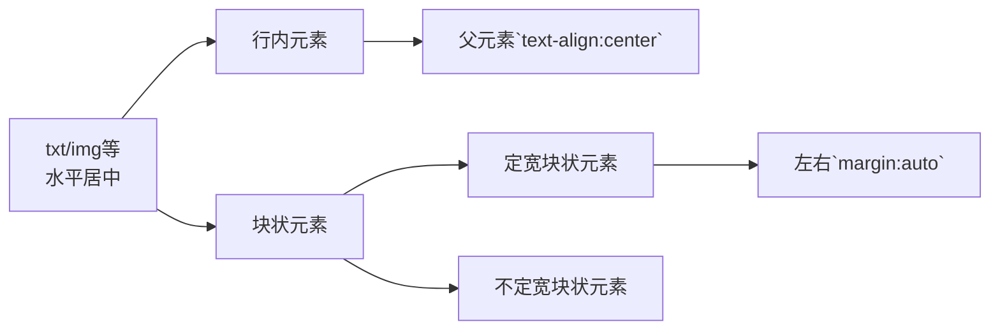
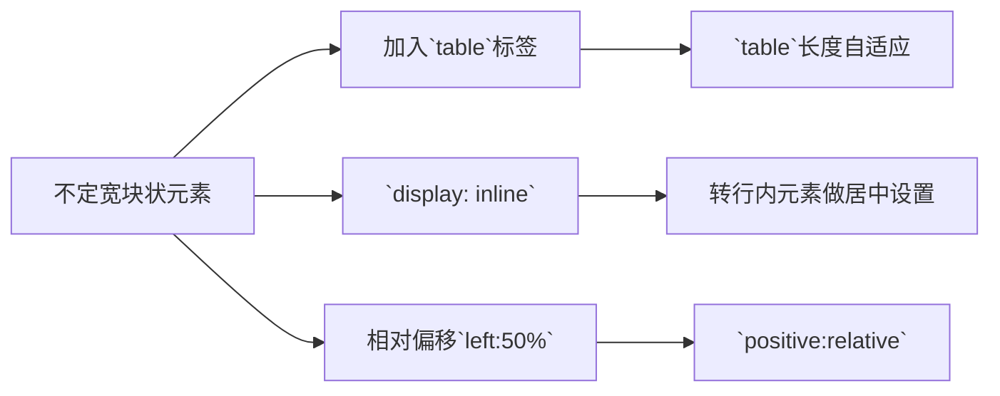
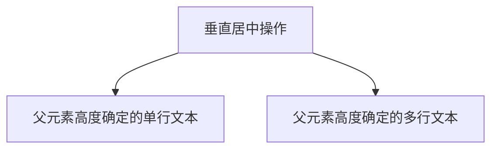

# HTML和CSS初识

## 一、介绍

### 1.1 Html和CSS的关系

学习web前端开发基础技术需要掌握：HTML、CSS、JavaScript语言。下面我们就来了解下这三门技术都是用来实现什么的：

1. **HTML是网页内容的载体**。内容就是网页制作者放在页面上想要让用户浏览的信息，可以包含文字、图片、视频等。

2. **CSS样式是表现**。就像网页的外衣。比如，标题字体、颜色变化，或为标题加入背景图片、边框等。所有这些用来改变内容外观的东西称之为表现。

3. **JavaScript是用来实现网页上的特效效果**。如：鼠标滑过弹出下拉菜单。或鼠标滑过表格的背景颜色改变。还有焦点新闻（新闻图片）的轮换。可以这么理解，有动画的，有交互的一般都是用JavaScript来实现的

```html
<!DOCTYPE HTML>
<html>
    <head>
        <meta http-equiv="Content-Type" content="text/html; charset=utf-8">
        <title>Html和CSS的关系</title>
        <style type="text/css">
        h1{
            font-size:30px;    
            color:#930;
            text-align:center;
        }
        </style>
    </head>
    <!-- 我是注释，看到了吗？注释就是这个样子 -->
    <body>
        <h1>Hello World!</h1>
        <h1>TEST</h1>
    </body>
</html>
```

- **结构上**

  以*\<!DOCTYPE HTML\>*开头说明页面信息的属性为HTML类型；

  \<html\>...\</html\>作为总的html结构包起所有的页面元素信息；

  包含两个主体：**head**和**body**。head作为环境变量以及后台相关程序及设置。而body为显式的语义化信息，是页面元素的主体。

- **联系上**

  如上的CSS样式**style**就可以在html的元素中体现出来

## 二、认识标签

### 2.1 标签的用途——语义化

**语义化**：明白每个标签的用途（在什么情况下使用此标签合理）比如，网页上的文章的**标题**就可以用标题标签，网页上的各个栏目的**栏目名称**也可以使用标题标签。文章中内容的段落就得放在**段落标签**中，在文章中有想强调的文本，就可以使用 em 标签表示强调等等。

讲了这么多语义化，但是语义化可以给我们带来什么样的好处呢？

1. 更容易被搜索引擎收录。

2. 更容易让屏幕阅读器读出网页内容。

### 2.2 标签——基础单元素标签

| 标签             | 含义                                   | 备注                         |
| ---------------- | -------------------------------------- | ---------------------------- |
| \<p>             | 段落                                   | <p>我是段落</p>              |
| \<em>、\<strong> | *斜体*、**黑体**                       |                              |
| \<hx>            | 标题，h1-h6                            |                              |
| \<span>          | 无意义的标签，作用为添加特殊样式       |                              |
| \<q>             | **简短文本**的引用，自带双引号。       |                              |
| \<blockquote>    | 也是引用，但确实对**长文本**的引用。   | 带有缩进效果，前后缩进。     |
| \<br>            | 分行，或者换行用                       | 可等价使用：**\<br/>**       |
| &nbsp            | 空格                                   | **Html中默认忽略换行和空格** |
| \<hr>            | 分隔线                                 |                              |
| \<address>       | 为网页加入地址信息，可以定义一个地址等 | 默认显示效果为**斜体**       |
| \<code>          | 为一行代码添加语义时可用。             | 效果为字体和字号改变         |
| \<pre>           | 多行代码是使用该标签                   |                              |

### 2.3 标签——列表、块、表格

| 标签       | 含义                                       | 备注                             |
| ---------- | ------------------------------------------ | -------------------------------- |
| \<ul>\<li> | 列表，\<ul>外部包含，单个元素使用\<li>完成 | 默认效果是小圆点，可嵌套使用     |
| \<ol>\<li> | 列表，数字排序的。有序标签                 | 默认效果是1. 2. 3.               |
| \<div>     | 逻辑划分，把独立部分分割开                 | 可以赋予id名，更直观的了解逻辑块 |
| \<table>   | 制定表格table,tbody,tr,th,td               |                                  |
| \<caption> | 表格的标题                                 |                                  |

---

**列表**

<ul>
    <li>列表第一项</li>
    <li>列表第二项</li>
    <ol>
        <li>2.1项</li>
    </ol>
</ul>
----

**表格**


<table summary="summary记录的是表格的摘要">
  <caption>作为表格的标题而存在</caption>
    <tr>	<!-- 每一行用tr -->
        <th>id</th>		<!-- 表单元格头用th-->
        <th>name</th>
        <th>age</th>
    </tr>
    <tr>
        <td>1</td>	<!-- 单元格用td-->
        <td>张三</td>
        <td>15</td>
    </tr>
    <tr>
        <td>2</td>
        <td>李四</td>
        <td>28</td>
    </tr>
</table>
### 2.4 标签——链接

**超链接\<a>**

```html
<a  href="目标网址"  title="鼠标滑过显示的文本" target="_blank">链接显示的文本</a>
target="_blank" 含义为在新窗口中打开网页
```

<ul>
    <li><a href="#" title="前端开发面试心法">前端试心法</a> </li>
    <li><a href="#" title="零基础学习html">零基础html</a></li>
    <li><a href="#" title="JavaScript全攻略">JavaScript全攻略</a></li>
</ul>
`<a>`标签还有一个功能就是可以链接`Email`地址


**注意**：如果mailto后面同时有多个参数的话，第一个参数必须以“`?`”开头，后面的参数每一个都以“`&`”分隔。


### 2.5 定义列表

`<dl>`英文单词：definition list，没有属性。dl的子元素只能是dt和dd。

- `<dt>`：definition title 列表的标题，这个标签是必须的
- `<dd>`：definition description 列表的列表项，如果不需要它，可以不加

<dl>
	<dt>购物指南</dt>
	<dd>
		<a href="#">购物流程</a>
		<a href="#">会员介绍</a>
		<a href="#">生活旅行/团购</a>
		<a href="#">常见问题</a>
		<a href="#">大家电</a>
		<a href="#">联系客服</a>
	</dd>
</dl>
<dl>
	<dt>配送方式</dt>
	<dd>
		<a href="#">上门自提</a>
		<a href="#">211限时达</a>
		<a href="#">配送服务查询</a>
		<a href="#">配送费收取标准</a>
		<a href="#">海外配送</a>
	</dd>
</dl>
### 2.6 img标签

图像可以是GIF，PNG，JPEG格式的图像文件。

```html

```

## 三、表单

### 3.1 表单标签

```html
<form   method="传送方式"   action="服务器文件(save.php等)">

<form method="post" action="save.php">
      <label for="username">用户名:</label>
      <input type="text"  name="username" id="username" value="" />
      <label for="pass">密码:</label>
      <input type="password"  name="pass" id="pass" value="" />    
      <input type="submit" value="确定"  name="submit" />
      <input type="reset" value="重置" name="reset" />
</form>
```

注意：

1. 所有表单控件(文本框、文本域、按钮、单选框、复选框等)都必须放在`<form></form>`标签之间。否则无法提交
2. `method`的方法分为`get/post`两种，后端考虑。

### 3.2 输入框

输入框用于用户表单中需要提交的数据时使用，可分为**文本输入框和密码输入框**

```html
<form>
   <input type="text/password" name="名称" value="文本" />
</form>
```

**文本域**：当用户需要提交大段文字时，就需要用到文本输入域。

```html
<textarea rows="行数" cols="列数">文本</textarea>
```

注意：`cols和rows`两个属性均可以用css中的`width和height`来代替。

### 3.3 单选框、复选框

`type="radio"` 控件为单选框，`type="checkbox"` 控件为复选框，`value`为提交到服务器的值，`name`为空间命名，`checked`是否被默认选择

```html
<input   type="radio/checkbox"   value="值"    name="名称"   checked="checked"/>
```

当多个input为单选框时，name选项一定要一致。

### 3.4 下拉选框

下拉选框可以单选，也可以多选，可以设置默认选项。

```html
<select multiple="multiple">
      <option value="看书">看书</option>
      <option value="旅游" selected="selected">旅游</option>
      <option value="运动">运动</option>
      <option value="购物">购物</option>
</select>
```

如果需要多选，操作时需要`Ctrl+单击`选择。

### 3.5 按钮

**提交按钮：**`type="submit"`，**重置按钮：**`type="reset"`，`value`为按钮上显式的文字

```html
<input   type="submit"   value="提交">
```

### 3.6 label标签

`label`标签不会向用户呈现任何特殊效果，它的作用是为鼠标用户改进了可用性。如果你在 label 标签内点击文本，就会触发此控件。就是说，当用户单击选中该label标签时，浏览器就会自动将焦点转到和标签相关的表单控件上（就自动选中和该label标签相关连的表单控件上）。

```html
<label for="控件id名称">

    <label for="sport1">慢跑</label>
    <input type="checkbox" name="run" id="sport1">
    <br/>
    <label for="sport2">登山</label>
    <input type="checkbox" name="clam" id="sport2">
```

此时的效果即为，选择`label`文字的同时，会选择`id`一致的控件。同时二者并非直接关联关系，即可以错乱排列。

## 四、CSS 样式

### 4.0 说明

CSS全称为“层叠样式表 (Cascading Style Sheets)”，它主要是用于定义HTML内容在浏览器内的显示样式，如文字大小、颜色、字体加粗等。

使用CSS样式的一个好处是通过定义某个样式，可以让不同网页位置的文字有着统一的字体、字号或者颜色等。

CSS样式由**选择符**和**声明**组成，而声明由**属性**和**值**组成。

**选择符：**又称选择器，指明网页中要应用样式规则的元素。

**声明：**在大括号中的就是声明，格式如字典格式。

CSS中的注释使用`/*注释语句*/`

### 4.1 CSS三种使用方式

**内联式CSS样式：**直接写在现有的HTML标签中。

```html
<p style="color:red;font-size:12px">这里文字是红色。</p>
```

**嵌入式CSS样式：**写在当前HTML文件中，一般写在`<head></head>`之间

```html
<style type="text/css">
span{
   color:red;
}
</style>
```

**外部式CSS样式：**写在单独的一个文件中，在主HTML中写入链接加以引用。

```html
<link href="base.css" rel="stylesheet" type="text/css" />
```

```css
span{
   color:red;
}
```

**三种方式优先级如下：**`内联式 > 嵌入式 > 外部式`

特殊情况，因为嵌入式和外部式均在`<head></head>`中，而HTML是自上至下进行加载解释的，所以存在一个加载的先后顺序问题。一般情况下我们外部式的链接写在嵌入式的前边，造成的结果就是优先级上的差别，如果外部式的链接写在嵌入式的后边，则外部式的优先级会高。**因此，后两个的优先级要看谁在后边加载谁的优先级高，简而言之就是==就近加载==。 **

### 4.2 选择器

```
选择器{
    样式;
}
```

**标签选择器：**使用HTML代码中的标签作为选择器使用。

**类选择器：**`语法：   .Aclass {css样式;}`，以英文点开头，类选择器可以任意命名。

**ID选择器：**选择标签的**id**作为选择器，格式如下：`#id{css样式;}`

| 比较项   | 类选择器             | ID选择器                     | 原因       |
| -------- | -------------------- | ---------------------------- | ---------- |
| 相同点   | 均可以应用于任何元素 | 均可以应用于任何元素         |            |
| 使用次数 | 可以==多次==使用     | **只能在文档中使用==一次==** | id必须唯一 |
| 样式叠加 | 多个类并举           | 只能一个样式                 | id必须唯一 |

---

**子选择器：** `.food>li{border:1px solid red;}` 选择器指向`.food类下的<li>标签`。块状的标签格式样式设置。==作用域为直接后代，且为子元素的**第一代后代**。==

**包含(后代)选择器：**`.first span{color:red;}`选择器指向`.first类下的span标签`。==作用域为**所有子后代**元素。==

```html
<style type="text/css">
.food>li{border:1px solid blue;}
.food li{border:1px solid red;}	<!--红色边框在所有<li>标签区域-->
</style>
<ul class="food">
    <li>水果		<!--蓝色边框仅在这个区域-->
        <ul>
        	<li>香蕉</li>
            <li>苹果</li>
            <li>梨</li>
        </ul>
    </li>
    <li>蔬菜		<!--蓝色边框仅在这个区域-->
    	<ul>
        	<li>白菜</li>
            <li>油菜</li>
            <li>卷心菜</li>
        </ul>
    </li>
</ul>
```

**通用选择器：**`* {color:red;}`，选择器指向所有标签。

---

**伪类选择符：**`a:hover{color:red;}`允许给html不存在的标签，或称为标签的某种状态设置样式。

```css
a:hover{color:red;}		/*给标签元素的 鼠标划过的状态 设置样式*/
```

**分组选择符：**`h1,span{color:red;}`，以逗号隔开的选择器具有相同的样式。

### 4.3 样式的继承,层叠,权值

**继承：**继承是一种规则，它允许样式不仅应用于某个特定html标签元素，而且应用于其后代。

```html
<style type="text/css">
    .p1{color:red;}
    .p2{border:1px solid red;}
</style>
<p class=".p1">三年级时，我还是一个<span>胆小如鼠</span>的小女孩。</p>
<p class=".p2">三年级时，我还是一个<span>胆小如鼠</span>的小女孩。</p>
```

上例可见`.p1`样式作用于整段，包含胆小如鼠的`<span>`标签。而`.p2`标签仅作用于整段，子标签并未继承该样式。

区别就是，有些样式具有继承性有些样式不具有继承性。

**权值：**==标签的权值为1，类选择符的权值为10，ID选择符的权值最高为100==。权值的计算为标签权值的计算，而非继承类权值的计算。

```css
p{color:red;} /*权值为1*/
p span{color:green;} /*权值为1+1=2*/
.warning{color:white;} /*权值为10*/
p span .warning{color:purple;} /*权值为1+1+10=12*/
#footer .note p{color:yellow;} /*权值为100+10+1=111*/
```

*注意：还有一个权值比较特殊--继承也有权值但很低，有的文献提出它只有0.1，所以可以理解为继承的权值最低。*

**层叠：**就是在html文件中对于同一个元素可以有多个css样式存在，当有相同权重的样式存在时，会根据这些css样式的前后顺序来决定，处于最后面的css样式会被应用。**就近加载**

```css
p{color:red;}
p{color:green;}		/*最终显示为绿色*/
```

**重要性：**`!important`关键字来赋予最高权限。==!important必须写在分号前==

```css
p{color:red!important;}		/*标记为了最高权限，所以最终显示为红色。*/
p{color:green;}
```

这里注意当网页制作者不设置css样式时，浏览器会按照自己的一套样式来显示网页。并且用户也可以在浏览器中设置自己习惯的样式，比如有的用户习惯把字号设置为大一些，使其查看网页的文本更加清楚。这时注意样式优先级为：**浏览器默认的样式 < 网页制作者样式 < 用户自己设置的样式**，但记住!important优先级样式是个例外，权值高于用户自己设置的样式。

## 五、css格式化排版

### 5.1 文字

```css
body{
    font-famaily:"宋体";	/*或"微软雅黑" font-famaily:"Microsoft Yahei";*/
    /*字体的设定两点注意：1. 客户端系统必须有这个字体。2. 常用字体微软雅黑，兼容性最好的是英文格式。*/
    font-size:12px;		/*字号*/
    color:#666;			/*颜色*/
    
    font-weight:bold;	/*字体样式，粗体、斜体、下划线、删除线等*/
    font-style:italic;	/*斜体*/
    text-decoration:underline;	/*下划线*/
    text-decoration:line-through;	/*删除线*/
    
    text-indent:2em;		/*缩进。2em 文字的两倍大小*/
    line-height:1.5em;		/*文字的行间距(行高)， 1.5em */
    letter-spacing:50px;	/*文字(字母)间距*/
    word-spacing:50px;		/*单词间距*/
    
    text-align:center;		/*对齐设置——————块状元素设置样式*/
}
```

### 5.2 元素分类

> 在CSS中，html中的标签元素大体被分为三种不同类型：**块状元素、内联元素、内联块状元素**
>
> （其中内联元素又叫行内元素。）

**常见块状元素有：**

`<div>、<p>、<h1>...<h6>、<ol>、<ul>、<dl>、<table>、<address>、<blockquote> 、<form>`

**常见内联元素有：**

`<a>、<span>、<br>、<i>、<em>、<strong>、<label>、<q>、<var>、<cite>、<code>`

**常见内联块状元素：**

`、<input>`

---

**块级元素：**

1. 每个块级元素都从新的一行开始，并且其后的元素也另起一行。（每个块级元素独占一行）
2. 元素的高度、宽度、行高、顶和边距==都可设置==
3. 元素宽度在不设置的情况下，是它本身父容器的100%（和父元素宽度一致），除非设定一个值。
4. 要把内联元素转为块状元素，`a{display:block;}`

----

**内联元素：**

1. 和其他元素都在一行上；
2. 元素的高度、宽度、顶部和底部均==不可设置==；
3. 元素的高度就是它包含的文字或图片的宽度，不可改变。
4. 同样要转为内联元素设置为：`a{display:inline}`

-----

**内联块状元素：**

1. 和其他元素都在一行上；
2. 元素的高度、宽度、行高、顶部及底部边距==均可设置==。
3. 同样转为内联块状元素代码为：`{display:inline-block}`

---

### 5.3 CSS盒模型

一般分两种：**标准模型**和**IE模型**


#### 5.3.1 边框

```css
div{
    border:2px  solid  red;
}
/*等价于*/
div{
    border-width:2px;
    border-style:solid;
    border-color:red;
}
/*边框常见样式有： dashed(虚线)、dotted(点线)、solid(实线)*/
/*如上格式可以继续拆分为： 上，右，下，左，四个方向。以此设置自定义边框样式*/
div{
    border-top:1px solid red;
    border-right:1px solid red;
    border-bottom:1px solid red;
    border-left:1px solid red;
}
```

#### 5.3.2 填充

**元素内容与边框之间称之为填充。**同样可以分开写为，上右下左四个方向。

`div{padding:20px 10x 15px 30px;}`

#### 5.3.3 高度和宽度

盒模型宽度和高度和我们平常所说的物体的宽度和高度理解是不一样的，css内定义的宽（width）和高（height），指的是填充以里的内容范围。


因此一个元素实际宽度（盒子的宽度）=左边界+左边框+左填充+内容宽度+右填充+右边框+右边界。

#### 5.3.4 边界

元素与其它元素之间的距离可以使用边界（margin）来设置。边界也是可分为上、右、下、左。如下代码：

```css
div{margin:20px 10px 15px 30px;}
```

==**padding和margin的区别，padding在边框里，margin在边框外。**==

### 5.4 css布局模型

**布局模型是建立在盒模型基础之上的外在表现形式。**

网页中有三种布局模型：**流动模型（Flow）、浮动模型（float）、层模型（layout）**

#### 5.4.1 流动模型

网页默认布局模型。

1. 块状元素都会在所处的包含元素内自上而下按顺序垂直延伸分布，因为在默认状态下，块状元素的宽度都为100%。实际上，块状元素都会以行的形式占据位置。如右侧代码编辑器中三个块状元素标签(div，h1，p)宽度显示为100%。
2. 第二点，在流动模型下，**内联元素**都会在所处的包含元素内从左到右水平分布显示。（内联元素可不像块状元素这么霸道独占一行）。右侧代码编辑器中内联元素标签a、span、em、strong都是内联元素。

---

#### 5.4.2 浮动模型：

任何元素默认情况下都是不能浮动的，但可以通过CSS定义设为浮动模式。

```css
div{
    width:200px;
    height:200px;
    border:2px red solid;
}
#div1{float:left;}
#div2{float:right;}
/*设定了两个块级模块为浮动模型，浮动方向为左和右*/
```

---

#### 5.4.3 层模型：

​		层布局模型就像是图像软件PhotoShop中非常流行的图层编辑功能一样，每个图层能够精确定位操作，但在网页设计领域，由于网页大小的活动性，层布局没能受到热捧。但是在网页上局部使用层布局还是有其方便之处的。下面我们来学习一下html中的层布局。

层模型三种定位方式：

**绝对定位**(position: absolute)、**相对定位**(position: relative)、**固定定位**(position: fixed)

-----

**绝对定位：**如果想为元素设置层模型中的绝对定位，需要设置**position:absolute**(表示绝对定位)，这条语句的作用将元素从文档流中拖出来，然后使用left、right、top、bottom属性相对于其最接近的一个具有定位属性的父包含块进行绝对定位。如果不存在这样的包含块，则相对于body元素，即相对于**浏览器窗口**。

```css
div{
    width:200px;
    height:200px;
    border:2px red solid;
    position:absolute;
    left:100px;
    top:50px;
}
<div id="div1"></div>
```

效果：


---

**相对定位：**如果想为元素设置层模型中的相对定位，需要设置**position:relative**（表示相对定位），它通过left、right、top、bottom属性确定元素在**正常文档流中**的偏移位置。相对定位完成的过程是首先按static(float)方式生成一个元素(并且元素像层一样浮动了起来)，然后相对于**以前的位置移动，**移动的方向和幅度由left、right、top、bottom属性确定，偏移前的位置保留不动。

```css
#div1{
    width:200px;
    height:200px;
    border:2px red solid;
    position:relative;
	bottom:0;
    right:0;
}
<div id="div1"></div>
```


*实际操作中发现：当需求为向右偏移是，使用left；想左偏移时，使用right；向下偏移时使用top，刚好相反使用。*

***

**固定定位 fixed：**表示固定定位，与absolute定位类型类似，但它的相对移动的坐标是视图（**屏幕内的网页窗口**）本身。由于视图本身是固定的，它不会随浏览器窗口的滚动条滚动而变化，除非你在屏幕中移动浏览器窗口的屏幕位置，或改变浏览器窗口的显示大小，因此固定定位的元素会始终位于浏览器窗口内视图的某个位置，不会受文档流动影响，这与background-attachment:fixed;属性功能相同。以下代码可以实现相对于**浏览器视图**向右移动100px，向下移动50px。并且拖动滚动条时位置固定不变。

```css
#div1{
    width:200px;
    height:200px;
    border:2px red solid;
    position:fixed;
    left:100px;
    top:50px;
}
```


随着滚动条的上下滚动，红色框均不会上下移动，处于固定位置。

#### 5.4.4 Relative Absolute混用

使用`position:absolute`可以实现被设置元素相对于浏览器（body）设置定位以后，大家有没有想过可不可以相对于其它元素进行定位呢？答案是肯定的，当然可以。使用position:relative来帮忙，但是必须遵守下面规范：

1、参照定位的元素必须是相对定位元素的前辈元素：

```
<div id="box1"><!--参照定位的元素-->
    <div id="box2">相对参照元素进行定位</div><!--相对定位元素-->
</div>
```

从上面代码可以看出box1是box2的父元素（父元素当然也是前辈元素了）。

2、参照定位的元素必须加入position:relative;

```
#box1{
    width:200px;
    height:200px;
    position:relative;        
}
```

3、定位元素加入position:absolute，便可以使用top、bottom、left、right来进行偏移定位了。

```
#box2{
    position:absolute;
    top:20px;
    left:30px;         
}
```

这样box2就可以相对于父元素box1定位了（这里注意参照物就可以不是浏览器了，而可以自由设置了）。

## 六、css其他

### 6.1 盒模型代码简写

盒模型： **外边距(margin)、内边距(padding)、边框(boarder)、内容宽高。**

其中除了内容外，其余部分均分为四个方向上的参数。==他们具有相同的简写设置顺序：**上右下左**==。

```css
margin: 10px 15 px 12px 14px;
/*上设置为：10px 、右设置为：15px 、下设置为：12px 、左设置为：14px*/
/*如上简写同样可以适用于padding和boarder*/
```

```css
/*简写*/
/*1. top = right = bottom = left*/
margin: 10px;
/*2. top = bottom, right = left*/
margin: 10px 20px;
/*3. left = right*/
margin: 10px 20px 30px;
```

### 6.2 属性缩写

**颜色缩写：**

```css
p {
    color:#000000;
    color:#000;
}
p {
    color: #336699;
    color: #369;
}
```

**字体缩写：**

```css
body{
    font-style:italic;
    font-variant:small-caps; 
    font-weight:bold; 
    font-size:12px; 
    line-height:1.5em; 
    font-family:"宋体",sans-serif;
}
body{
    font:italic  small-caps  bold  12px/1.5em  "宋体",sans-serif;
}
```

注意：

1. 至少指定`font-size`和`font-family`属性。
2.  `font-size`和`line-height`中间加斜杠。

3. 可以同时包含`font`和分写属性。

### 6.3 单位与值

**颜色值：**

```css
p{color:red;}
p{color:rgb(133,45,200);}
p{color:rgb(20%,33%,25%);}
p{color:#00ffff;}
```


**长度值：**

1. ==像素==。90px = 1英寸。
2. ==em==。全局值设定。

```css
p{font-size:12px;text-indent:2em;}	/*此时text-indent 为24px*/
p{font-size:1em; text-indent:2em;}	/*此时em的值去父元素的font-size*/
```

3. ==百分比==。同em类似

### 6.4 水平居中设置



- **注意**：此处可以重叠使用，即块状元素在当前块中的剧中使用`margin`，而在块中的文字或者图片需要居中时，就使用`text-align:center;`



1. ==方法一==：使用table标签，实际操作使用table的一个单元格作为容器装载元素。使得元素整体成为一个定宽块元素，此时使用定宽的方法实现。

```html
<style>
table{
    margin:0 auto;		/* 定宽设定水平居中 */
}

/*下面是任务区代码*/
.wrap{
    background:#ccc;
}
</style>

<table>				<!-- table标签 -->
  <tbody>			<!-- table主体 -->
    <tr><td>		<!-- tr一行，td一个单元格。 -->
	<ul>			<!-- 所以此处为一个占用一行的一快单元格 -->
    	<li>我是第一行文本</li>
        <li>我是第二行文本</li>
        <li>我是第三行文本</li>
    </ul>
    </td></tr>
  </tbody>
</table>
```

2. ==方法二==：转为行内元素操作。

```html
<style>
    .container{ text-align:center; }
    /* margin:0;padding:0（消除文本与div边框之间的间隙）*/
    .container ul{ list-style:none;margin:0;padding:0;display:inline; }
    /* margin-right:8px（设置li文本之间的间隔）*/
    .container li{ margin-right:8px;display:inline; }
</style>

<body>
<div class="container">
    <ul>
    	<li><a href="#">1</a></li>
        <li><a href="#">2</a></li>
        <li><a href="#">3</a></li>
    </ul>
</div>
</body>
```

这种方法相比第一种方法的优势是不用增加无语义标签，但也存在着一些问题：它将块状元素的 display 类型改为 inline，变成了行内元素，所以少了一些功能，比如设定长度值。**效果上，如上三个块状元素呈一行排列。**

3. ==方法三==：通过给父元素设置`float`，然后给父元素设置 `position:relative`和 `left:50%`，子元素设置 `position:relative` 和 `left: -50%` 来实现水平居中。

```html
<style>
    .container{ float:left;position:relative;left:50% }
    .container ul{ list-style:none;margin:0;padding:0;
        position:relative;
        left:-50%;
    }
    .container li{float:left;display:inline;margin-right:8px;}
</style>

<body>
<div class="container">
    <ul>
        <li><a href="#">1</a></li>
        <li><a href="#">2</a></li>
        <li><a href="#">3</a></li>
    </ul>
</div>
</body>
```

我们可以这样理解：假想ul层的父层（即下面例子中的div层）中间有条平分线将ul层的父层（div层）平均分为两份，ul层的css代码是将ul层的最左端与ul层的父层（div层）的平分线对齐；而li层的css代码则是将li层的平分线与ul层的最左端（也是div层的平分线）对齐，从而实现li层的居中。

**实际效果：浮动模式会造成元素的交叠请情况，即因为相对位置的改变造成重叠现象。**

### 6.5 垂直居中



1. **父元素高度确定的单行文本: **的竖直居中的方法是通过设置父元素的 `height` 和`line-height` 高度一致来实现的。(`height`: 该元素的高度，`line-height`: 顾名思义，行高（行间距），指在文本中，行与行之间的 基线间的距离 )。

   `line-height` 与 `font-size` 的计算值之差，在 CSS 中成为“行间距”。分为两半，分别加到一个文本行内容的顶部和底部。==此时让两者保持一致，就使得文字的行完全占据了父元素的顶部和底部。==

   **弊端**：当文字内容的长度大于块的宽时，就有内容脱离了块。

   ```html
   <style>
   .container{
       height:100px;
       line-height:100px;
       background:#999;
   }
   </style>
   
   <div class="container">
       hi,imooc!
   </div>
   ```

2. **父元素高度确定的多行文本**：

   方法一： 使用`table`标签 (包括tbody、tr、td)标签，同时设置 `vertical-align：middle`，（纵向校准为居中）

   ```html
   <style>
       table td{ height:500px; background:#ccc }
   </style>
   
   <body>
   <table><tbody><tr><td class="wrap">
   <div>
       <p>看我是否可以居中。</p>
   </div>
   </td></tr></tbody></table>
   </body>
   ```

   方法二：在 chrome、firefox 及 IE8 以上的浏览器下可以设置块级元素的 display 为 table-cell（设置为表格单元显示），激活 vertical-align 属性，但注意 IE6、7 并不支持这个样式, 兼容性比较差。

   ```html
   <style>
       .container{
           height:300px;
           background:#ccc;
           display:table-cell;/*IE8以上及Chrome、Firefox*/
           vertical-align:middle;/*IE8以上及Chrome、Firefox*/
       }
   </style>
   
   <div class="container">
       <div>
           <p>看我是否可以居中。</p>
           <p>看我是否可以居中。</p>
           <p>看我是否可以居中。</p>
       </div>
   </div>
   ```

   这种方法的好处是不用添加多余的无意义的标签，但缺点也很明显，它的兼容性不是很好，不兼容 IE6、7而且这样修改display的block变成了table-cell，破坏了原有的块状元素的性质。

### 6.6 隐性改变display类型

有一个有趣的现象就是当为元素（不论之前是什么类型元素，display:none 除外）设置以下 2 个句之一：

1. `position : absolute` 

2. `float : left` 或 `float:right`

简单来说，只要html代码中出现以上两句之一，元素的display显示类型就会自动变为以 display:inline-block（[块状元素](http://www.imooc.com/code/2048)）的方式显示，当然就可以设置元素的 width 和 height 了，且默认宽度不占满父元素。

```html
<style>
    .container a{
        position:absolute;
        width:200px;
        background:#ccc;
    }
</style>

<div class="container">
    <a href="#" title="">进入课程请单击这里</a>
</div>
```


