### 一、定时器

定时器： 通用定时器、高级定时器、基本定时器。

STM32F103ZE有8个定时器，其中2个高级定时器（TIM1、TIM8），4个通用定时器（TIM2、TIM3、TIM4、TIM5），2个基本定时器（TIM6、TIM7）。下表是对这8个定时器的详细描述。

| 定时器种类                | 位数 | 计数器模式          | 产生DMA请求 | 捕获/比较通道 | 互补输出 | 特殊应用场景                                 |
| ------------------------- | ---- | ------------------- | ----------- | ------------- | -------- | -------------------------------------------- |
| 高级定时器 （TIM1，TIM8） | 16   | 向上、向下、向上/下 | 可以        | 4             | 有       | 带死区控制盒紧急刹车， 可应用于PWM电机控制   |
| 通用定时器 （TIM2~TIM5）  | 16   | 向上、向下、向上/下 | 可以        | 4             | 无       | 通用。定时计数，PWM输出， 输入捕获，输出比较 |
| 基本定时器 （TIM6，TIM7） | 16   | 向上、向下、向上/下 | 可以        | 0             | 无       | 主要应用于驱动DAC                            |

#### 0. 通用定时器概述

通用计数器TIMx（TIM2~TIM5）定时器的特点包括：

- 位于低速的APB1总线上(APB1)
- 16 位向上、向下、向上/向下(中心对齐)计数模式，自动装载计数器（TIMx_CNT）。
- 16 位可编程(可以实时修改)预分频器(TIMx_PSC)，计数器时钟频率的分频系数 为 1～65535 之间的任意数值。
- 4 个独立通道（TIMx_CH1~4），这些通道可以用来作为： 
  ① 输入捕获 
  ② 输出比较 
  ③ PWM 生成(边缘或中间对齐模式) 
  ④ 单脉冲模式输出
- 可使用外部信号（TIMx_ETR）控制定时器和定时器互连（可以用 1 个定时器控制另外一个定时器）的同步电路。
- 产生中断/DMA（6个独立的IRQ/DMA请求生成器），该中断产生的事件如下： 
  ① 更新：计数器向上溢出/向下溢出，计数器初始化(通过软件或者内部/外部触发) 
  ② 触发事件(计数器启动、停止、初始化或者由内部/外部触发计数) 
  ③ 输入捕获 
  ④ 输出比较 
  ⑤ 支持针对定位的增量(正交)编码器和霍尔传感器电路 
  ⑥ 触发输入作为外部时钟或者按周期的电流管理
- STM32 的通用定时器可以被用于：测量输入信号的脉冲长度(输入捕获)或者产生输出波形(输出比较和 PWM)等。
- 使用定时器预分频器和 RCC 时钟控制器预分频器，脉冲长度和波形周期可以在几个微秒到几个毫秒间调整。STM32 的每个通用定时器都是完全独立的，没有互相共享的任何资源。

#### 1. 通用定时器中断实现

时基单元为我们提供了定时的功能，我们利用该功能实现如下**示例程序**的编写： 
**通过定时器中断配置，实现每500ms中断一次，通过定时中断实现LED灯闪烁。** 
① 使能定时器时钟。 
RCC_APB1PeriphClockCmd(); 
② 初始化定时器，配置ARR,PSC（即配置自动装载寄存器TIMx_ARR和预分频寄存器值TIMx_PSC） 
TIM_TimeBaseInit(TIM_TypeDef* TIMx, IM_TimeBaseInitTypeDef* TIM_TimeBaseInitStruct);

> ARR、PSC如何确定 
> 1）我们知道计数器ARR溢出后会产生更新中断，我们以中心对齐模式的时序图来说明，如下图： 
>
> 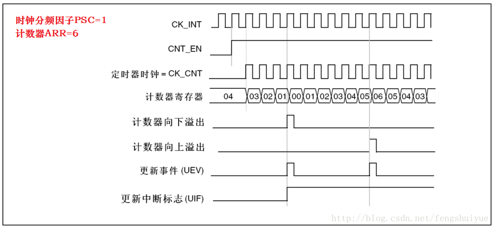
>
> 上图中CK_INT前面已说过，其频率由APB1来决定，若使用默认时钟SystemInit初始化的话，CK_INT=72MHz。 
> CK_CNT如何确定，我们看下图 
>
> 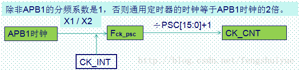
>
> 上述公式为何计数器ARR和时钟分频PSC都要加1，因为这两个值是配置在寄存器中的，其实从0开始计数，故要加1。

根据上面导出的Tout的公式，结合本小节开头的需求，中断时间设置为500ms，我们可使用默认的系统频率，则Fck_psc=CK_INT=72MHz，则 

>  设PSC=7199，则ARR=4999，该需求的ARR,PSC我们将会以此值去配置。

③ 开启定时器中断，配置NVIC。 

`void TIM_ITConfig(TIM_TypeDef* TIMx, uint16_t TIM_IT, FunctionalState NewState); `
`NVIC_Init(); `
④ 使能定时器。 
`TIM_Cmd(TIM_TypeDef* TIMx, FunctionalState NewState); `
⑤ 编写中断服务函数。 
`TIMx_IRQHandler();`

```c
//通用定时器3中断初始化
//这里时钟选择为APB1的2倍，而APB1为36M
//arr：自动重装值。
//psc：时钟预分频数
//这里使用的是定时器3!
void TIM3_Int_Init(u16 arr,u16 psc)
{
    TIM_TimeBaseInitTypeDef  TIM_TimeBaseStructure;
    NVIC_InitTypeDef NVIC_InitStructure;

    RCC_APB1PeriphClockCmd(RCC_APB1Periph_TIM3, ENABLE); //时钟使能

    //定时器TIM3初始化
    TIM_TimeBaseStructure.TIM_Period = arr; //设置在下一个更新事件装入活动的自动重装载寄存器周期的值   
    TIM_TimeBaseStructure.TIM_Prescaler =psc; //设置用来作为TIMx时钟频率除数的预分频值
    TIM_TimeBaseStructure.TIM_ClockDivision = TIM_CKD_DIV1; //设置时钟分割:TDTS = Tck_tim
    TIM_TimeBaseStructure.TIM_CounterMode = TIM_CounterMode_Up;  //TIM向上计数模式
    TIM_TimeBaseInit(TIM3, &TIM_TimeBaseStructure); //根据指定的参数初始化TIMx的时间基数单位

    TIM_ITConfig(TIM3,TIM_IT_Update,ENABLE ); //使能指定的TIM3中断,允许更新中断

    //中断优先级NVIC设置
    NVIC_InitStructure.NVIC_IRQChannel = TIM3_IRQn;  //TIM3中断
    NVIC_InitStructure.NVIC_IRQChannelPreemptionPriority = 0;  //先占优先级0级
    NVIC_InitStructure.NVIC_IRQChannelSubPriority = 3;  //从优先级3级
    NVIC_InitStructure.NVIC_IRQChannelCmd = ENABLE; //IRQ通道被使能
    NVIC_Init(&NVIC_InitStructure);  //初始化NVIC寄存器


    TIM_Cmd(TIM3, ENABLE);  //使能TIMx                     
}
//定时器3中断服务程序
void TIM3_IRQHandler(void)   //TIM3中断
{
    if (TIM_GetITStatus(TIM3, TIM_IT_Update) != RESET)  //检查TIM3更新中断发生与否
    {
        TIM_ClearITPendingBit(TIM3, TIM_IT_Update  );  //清除TIMx更新中断标志 
        LED1=!LED1;
    }
}
//LED1闪烁的周期为500ms，LED0闪烁的周期为200ms，看到的现象为LED1闪烁慢，LED0闪烁快
int main(void)
{       

    delay_init();            //延时函数初始化    
    NVIC_PriorityGroupConfig(NVIC_PriorityGroup_2); //设置NVIC中断分组2:2位抢占优先级，2位响应优先级

    LED_Init();              //LED端口初始化

    TIM3_Int_Init(4999,7199);//10Khz的计数频率，计数到5000为500ms  
    while(1)
    {
        LED0=!LED0;
        delay_ms(200);         
    }
}    
```

**总结：** 

预设时钟源：$T_{preinstall}$ = $72$$MHz$

`TIM_Prescaler` 预分频值：对时钟源做频率分割，起始0计数。 （做720的分频：720 - 1）

此时时钟的频率为：$T_{clk}$ = $\frac{72M}{720}Hz$ = $100 kHz$ = $\frac{1}{100*1000}s$ =  $1 us$

`TIM_Period` 重周期值：1000。则有每一次TIM时钟触发中断的时间间隔为： $T_{out} = T_{0}*TIM_{period} = 1 us * 1000 = 1 ms$

#### 2. 附

[STM32定时器配置](https://www.cnblogs.com/pertor/p/9488813.html)

[STM32通用定时器使用详解](https://blog.csdn.net/private_void_main/article/details/81491015)

```c
//系统时钟初始化配置
void RCC_Configuration(void)
{
    //定义错误状态变量
   ErrorStatus HSEStartUpStatus;
   //将RCC寄存器重新设置为默认值
   RCC_DeInit();
   //打开外部高速时钟晶振
   RCC_HSEConfig(RCC_HSE_ON);
   //等待外部高速时钟晶振工作
   HSEStartUpStatus = RCC_WaitForHSEStartUp();
   if(HSEStartUpStatus == SUCCESS)
   {
          //设置AHB时钟(HCLK)为系统时钟
          RCC_HCLKConfig(RCC_SYSCLK_Div1);
          //设置高速AHB时钟(APB2)为HCLK时钟
          RCC_PCLK2Config(RCC_HCLK_Div1);
          //设置低速AHB时钟(APB1)为HCLK的2分频（TIM2-TIM5输入TIMxCLK频率将为72MHZ/2x2=72MHZ输入）
          RCC_PCLK1Config(RCC_HCLK_Div2);
          //设置FLASH代码延时
          FLASH_SetLatency(FLASH_Latency_2);
          //使能预取指缓存
          FLASH_PrefetchBufferCmd(FLASH_PrefetchBuffer_Enable);
          //设置PLL时钟，为HSE的9倍频 8MHz * 9 = 72MHz
          RCC_PLLConfig(RCC_PLLSource_HSE_Div1, RCC_PLLMul_9);
          //使能PLL
          RCC_PLLCmd(ENABLE);
          //等待PLL准备就绪
          while(RCC_GetFlagStatus(RCC_FLAG_PLLRDY) == RESET);
          //设置PLL为系统时钟源
          RCC_SYSCLKConfig(RCC_SYSCLKSource_PLLCLK);
          //判断PLL是否是系统时钟
          while(RCC_GetSYSCLKSource() != 0x08);
   }
   //允许TIM2的时钟
   RCC_APB1PeriphClockCmd(RCC_APB1Periph_TIM2,ENABLE);
   //允许GPIO的时钟
   RCC_APB2PeriphClockCmd(RCC_APB2Periph_GPIOB,ENABLE);
}
```

#### 3. 主从定时器

##### 3.0 从计数更新中断

使用TIM1作为主定时器,TIM2为从定时器,当TIM1发生更新事件时,TIM2计数器+1.在主循环中循环改变TIM1的更新周期,TIM2开启更新中断,在中断中翻转LED电平.

```c
void MASTER_TIMx_Init(void)
{
  TIM_ClockConfigTypeDef sClockSourceConfig;
  TIM_MasterConfigTypeDef  sMasterConfig;
  
  /* 基本定时器外设时钟使能 */
  MASTER_TIM_RCC_CLK_ENABLE();
  
  /* 主定时器基本功能配置 */
  htimx_MasterTIM.Instance = TIM1;
  htimx_MasterTIM.Init.Prescaler = MASTER_TIM_PRESCALER;
  htimx_MasterTIM.Init.CounterMode = TIM_COUNTERMODE_UP;
  htimx_MasterTIM.Init.Period = MASTER_TIM_PERIOD;
  htimx_MasterTIM.Init.ClockDivision = TIM_CLOCKDIVISION_DIV1;
  HAL_TIM_Base_Init(&htimx_MasterTIM);
 
 
  /* 定时器时钟源选择 */
  sClockSourceConfig.ClockSource = TIM_CLOCKSOURCE_INTERNAL;    //使用内部时钟源
  HAL_TIM_ConfigClockSource(&htimx_MasterTIM, &sClockSourceConfig);
  
  /* 主模式配置 */
  sMasterConfig.MasterSlaveMode = TIM_MASTERSLAVEMODE_ENABLE;
  sMasterConfig.MasterOutputTrigger = TIM_TRGO_UPDATE;
  HAL_TIMEx_MasterConfigSynchronization(&htimx_MasterTIM,&sMasterConfig);
  
}
 
void SLAVE_TIMx_Init(void)
{
  TIM_ClockConfigTypeDef sClockSourceConfig;
  TIM_SlaveConfigTypeDef  sSlaveConfig;
 
  /* 基本定时器外设时钟使能 */
  SLAVE_TIM_RCC_CLK_ENABLE();
  
  /* 从定时器基本功能配置 */
  htimx_SlaveTIM.Instance = TIM2;
  htimx_SlaveTIM.Init.Prescaler = SLAVE_TIM_PRESCALER;
  htimx_SlaveTIM.Init.CounterMode = TIM_COUNTERMODE_UP;
  htimx_SlaveTIM.Init.Period = SLAVE_TIM_PERIOD;
  htimx_SlaveTIM.Init.ClockDivision = TIM_CLOCKDIVISION_DIV1;
  HAL_TIM_Base_Init(&htimx_SlaveTIM);
 
 
  /* 定时器时钟源选择 */
  sClockSourceConfig.ClockSource = TIM_CLOCKSOURCE_ITR0;
  HAL_TIM_ConfigClockSource(&htimx_SlaveTIM, &sClockSourceConfig);
 
 
  /* 从模式：外部触发模式1(内部定时器触发)*/
  sSlaveConfig.SlaveMode = TIM_SLAVEMODE_EXTERNAL1;         // 从模式：外部触发模式1
  sSlaveConfig.InputTrigger = TIM_TS_ITR0;                  // 输入触发：选择 ITR0 作为输入源
  sSlaveConfig.TriggerPolarity = TIM_TRIGGERPOLARITY_RISING;// 触发极性：上升沿
  sSlaveConfig.TriggerPrescaler = TIM_TRIGGERPRESCALER_DIV1;// 触发预分频：无
  sSlaveConfig.TriggerFilter = 0x0;                         // 滤波：本例中不需要任何滤波
  HAL_TIM_SlaveConfigSynchronization(&htimx_SlaveTIM,&sSlaveConfig);
  
  /* 外设中断配置 */
  HAL_NVIC_SetPriority(SLAVE_TIM_IRQ, 0, 0);
  HAL_NVIC_EnableIRQ(SLAVE_TIM_IRQ);
}

```

##### 3.1 主从高频更新

使用TIM1作为主定时器,TIM2为从定时器。 当TIM1的OC1REF发生高电平时,TIM2计数器使能运行。在主循环中将LED2灭掉,在TIM2的更新中断中点亮LED2,所以只有TIM2发生高频率的更新事件才能维持LED2点亮。

将TIM1的CH1配置为PWM1模式,这样修改比较值就可以修改OC1REF,使OC1REF占空比为50%就可以使LED2低频闪烁.

```c
void MASTER_TIMx_Init(void)
{
    TIM_ClockConfigTypeDef sClockSourceConfig;
    TIM_MasterConfigTypeDef  sMasterConfig;
    TIM_OC_InitTypeDef sOCConfig ;

    /* 基本定时器外设时钟使能 */
    MASTER_TIM_RCC_CLK_ENABLE();

    /* 主定时器基本功能配置 */
    htimx_MasterTIM.Instance = MASTER_TIMx;
    htimx_MasterTIM.Init.Prescaler = MASTER_TIM_PRESCALER;
    htimx_MasterTIM.Init.CounterMode = TIM_COUNTERMODE_UP;
    htimx_MasterTIM.Init.Period = MASTER_TIM_PERIOD;
    htimx_MasterTIM.Init.ClockDivision = TIM_CLOCKDIVISION_DIV1;
    HAL_TIM_Base_Init(&htimx_MasterTIM);

    /* 定时器时钟源选择 */
    sClockSourceConfig.ClockSource = TIM_CLOCKSOURCE_INTERNAL;
    HAL_TIM_ConfigClockSource(&htimx_MasterTIM, &sClockSourceConfig);

    /* 主模式配置 */
    sMasterConfig.MasterSlaveMode = TIM_MASTERSLAVEMODE_ENABLE;
    sMasterConfig.MasterOutputTrigger = TIM_TRGO_OC1REF;
    HAL_TIMEx_MasterConfigSynchronization(&htimx_MasterTIM,&sMasterConfig);

    sOCConfig.OCMode = TIM_OCMODE_PWM1;       // 使用PWM模式,通过控制比较器值就可以控制OCxREF
    sOCConfig.Pulse = MASTER_TIM_PERIOD/2;                      // 比较值
    sOCConfig.OCPolarity = TIM_OCPOLARITY_HIGH;
    sOCConfig.OCNPolarity = TIM_OCNPOLARITY_HIGH;
    sOCConfig.OCFastMode = TIM_OCFAST_DISABLE;
    sOCConfig.OCIdleState = TIM_OCIDLESTATE_SET;
    sOCConfig.OCNIdleState = TIM_OCNIDLESTATE_SET;
    HAL_TIM_OC_ConfigChannel(&htimx_MasterTIM,&sOCConfig,TIM_CHANNEL_1);
}

void SLAVE_TIMx_Init(void)
{
    TIM_ClockConfigTypeDef sClockSourceConfig;
    TIM_SlaveConfigTypeDef  sSlaveConfig;

    /* 基本定时器外设时钟使能 */
    SLAVE_TIM_RCC_CLK_ENABLE();

    /* 从定时器基本功能配置 */
    htimx_SlaveTIM.Instance = SLAVE_TIMx;
    htimx_SlaveTIM.Init.Prescaler = SLAVE_TIM_PRESCALER;
    htimx_SlaveTIM.Init.CounterMode = TIM_COUNTERMODE_UP;
    htimx_SlaveTIM.Init.Period = SLAVE_TIM_PERIOD;
    htimx_SlaveTIM.Init.ClockDivision = TIM_CLOCKDIVISION_DIV1;
    HAL_TIM_Base_Init(&htimx_SlaveTIM);

    /* 定时器时钟源选择 */
    sClockSourceConfig.ClockSource = TIM_CLOCKSOURCE_INTERNAL;
    HAL_TIM_ConfigClockSource(&htimx_SlaveTIM, &sClockSourceConfig);

    /* 从模式：外部触发模式1(内部定时器触发)*/
    sSlaveConfig.SlaveMode = TIM_SLAVEMODE_GATED;             // 从模式：外部触发模式1
    sSlaveConfig.InputTrigger = TIM_TS_ITR0;                  // 输入触发：选择 ITR0 作为输入源
    sSlaveConfig.TriggerPolarity = TIM_TRIGGERPOLARITY_RISING;// 触发极性：上升沿
    sSlaveConfig.TriggerPrescaler = TIM_TRIGGERPRESCALER_DIV1;// 触发预分频：无
    sSlaveConfig.TriggerFilter = 0x0;                         // 滤波：本例中不需要任何滤波
    HAL_TIM_SlaveConfigSynchronization(&htimx_SlaveTIM,&sSlaveConfig);

    /* 外设中断配置 */
    HAL_NVIC_SetPriority(SLAVE_TIM_IRQ, 0, 0);
    HAL_NVIC_EnableIRQ(SLAVE_TIM_IRQ);
}
```

```c

/* 主从定时器初始化 */
MASTER_TIMx_Init();
SLAVE_TIMx_Init();


/* 使能主从定时器,并开启从定时器的中断 */
HAL_TIM_Base_Start(&htimx_MasterTIM);
HAL_TIM_Base_Start_IT(&htimx_SlaveTIM);
/* 点亮LED灯,使用不同频率闪烁 */
LED2_TOGGLE;
/* 改变TIM1的比较值,修改OC1REF电平 */
__HAL_TIM_SET_COMPARE(&htimx_MasterTIM,TIM_CHANNEL_1,MASTER_TIM_PERIOD/2);
/* 无限循环 */ 
while (1)
{
    /* 主循环中总是关闭LED2,在TIM2中断点亮LED2 */
    /* 所以可以通过LED2的亮灭观察到TIM2是否使能启动 */
    LED2_OFF;    
    /* TIM2作为从定时器,只有在OC1REF高电平的时候才运行,
       这里可以修改TIM1比较值改变OC1REF的占空比% 达到改变LED2亮灭时间*/
}

void HAL_TIM_PeriodElapsedCallback(TIM_HandleTypeDef *htim)
{
    if(htim->Instance == SLAVE_TIMx)
    {
        __HAL_TIM_CLEAR_IT(&htimx_SlaveTIM, TIM_SR_TIF);
        LED2_ON;
    }
}

```

##### 3.2 触发模式

使用TIM1作为主定时器,TIM2为从定时器,当使能TIM1计数器时,同时也使能了TIM2.
在TIM2的更新中断翻转LED电平,当启动TIM1的时候,TIM2也启动了,所以LED会闪烁.

```c
void MASTER_TIMx_Init(void)
{
  TIM_ClockConfigTypeDef sClockSourceConfig;
  TIM_MasterConfigTypeDef  sMasterConfig;
  
  /* 基本定时器外设时钟使能 */
  MASTER_TIM_RCC_CLK_ENABLE();
  
  /* 主定时器基本功能配置 */
  htimx_MasterTIM.Instance = MASTER_TIMx;
  htimx_MasterTIM.Init.Prescaler = MASTER_TIM_PRESCALER;
  htimx_MasterTIM.Init.CounterMode = TIM_COUNTERMODE_UP;
  htimx_MasterTIM.Init.Period = MASTER_TIM_PERIOD;
  htimx_MasterTIM.Init.ClockDivision = TIM_CLOCKDIVISION_DIV1;
  HAL_TIM_Base_Init(&htimx_MasterTIM);
 
 
  /* 定时器时钟源选择 */
  sClockSourceConfig.ClockSource = TIM_CLOCKSOURCE_INTERNAL;
  HAL_TIM_ConfigClockSource(&htimx_MasterTIM, &sClockSourceConfig);
  
  /* 主模式配置 */
  sMasterConfig.MasterSlaveMode = TIM_MASTERSLAVEMODE_ENABLE;
  sMasterConfig.MasterOutputTrigger = TIM_TRGO_UPDATE;     //产生更新事件时，会在TRG0产生输出。
  HAL_TIMEx_MasterConfigSynchronization(&htimx_MasterTIM,&sMasterConfig);
  
}

void SLAVE_TIMx_Init(void)
{
  TIM_ClockConfigTypeDef sClockSourceConfig;
  TIM_SlaveConfigTypeDef  sSlaveConfig;
 
  /* 基本定时器外设时钟使能 */
  SLAVE_TIM_RCC_CLK_ENABLE();
  
  /* 从定时器基本功能配置 */
  htimx_SlaveTIM.Instance = SLAVE_TIMx;
  htimx_SlaveTIM.Init.Prescaler = SLAVE_TIM_PRESCALER;
  htimx_SlaveTIM.Init.CounterMode = TIM_COUNTERMODE_UP;
  htimx_SlaveTIM.Init.Period = SLAVE_TIM_PERIOD;
  htimx_SlaveTIM.Init.ClockDivision = TIM_CLOCKDIVISION_DIV1;
  HAL_TIM_Base_Init(&htimx_SlaveTIM);
 
 
  /* 定时器时钟源选择 */
  sClockSourceConfig.ClockSource = TIM_CLOCKSOURCE_ITR0;
  HAL_TIM_ConfigClockSource(&htimx_SlaveTIM, &sClockSourceConfig);
 
 
  /* 从模式：外部触发模式1(内部定时器触发)*/
  sSlaveConfig.SlaveMode = TIM_SLAVEMODE_TRIGGER;           // 定时器同步:触发模式
  sSlaveConfig.InputTrigger = TIM_TS_ITR0;                  // 输入触发：选择 ITR0 作为输入源
  sSlaveConfig.TriggerPolarity = TIM_TRIGGERPOLARITY_RISING;// 触发极性：上升沿
  sSlaveConfig.TriggerPrescaler = TIM_TRIGGERPRESCALER_DIV1;// 触发预分频：无
  sSlaveConfig.TriggerFilter = 0x0;                         // 滤波：本例中不需要任何滤波
  HAL_TIM_SlaveConfigSynchronization(&htimx_SlaveTIM,&sSlaveConfig);
  
  /* 外设中断配置 */
  HAL_NVIC_SetPriority(SLAVE_TIM_IRQ, 0, 0);
  HAL_NVIC_EnableIRQ(SLAVE_TIM_IRQ);
}
```

```c
while (1)
{
    HAL_Delay(5000);
    /* 只开启TIM1,然后TIM2也会启动 */
    HAL_TIM_Base_Start(&htimx_MasterTIM);
}
void HAL_TIM_PeriodElapsedCallback(TIM_HandleTypeDef *htim)
{
    if(htim->Instance == SLAVE_TIMx)
    {
        LED1_TOGGLE;
        LED2_TOGGLE;
        LED3_TOGGLE;
    }
}

```

##### 3.3 同步触发两个TIM

给PA8一个上升沿,LED1和LED3同步闪烁使用LED1即既作为主模式也作为从模式,TIM2作为从模式,使用TIM1的CH1作为触发输入, 检测到 上升沿就触发启动TIM1,TIM1启动的同时触发启动TIM2,TIM1和TIM2的时钟频率和计数周期是一致的,TIM1更新中断翻转LED3电平,TIM2更新中断翻转LED2电平,所以两个LED灯是同步闪烁的.

```c
void MASTER_TIMx_Init(void)
{
    TIM_ClockConfigTypeDef sClockSourceConfig;
    TIM_MasterConfigTypeDef  sMasterConfig;
    TIM_SlaveConfigTypeDef  sSlaveConfig;

    /* 基本定时器外设时钟使能 */
    MASTER_TIM_RCC_CLK_ENABLE();

    /* 主定时器基本功能配置 */
    htimx_MasterTIM.Instance = MASTER_TIMx;
    htimx_MasterTIM.Init.Prescaler = MASTER_TIM_PRESCALER;
    htimx_MasterTIM.Init.CounterMode = TIM_COUNTERMODE_UP;
    htimx_MasterTIM.Init.Period = MASTER_TIM_PERIOD;
    htimx_MasterTIM.Init.ClockDivision = TIM_CLOCKDIVISION_DIV1;
    HAL_TIM_Base_Init(&htimx_MasterTIM);


    /* 定时器时钟源选择 */
    sClockSourceConfig.ClockSource = TIM_CLOCKSOURCE_INTERNAL;
    HAL_TIM_ConfigClockSource(&htimx_MasterTIM, &sClockSourceConfig);


    /* 主模式配置 */
    sMasterConfig.MasterSlaveMode = TIM_MASTERSLAVEMODE_ENABLE;
    sMasterConfig.MasterOutputTrigger = TIM_TRGO_ENABLE;      // 使能时触发输出      
    HAL_TIMEx_MasterConfigSynchronization(&htimx_MasterTIM,&sMasterConfig);

    /* 从模式：外部触发 */
    sSlaveConfig.SlaveMode = TIM_SLAVEMODE_TRIGGER;           // 从模式：触发模式
    sSlaveConfig.InputTrigger = TIM_TS_TI1F_ED;                // 输入触发：选择外部触发 TI1的边沿检测（即PA8）
    sSlaveConfig.TriggerPolarity = TIM_TRIGGERPOLARITY_RISING;// 触发极性：上升沿
    sSlaveConfig.TriggerPrescaler = TIM_TRIGGERPRESCALER_DIV1;// 触发预分频：无
    sSlaveConfig.TriggerFilter = 0x0;                         // 滤波：本例中不需要任何滤波
    HAL_TIM_SlaveConfigSynchronization(&htimx_MasterTIM,&sSlaveConfig);


    HAL_NVIC_SetPriority(MASTER_TIM_IRQ, 0, 0);
    HAL_NVIC_EnableIRQ(MASTER_TIM_IRQ);
}


void SLAVE_TIMx_Init(void)
{
    TIM_ClockConfigTypeDef sClockSourceConfig;
    TIM_SlaveConfigTypeDef  sSlaveConfig;

    /* 基本定时器外设时钟使能 */
    SLAVE_TIM_RCC_CLK_ENABLE();

    /* 从定时器基本功能配置 */
    htimx_SlaveTIM.Instance = SLAVE_TIMx;
    htimx_SlaveTIM.Init.Prescaler = SLAVE_TIM_PRESCALER;
    htimx_SlaveTIM.Init.CounterMode = TIM_COUNTERMODE_UP;
    htimx_SlaveTIM.Init.Period = SLAVE_TIM_PERIOD;
    htimx_SlaveTIM.Init.ClockDivision = TIM_CLOCKDIVISION_DIV1;
    HAL_TIM_Base_Init(&htimx_SlaveTIM);


    /* 定时器时钟源选择 */
    sClockSourceConfig.ClockSource = TIM_CLOCKSOURCE_ITR0;
    HAL_TIM_ConfigClockSource(&htimx_SlaveTIM, &sClockSourceConfig);


    /* 从模式：外部触发模式1(内部定时器触发)*/
    sSlaveConfig.SlaveMode = TIM_SLAVEMODE_TRIGGER;         // 从模式：外部触发模式1
    sSlaveConfig.InputTrigger = TIM_TS_ITR0;                  // 输入触发：选择 ITR0 作为输入源
    sSlaveConfig.TriggerPolarity = TIM_TRIGGERPOLARITY_RISING;// 触发极性：上升沿
    sSlaveConfig.TriggerPrescaler = TIM_TRIGGERPRESCALER_DIV1;// 触发预分频：无
    sSlaveConfig.TriggerFilter = 0x0;                         // 滤波：本例中不需要任何滤波
    HAL_TIM_SlaveConfigSynchronization(&htimx_SlaveTIM,&sSlaveConfig);

    /* 外设中断配置 */
    HAL_NVIC_SetPriority(SLAVE_TIM_IRQ, 0, 0);
    HAL_NVIC_EnableIRQ(SLAVE_TIM_IRQ);
}

```


 ### 二、DMA控制器

#### 0. 概述

DMA，全称Direct Memory Access，即直接存储器访问。

**DMA传输将数据从一个地址空间复制到另一个地址空间，提供在外设和存储器之间或者存储器和存储器之间的高速数据传输。当CPU初始化这个传输动作，传输动作本身是由DMA控制器来实现和完成的。**DMA传输方式无需CPU直接控制传输，也没有中断处理方式那样保留现场和恢复现场过程，通过硬件为RAM和IO设备开辟一条直接传输数据的通道，使得CPU的效率大大提高。（外设的数据寄存器本质上就是内存的一个存储单元）

- 外设到内存
- 内存到外设
- 内存到内存
- 外设到外设

当用户将参数设置好，主要涉及**源地址、目标地址、传输数据量**这三个，DMA控制器就会启动数据传输，传输的终点就是剩余传输数据量为0（循环传输不是这样的）。换句话说只要剩余传输数据量不是0，而且DMA是启动状态，那么就会发生数据传输。

#### 1. DMA主要特性

● 12个 独立的可配置的通道(请求)DMA1有7个通道，DMA2 有5个通道 
● 每个通道都直接连接专用的硬件DMA请求，每个通道都同样支持软件触发。这些功能通过
软件来配置。 
● 在七个请求间的优先权可以通过软件编程设置(共有四级：很高、高、中等和低)，假如在相
等优先权时由硬件决定(请求0优先于请求1，依此类推) 。 
● 独立的源和目标数据区的传输宽度(字节、半字、全字)，模拟打包和拆包的过程。源和目标
地址必须按数据传输宽度对齐。 
● 支持循环的缓冲器管理 
● 每个通道都有3个事件标志(DMA 半传输，DMA传输完成和DMA传输出错)，这3个事件标志
逻辑或成为一个单独的中断请求。 
● 存储器和存储器间的传输  外设和存储器，存储器和外设的传输 
● 闪存、SRAM 、外设的SRAM 、APB1 APB2和AHB外设均可作为访问的源和目标。 
● 可编程的数据传输数目：最大为65536

#### 2. DMA控制器结构

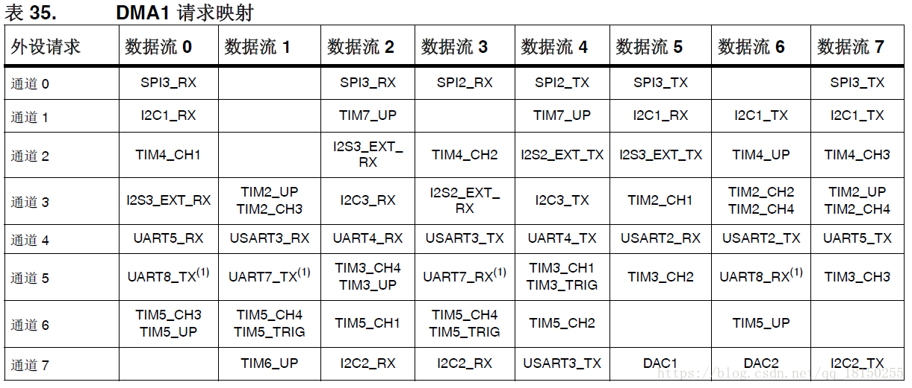

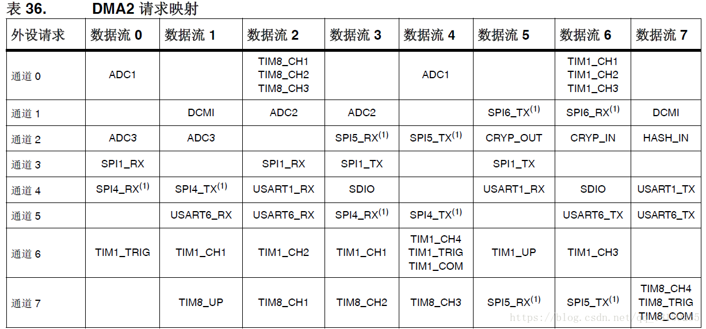

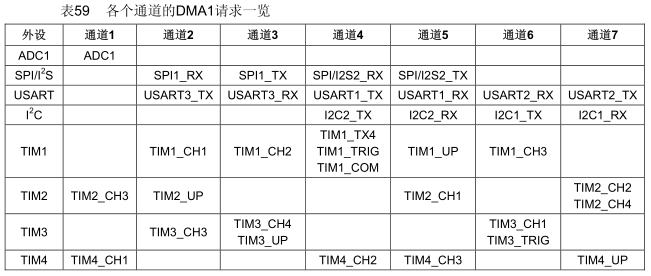

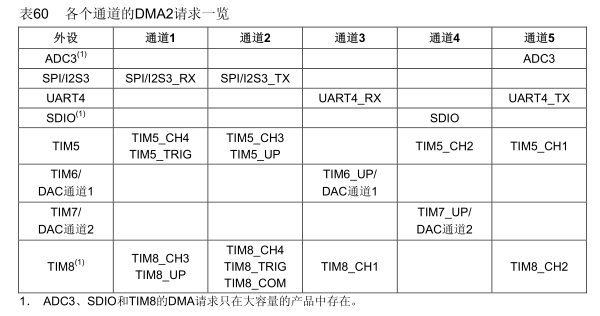

**① 中断类**

DMA_ISR： 　　DMA中断状态寄存器

DMA_IFCR:　　 DMA中断标志位清除寄存器

说明： 				DMA1、DMA2分别有一组寄存器。

**② 控制传输类**

DMA_CCRx:　　　DMA通道x配置寄存器　

**DMA_CNDTRx**:　 DMA通道x数据数量寄存器

**DMA_CPARx**:　　 DMA通道x外设地址寄存器

**DMA_CMARx**:　　DMA通道x内存地址寄存器

说明：    

1> 每一个通道都有一组寄存器。

2> DMA_CPARx、DMA_CMARx是没有差别的，它们都可以存放外设的地址、内存的地址。DMA_CPARx、DMA_CMARx只不过起得名字有差别而已。

**④DMA进行数据传输的必要条件**

- 剩余传输数据量大于0
- DMA通道传输使能
- 通道上DMA数据传输有**事件请求**

**⑤ DMA操作流程**

1. 从外设数据寄存器或者从DMA_CMARx寄存器指定地址的存储器单元执行加载操作。

2. 存数据到外设数据寄存器或者存数据到DMA_CMARx寄存器指定地址的存储器单元。

3. 执行一次DMA_CNDTRx寄存器的递减操作。该寄存器包含未完成的操作数目。

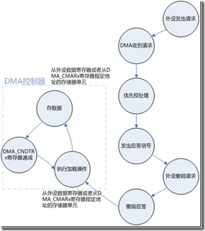

**⑥DMA通道中断位 标志位：**

DMA_FLAG_GL1                    通道 1 全局标志位 
DMA_FLAG_TC1                    通道 1 传输完成标志位
DMA_FLAG_HT1                    通道 1 传输过半标志位
DMA_FLAG_TE1                    通道 1 传输错误标志位 

DMA_IT_GL3                      通道 3 全局中断 
DMA_IT_TC3                      通道 3 传输完成中断 
DMA_IT_HT3                      通道 3 传输过半中断 
DMA_IT_TE3                      通道 3 传输错误中断

#### 3. M2M样例

```c
uint8_t SendBuff[SENDBUFF_SIZE];
uint8_t ReceiveBuff[RXBUFF_SIZE];
/**
  * @brief  USART1 TX DMA 配置，内存到内存
  * @param  无
  * @retval 无
  */
void DMA_Mem2Mem_Config(void)
{
        DMA_InitTypeDef DMA_InitStructure;
    
        /*开启DMA时钟*/
        RCC_AHBPeriphClockCmd(RCC_AHBPeriph_DMA1, ENABLE);    

        /*设置DMA源地址*/
        DMA_InitStructure.DMA_MemoryBaseAddr = (uint32_t)SendBuff;

        /*设置DMA目的地址*/
        DMA_InitStructure.DMA_PeripheralBaseAddr =  (uint32_t)ReceiveBuff;       

        /*方向：从内存SendBuff到内存ReceiveBuff*/        
        DMA_InitStructure.DMA_DIR = DMA_DIR_PeripheralDST;    

        /*传输大小DMA_BufferSize=SENDBUFF_SIZE*/    
        DMA_InitStructure.DMA_BufferSize = SENDBUFF_SIZE;

        /*ReceiveBuff地址自增*/      
        DMA_InitStructure.DMA_PeripheralInc = DMA_PeripheralInc_Enable; 

        /*SENDBUFF_SIZE地址自增*/
        DMA_InitStructure.DMA_MemoryInc = DMA_MemoryInc_Enable;    

        /*ReceiveBuff数据单位*/    
        DMA_InitStructure.DMA_PeripheralDataSize = DMA_PeripheralDataSize_Byte;

        /*SENDBUFF_SIZE数据单位*/
        DMA_InitStructure.DMA_MemoryDataSize = DMA_MemoryDataSize_Byte;     

        /*DMA模式：正常模式*/
        DMA_InitStructure.DMA_Mode = DMA_Mode_Normal ;

        /*优先级：中*/    
        DMA_InitStructure.DMA_Priority = DMA_Priority_Medium;  

        /*使能内存到内存的传输    */
        DMA_InitStructure.DMA_M2M = DMA_M2M_Enable;

        /*配置DMA1的4通道*/           
        DMA_Init(DMA1_Channel4, &DMA_InitStructure);        
        
        /*失能DMA1的4通道，一旦使能就开始传输*/
        DMA_Cmd (DMA1_Channel4,DISABLE); 
} 
```

```c
/**
  * @brief  DMA 中断配置
  * @param  无
  * @retval 无
  */
void DMA_NVIC_Configuration(void)
{                                                                      
    NVIC_InitTypeDef NVIC_InitStructure;            
    
    /* 配置中断源 */
    NVIC_InitStructure.NVIC_IRQChannel = DMA1_Channel4_IRQn;
    NVIC_InitStructure.NVIC_IRQChannelPreemptionPriority = 1;
    NVIC_InitStructure.NVIC_IRQChannelSubPriority = 1;
    NVIC_InitStructure.NVIC_IRQChannelCmd = ENABLE;
    NVIC_Init(&NVIC_InitStructure);    

    /* 配置DMA发送完成后产生中断 */            
    DMA_ITConfig(DMA1_Channel4,DMA_IT_TC,ENABLE);
}
```

```c
/* 启动传输 */
DMA_Cmd (DMA1_Channel4,ENABLE); 
```

**利用DMA实现循环传输**

**方法1：单次传输模式**

　　当传输结束时，触发DMA中断，在中断程序中首先失能DMA通道，然后修改该通道的传输数据量。最后重新使能DMA通道，注意只有失能的DMA通道才能成功修改传输数据量。

**方法2：循环传输模式**

　　当传输结束时，硬件自动会将传输数据量寄存器进行重装，进行下一轮的数据传输。

#### 4. DMA程序接口详解

**过程：**怎样启用DMA？首先，众所周知的是初始化，任何设备启用前都要对其进行初始化，要对模块初始化，还要先了解该模块相应的结构及其函数，以便正确的设置；由于DMA较为复杂，我就只谈谈DMA的基本结构和和常用函数，这些都是ST公司提供在库函数中的。下面代码是一个标准DMA设置，当然实际应用中可根据实际情况进行裁减：

**DMA_DeInit(DMA_Channel1);**

上面这句是给DMA配置通道，根据ST提供的资料，STM3210Fx中DMA包含7个通道（CH1~CH7），也就是说可以为外设或memory提供7座“桥梁”（请允许我使用桥梁一词，我觉得更容易理解，哈哈，别“拍砖”呀！）；

**DMA_InitStructure.DMA_PeripheralBaseAddr = ADC1_DR_Address;**

上面语句中的DMA_InitStructure是一个DMA结构体，在库中有声明了，当然使用时就要先定义了；DMA_PeripheralBaseAddr是该结构体中一个数据成员，给DMA一个起始地址，好比是一个buffer起始地址，数据流程是：外设寄存器à DMA_PeripheralBaseAddàmemory中变量空间（或flash中数据空间等），ADC1_DR_Address是我定义的一个地址变量；

**DMA_InitStructure.DMA_MemoryBaseAddr = (u32)ADC_ConvertedValue;**

上面这句很显然是DMA要连接在Memory中变量的地址，ADC_ConvertedValue是我自己在memory中定义的一个变量；

**DMA_InitStructure.DMA_DIR = DMA_DIR_PeripheralSRC;**

上面的这句是设置DMA的传输方向，就如前面我所说的，DMA可以双向传输，也可以单向传输，这里设置的是单向传输，如果需要双向传输：把DMA_DIR_PeripheralSRC改成DMA_DIR_PeripheralDST即可。

**DMA_InitStructure.DMA_BufferSize = 2;**

上面的这句是设置DMA在传输时缓冲区的长度，前面有定义过了buffer的起始地址：ADC1_DR_Address ，为了安全性和可靠性，一般需要给buffer定义一个储存片区，这个参数的单位有三种类型：Byte、HalfWord、word，我设置的2个half-word(见下面的设置)；32位的MCU中1个half-word占16 bits。

**DMA_InitStructure.DMA_PeripheralInc = DMA_PeripheralInc_Disable;**

上面的这句是设置DMA的外设递增模式，如果DMA选用的通道（CHx）有多个外设连接，需要使用外设递增模式：DMA_PeripheralInc_Enable;我的例子里DMA只与ADC1建立了联系，所以选用DMA_PeripheralInc_Disable

**DMA_InitStructure.DMA_MemoryInc = DMA_MemoryInc_Enable;**

上面的这句是设置DMA的内存递增模式，DMA访问多个内存参数时，需要使用DMA_MemoryInc_Enable，当DMA只访问一个内存参数时，可设置成：DMA_MemoryInc_Disable。

| DMA_DIR                   | 描述                     |
| ------------------------- | ------------------------ |
| DMA_DIR_PeripheralDST     | 外设作为数据传输的目的地 |
| DMA_DIR_PeripheralSRC     | 外设作为数据传输的来源   |
| **DMA_PeripheralInc**     |                          |
| DMA_PeripheralInc_Enable  | 外设地址寄存器递增       |
| DMA_PeripheralInc_Disable | 外设地址寄存器不变       |
| **DMA_MemoryInc**         |                          |
| DMA_MemoryInc_Enable      | 内存地址寄存器递增       |
| DMA_MemoryInc_Disable     | 内存地址寄存器不变       |
|                           |                          |

**DMA_InitStructure.DMA_PeripheralDataSize = DMA_PeripheralDataSize_HalfWord;**

上面的这句是设置DMA在访问时每次操作的数据长度。有三种数据长度类型，前面已经讲过了，这里不在叙述。

**DMA_InitStructure.DMA_MemoryDataSize = DMA_MemoryDataSize_HalfWord;**

与上面雷同。在此不再说明。

| DMA_PeripheralDataSize          | DMA_MemoryDataSize          | 描述           |
| ------------------------------- | --------------------------- | -------------- |
| DMA_PeripheralDataSize_Byte     | DMA_MemoryDataSize_Byte     | 数据宽度为8位  |
| DMA_PeripheralDataSize_HalfWold | DMA_MemoryDataSize_HalfWold | 数据宽度为16位 |
| DMA_PeripheralDataSize_Word     | DMA_MemoryDataSize_Word     | 数据宽度为32位 |

**DMA_InitStructure.DMA_Mode = DMA_Mode_Circular;**

上面的这句是设置DMA的传输模式：连续不断的循环模式，若只想访问一次后就不要访问了（或按指令操作来反问，也就是想要它访问的时候就访问，不要它访问的时候就停止），可以设置成通用模式：DMA_Mode_Normal

**DMA_InitStructure.DMA_Priority = DMA_Priority_High;**

上面的这句是设置DMA的优先级别：可以分为4级：VeryHigh，High,Medium,Low.

**DMA_InitStructure.DMA_M2M = DMA_M2M_Disable;**

上面的这句是设置DMA的2个memory中的变量互相访问的

**DMA_Init(DMA_Channel1,&DMA_InitStructure);**

前面那些都是对DMA结构体成员的设置，在次再统一对DMA整个模块做一次初始化，使得DMA各成员与上面的参数一致。*DMA Enable*

**DMA_Cmd(DMA_Channel1,ENABLE);**

#### 5. 代码样例

要使DMA与外设建立有效连接，这不是DMA自身的事情，是各个外设的事情，每个外设都有 一个xxx_DMACmd (XXXx,Enable ) 函数，如果使DMA与ADC建立有效联系，就使用ADC_DMACmd(ADC1,Enable); （这里我启用了ADC中的ADC1模块）。

##### 5.1 ADC外设到内存

```c
/* DMA1 channel1 configuration ----------------------------------------------*/
DMA_DeInit(DMA1_Channel1);
DMA_InitStructure.DMA_PeripheralBaseAddr = ADC1_DR_Address;
DMA_InitStructure.DMA_MemoryBaseAddr = (uint32_t)&AD_Value;   
//u16  AD_Value[2];   不加&应该也可以  数组名 代表地址
DMA_InitStructure.DMA_DIR = DMA_DIR_PeripheralSRC;
DMA_InitStructure.DMA_BufferSize = 2;      
DMA_InitStructure.DMA_PeripheralInc = DMA_PeripheralInc_Disable;
DMA_InitStructure.DMA_MemoryInc = DMA_MemoryInc_Enable;  
DMA_InitStructure.DMA_PeripheralDataSize = DMA_PeripheralDataSize_HalfWord;
DMA_InitStructure.DMA_MemoryDataSize = DMA_MemoryDataSize_HalfWord;
DMA_InitStructure.DMA_Mode = DMA_Mode_Circular;
DMA_InitStructure.DMA_Priority = DMA_Priority_High;
DMA_InitStructure.DMA_M2M = DMA_M2M_Disable;
DMA_Init(DMA1_Channel1, &DMA_InitStructure);

/* Enable DMA1 channel 1 */
DMA_Cmd(DMA1_Channel1, ENABLE);

/* ADC1 configuration ------------------------------------------------------*/
ADC_InitStructure.ADC_Mode = ADC_Mode_Independent;
ADC_InitStructure.ADC_ScanConvMode = ENABLE;
ADC_InitStructure.ADC_ContinuousConvMode = ENABLE;
ADC_InitStructure.ADC_ExternalTrigConv = ADC_ExternalTrigConv_None;
ADC_InitStructure.ADC_DataAlign = ADC_DataAlign_Right;
ADC_InitStructure.ADC_NbrOfChannel = 2;      //##############     改了
ADC_Init(ADC1, &ADC_InitStructure);
//内部温度传感器  添加这一句 
/* Enable the temperature sensor and vref internal channel */
ADC_TempSensorVrefintCmd(ENABLE);
//##############     改了

//################ Channel 10(电位器)
ADC_RegularChannelConfig(ADC1, ADC_Channel_10, 1, ADC_SampleTime_13Cycles5);
//###### 内部温度传感器  Channel 16 ###################
ADC_RegularChannelConfig(ADC1, ADC_Channel_16, 2, ADC_SampleTime_55Cycles5);

  /* Enable ADC1 DMA */使能ADC1的DMA请求映像
  ADC_DMACmd(ADC1, ENABLE);

/* Enable ADC1 */
ADC_Cmd(ADC1, ENABLE);

/* Enable ADC1 reset calibaration register */   //使用之前一定要校准
ADC_ResetCalibration(ADC1);
/* Check the end of ADC1 reset calibration register */
while(ADC_GetResetCalibrationStatus(ADC1));

/* Start ADC1 calibaration */
ADC_StartCalibration(ADC1);
/* Check the end of ADC1 calibration */
while(ADC_GetCalibrationStatus(ADC1));

/* Start ADC1 Software Conversion */ 
ADC_SoftwareStartConvCmd(ADC1, ENABLE);
```

##### 5.2 单次传输

```c
void MYDMA_Config(DMA_Channel_TypeDef* DMA_CHx, u32 cpar, u32 cmar, u16 cndtr)
{
    RCC_AHBPeriphClockCmd(RCC_AHBPeriph_DMA1, ENABLE); //开启时钟
    
    DMA_DeInit(DMA_CHx); //初始化通道，设置为默认配置

    DMA1_MEM_LEN=cndtr;

    DMA_InitStructure.DMA_PeripheralBaseAddr = cpar;//外设地址

    DMA_InitStructure.DMA_MemoryBaseAddr = cmar;//存储器地址

    DMA_InitStructure.DMA_DIR = DMA_DIR_PeripheralDST;//传输方向，从内存到外设

    DMA_InitStructure.DMA_BufferSize = cndtr;//每次循环传输的数据量值

    DMA_InitStructure.DMA_PeripheralInc = DMA_PeripheralInc_Disable;//外设地址不变

    DMA_InitStructure.DMA_MemoryInc = DMA_MemoryInc_Enable;//内存地址每次加1

    DMA_InitStructure.DMA_PeripheralDataSize = DMA_PeripheralDataSize_Byte;//字节传输

    DMA_InitStructure.DMA_MemoryDataSize = DMA_MemoryDataSize_Byte;//字节传输

    DMA_InitStructure.DMA_Mode = DMA_Mode_Normal;//非循环模式

    DMA_InitStructure.DMA_Priority = DMA_Priority_Medium;//设置优先级--中

    DMA_InitStructure.DMA_M2M = DMA_M2M_Disable;//不是内存到内存

    DMA_Init(DMA_CHx, &DMA_InitStructure);//初始化DMA配置过程
}

//开启一次传输
void MYDMA_Enable(DMA_Channel_TypeDef*DMA_CHx)
{ 
    DMA_Cmd(DMA_CHx, DISABLE );  //关闭DMA     
    DMA_SetCurrDataCounter(DMA_CHx,DMA1_MEM_LEN);//重新确定每次循环要传输的数据量值
    DMA_Cmd(DMA_CHx, ENABLE);  //再次开启DMA
}	

int main()
{
    u8 SendBuff[100]; //存储器数据
    MYDMA_Config(DMA1_Channel4, (u32)&USART1->DR, (u32)SendBuff, 100);//调用函数
    MYDMA_Enable(DMA1_Channel4);  //开启一次传输
}
```

##### 5.3 串口的DMA读写

```c
/* 全局变量以及宏定义 */

#define DEFAULT_BAUD 115200
#define UART_RX_LEN		128

/*串口接收DMA缓存*/
uint8_t Uart_Rx[UART_RX_LEN] = {0};

/*串口发送DMA缓存*/
uint8_t Uart_Send_Buffer[100]={0};

uint8_t Data_Receive_Usart=0;
```

```c
/* DMA和USART的初始化的函数 */
void usart_dma_init(void)
{
    GPIO_InitTypeDef	GPIO_InitStructure;
    USART_InitTypeDef	USART_InitStructure;
    DMA_InitTypeDef		DMA_InitStructure;
    NVIC_InitTypeDef	NVIC_InitStructure;
	
    /*  配置GPIO的模式和IO口 */	
    RCC_APB2PeriphClockCmd(RCC_APB2Periph_GPIOA,ENABLE);  
    GPIO_InitStructure.GPIO_Pin=GPIO_Pin_9;					//TX
    GPIO_InitStructure.GPIO_Speed=GPIO_Speed_50MHz;
    GPIO_InitStructure.GPIO_Mode=GPIO_Mode_AF_PP;			//复用推挽输出
    GPIO_Init(GPIOA,&GPIO_InitStructure);					//初始化串口输入IO
    GPIO_InitStructure.GPIO_Pin=GPIO_Pin_10;				//RX
    GPIO_InitStructure.GPIO_Mode=GPIO_Mode_IN_FLOATING;		//模拟输入
    GPIO_Init(GPIOA,&GPIO_InitStructure); 	
	
    /*初始化串口接收和发送函数*/
    RCC_APB2PeriphClockCmd(RCC_APB2Periph_USART1 , ENABLE);
    USART_InitStructure.USART_WordLength = USART_WordLength_8b;  
    USART_InitStructure.USART_StopBits = USART_StopBits_1;  
    USART_InitStructure.USART_Parity = USART_Parity_No;  
    USART_InitStructure.USART_HardwareFlowControl = USART_HardwareFlowControl_None;  
    USART_InitStructure.USART_Mode = USART_Mode_Rx | USART_Mode_Tx;    
    USART_InitStructure.USART_BaudRate = DEFAULT_BAUD; 
	
    /*初始化串口*/
    USART_Init(USART1,&USART_InitStructure);
	
    /*中断配置*/
    USART_ITConfig(USART1,USART_IT_TC,DISABLE);
    USART_ITConfig(USART1,USART_IT_RXNE,DISABLE);
    USART_ITConfig(USART1,USART_IT_IDLE,ENABLE); 
	
    //配置UART1中断  
    NVIC_PriorityGroupConfig(NVIC_PriorityGroup_3);
    NVIC_InitStructure.NVIC_IRQChannel = USART1_IRQn;              //通道设置为串口1中断  
    NVIC_InitStructure.NVIC_IRQChannelPreemptionPriority = 2;      //中断占先等级0  
    NVIC_InitStructure.NVIC_IRQChannelSubPriority = 1;             //中断响应优先级0  
    NVIC_InitStructure.NVIC_IRQChannelCmd = ENABLE;                //打开中断  
    NVIC_Init(&NVIC_InitStructure);

    /*DMA发送中断设置*/
    NVIC_InitStructure.NVIC_IRQChannel = DMA1_Channel4_IRQn;
    NVIC_InitStructure.NVIC_IRQChannelPreemptionPriority = 3;
    NVIC_InitStructure.NVIC_IRQChannelSubPriority = 2;
    NVIC_InitStructure.NVIC_IRQChannelCmd = ENABLE;
    NVIC_Init(&NVIC_InitStructure);
	
    /*DMA1通道4配置发送*/
    RCC_AHBPeriphClockCmd(RCC_AHBPeriph_DMA1, ENABLE);
    DMA_DeInit(DMA1_Channel4);
    DMA_InitStructure.DMA_PeripheralBaseAddr = (u32)(&USART1->DR);
    DMA_InitStructure.DMA_MemoryBaseAddr = (uint32_t)Uart_Send_Buffer;
    DMA_InitStructure.DMA_DIR = DMA_DIR_PeripheralDST;
    DMA_InitStructure.DMA_BufferSize = 100;
    DMA_InitStructure.DMA_PeripheralInc = DMA_PeripheralInc_Disable;
    DMA_InitStructure.DMA_MemoryInc = DMA_MemoryInc_Enable;
    DMA_InitStructure.DMA_PeripheralDataSize = DMA_PeripheralDataSize_Byte;
    DMA_InitStructure.DMA_MemoryDataSize = DMA_PeripheralDataSize_Byte;
    DMA_InitStructure.DMA_Mode = DMA_Mode_Normal;
    DMA_InitStructure.DMA_Priority = DMA_Priority_High;
    DMA_InitStructure.DMA_M2M = DMA_M2M_Disable;
    DMA_Init(DMA1_Channel4,&DMA_InitStructure);
    DMA_ITConfig(DMA1_Channel4,DMA_IT_TC,ENABLE);
    //DMA_Cmd(DMA1_Channel4, ENABLE);//使能通道4，一般发送的时候再使能
 
    /*DMA1通道5配置接收*/
    RCC_AHBPeriphClockCmd(RCC_AHBPeriph_DMA1, ENABLE);
    DMA_DeInit(DMA1_Channel5);
    DMA_InitStructure.DMA_PeripheralBaseAddr = (u32)(&USART1->DR);
    DMA_InitStructure.DMA_MemoryBaseAddr = (uint32_t)Uart_Rx;
    DMA_InitStructure.DMA_DIR = DMA_DIR_PeripheralSRC;
    DMA_InitStructure.DMA_BufferSize = UART_RX_LEN;
    DMA_InitStructure.DMA_PeripheralInc = DMA_PeripheralInc_Disable;
    DMA_InitStructure.DMA_MemoryInc = DMA_MemoryInc_Enable;
    DMA_InitStructure.DMA_PeripheralDataSize = DMA_PeripheralDataSize_Byte;
    DMA_InitStructure.DMA_MemoryDataSize = DMA_MemoryDataSize_Byte;
    DMA_InitStructure.DMA_Mode = DMA_Mode_Normal;
    DMA_InitStructure.DMA_Priority = DMA_Priority_VeryHigh;
    DMA_InitStructure.DMA_M2M = DMA_M2M_Disable;
    DMA_Init(DMA1_Channel5,&DMA_InitStructure);
 
    /*使能通道5*/
    DMA_Cmd(DMA1_Channel5,ENABLE);
       
    //采用DMA方式发送
    USART_DMACmd(USART1,USART_DMAReq_Tx,ENABLE);
	
    //采用DMA方式接收
    USART_DMACmd(USART1,USART_DMAReq_Rx,ENABLE);
	
    //启动串口  
    USART_Cmd(USART1, ENABLE);
}
```

```c
/* DMA发送使能函数 */
/**@ brief 使能发送数据
 *
 * 启动DMA数据发送功能
 * 
 * @param size表示需要发送的DMA中数据的个数
 */
void uart_dma_send_enable(uint16_t size)
{
    DMA1_Channel4->CNDTR = (uint16_t)size; 
    DMA_Cmd(DMA1_Channel4, ENABLE);       
}
```

```c
/**@ brief串口1接收中断
 *
 * 收到一帧数据进入一次，进行DMA的读取
 * 
 */
void USART1_IRQHandler(void)                               
{   
    uint32_t temp = 0;
    uint16_t i = 0;
	
    if(USART_GetITStatus(USART1, USART_IT_IDLE) != RESET)
    {
        //USART_ClearFlag(USART1,USART_IT_IDLE);
        temp = USART1->SR;
        temp = USART1->DR; //清USART_IT_IDLE标志
		
        DMA_Cmd(DMA1_Channel5,DISABLE);
 
        temp = UART_RX_LEN - DMA_GetCurrDataCounter(DMA1_Channel5);
        for (i = 0;i < temp;i++)
        {
            Data_Receive_Usart = Uart_Rx[i];
			
            //+++对收到的数据加一后回发出去		
            Uart_Send_Buffer[i]=Data_Receive_Usart+1;						
            uart_dma_send_enable(temp);
            //+++			
        }
		
        //设置传输数据长度
        DMA_SetCurrDataCounter(DMA1_Channel5,UART_RX_LEN);
		
        //打开DMA
        DMA_Cmd(DMA1_Channel5,ENABLE);
    } 
} 
```

```c
/**@ brief DMA发送中断
 *
 * 发送数据，将DMA中的数据发送出去
 * 
 */
void DMA1_Channel4_IRQHandler(void)
{
    if(DMA_GetITStatus(DMA1_FLAG_TC4)==SET)
    {
        DMA_ClearFlag(DMA1_FLAG_GL4);        
        DMA_Cmd(DMA1_Channel4, DISABLE);  
    }
}
```

##### 5.4 代码片段(参考)

```c
void DMA_UART_TX(void)
{
    DMA_InitTypeDef DMA_InitStructure;	// DMA_InitStructure <==> DMA_IniStru
    RCC_AHB1PeriphClockCmd(RCC_AHB1Periph_DMA2, ENABLE);    //开启DMA时钟 
    DMA_DeInit(DMA2_Stream7);
    while(DMA_GetCmdStatus(DMA2_Stream7) != DISABLE)
    	{} //等待stream可配置，即DMAy_SxCR.EN变为0
    
    //配置Stream
    DMA_IniStru.DMA_Channel = DMA_Channel_4;          //从8个channel中选择一个
    DMA_IniStru.DMA_PeripheralBaseAddr = (u32)&USART1->DR;            //外设地址
    DMA_IniStru.DMA_Memory0BaseAddr = (u32)SendBuff;    //存储器0地址，双缓存模式还要使用M1AR
    DMA_IniStru.DMA_DIR = DMA_DIR_MemoryToPeripheral;            //存储器到外设模式
    DMA_IniStru.DMA_BufferSize = SENDBUFF_SIZE;         //数据传输量，以外设数据项为单位 
    DMA_IniStru.DMA_PeripheralInc = DMA_PeripheralInc_Disable;        //外设地址保持不变
    DMA_IniStru.DMA_MemoryInc = DMA_MemoryInc_Enable;                 //存储器地址递增
    DMA_IniStru.DMA_PeripheralDataSize = DMA_PeripheralDataSize_Byte; //外设数据位宽:8位
    DMA_IniStru.DMA_MemoryDataSize = DMA_MemoryDataSize_Byte;         //存储器数据位宽:8位
    DMA_IniStru.DMA_Mode = DMA_Mode_Normal;               //普通模式(与循环模式对应)
    DMA_IniStru.DMA_Priority = DMA_Priority_Medium;                   //中等优先级
    DMA_IniStru.DMA_FIFOMode = DMA_FIFOMode_Disable;                  //禁止FIFO模式         
    DMA_IniStru.DMA_FIFOThreshold = DMA_FIFOThreshold_Full;
    DMA_IniStru.DMA_MemoryBurst = DMA_MemoryBurst_Single;             //单次传输
    DMA_IniStru.DMA_PeripheralBurst = DMA_PeripheralBurst_Single;     //单次传输
    DMA_Init(DMA2_Stream7, &DMA_IniStru);

}
```

```c
void DMA_TX(uint8_t *tx_buffer,uint16_t length)
{
    DMA_InitTypeDef DMA_InitStructure;
    DMA_Cmd(DMA2_Stream7, DISABLE);                             //关闭DMA通道
    DMA_SetCurrDataCounter(DMA2_Stream7, (uint16_t)length);     //设置传输字节数
    DMA2_Stream7->CR |= (1 << 10);                              //发送DMA流的地址不自增
    DMA2_Stream7->M0AR = (uint32_t)tx_buffer;                   //设置接收和发送的内存地址
    DMA_Cmd(DMA2_Stream7, ENABLE);                              //打开DMA通道
    USART_DMACmd(USART1,USART_DMAReq_Tx,ENABLE);                //使能串口1的DMA发送
    while( DMA_GetFlagStatus(DMA2_Stream7, DMA_FLAG_TCIF7) == RESET);	//等待传输完成 
    DMA_Cmd(DMA2_Stream7, DISABLE);                             //关闭DMA通道  
    DMA_ClearFlag(DMA2_Stream7, DMA_FLAG_TCIF7);                //清除DMA传输完成标志
}
```

```c
void DMA2_Channel7_IRQHandler(void)  
{   
   //判断是否为DMA发送完成中断
    if(DMA_GetFlagStatus(DMA2_Stream7,DMA_FLAG_TCIF7)==SET)
    {
        DMA_ClearFlag(DMA2_Stream7,DMA_FLAG_TCIF7);
    }               
}  
```


### 三、ADC

Analog-to-Digital Converter的缩写。指模/数转换器或者模拟/数字转换器。是指将**连续变量的模拟信号转换为离散的数字信号的器件。**

#### 0. ADC特征及说明

* 12位逐次逼近型的模拟数字转换器；

* 最多带3个ADC控制器，可以单独使用，也可以使用双重模式提高采样率；

* 最多支持23个通道，可最多测量21个外部和2个内部信号源；

* 支持单次和连续转换模式；

* 转换结束，注入转换结束，和发生模拟看门狗事件时产生中断；

* 通道0到通道n的自动扫描模式；

* 自动校准；

* 采样间隔可以按通道编程；

* 规则通道和注入通道均有外部触发选项；

* 转换结果支持左对齐或右对齐方式存储在16位数据寄存器；

* ADC转换时间：最大转换速率 1us（最大转换速度为1MHz，在ADCCLK=14M，采样周期为1.5个ADC时钟下

  得到）；

* ADC供电要求：2.4V-3.6V；

* ADC输入范围：VREF- ≤  VIN  ≤  VREF+。

**STM32F10x系列芯片ADC通道和引脚对应关系**

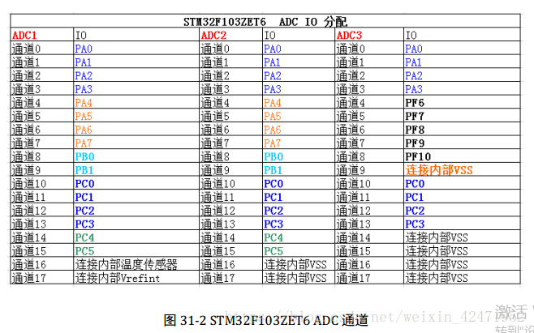

**ADC引脚：**

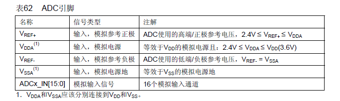

一般情况下，**VDD是3.3V，VSS接地，相对应的，VDDA是3.3V，VSSA也接地，模拟输入信号不要超过VDD（3.3V）。**

**ADC时钟配置**

框图中标注的来自ADC预分频器的ADCCLK是ADC模块的时钟来源。通常，*由时钟控制器提供的ADCCLK时钟和PCLK2（APB2时钟）同步。RCC控制器为ADC时钟提供一个专用的可编程预分频器。*

**ADC中断事件的具体类型有三种**

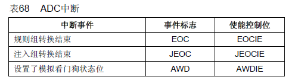

*注： ADC1和ADC2的中断映射在同一个中断向量上，而ADC3的中断有自己的中断向量。*

#### 1. ADC转换

STM32的ADC的各通道可以组成规则通道组或注入通道组，但是在转换方式还可以有**单次转换、连续转换、扫描转换模式**。

* 单次转换模式。单次转换模式下，ADC只执行一次转换。
* 连续转换模式。在连续转换模式中，当前面ADC转换一结束马上就启动另一次转换。
* 扫描模式。此模式用来扫描一组模拟通道。

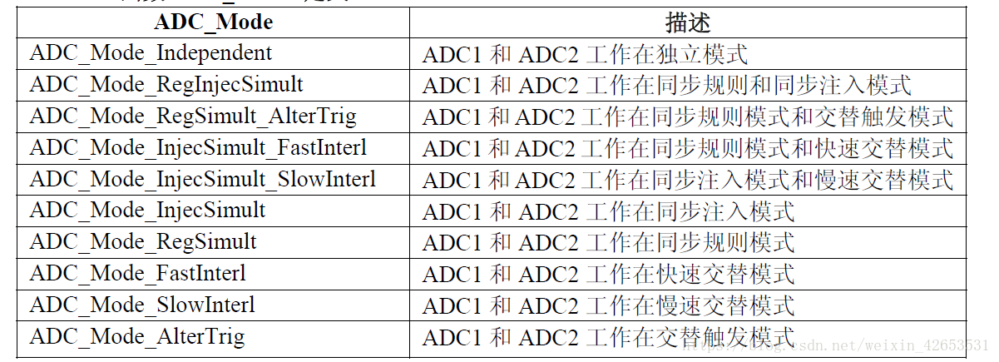

**数据对齐**

由于STM32的ADC是**12位逐次逼近型的模拟数字转换器，而数据保存在16位寄存器中**。所以，ADC_CR2寄存器中的ALIGN位选择转换后数据储存的对齐方式。数据可以左对齐或右对齐。

**通道采样时间**
ADC使用若干个ADC_CLK周期对输入电压采样，采样周期数目可以通过ADC_SMPR1和ADC_SMPR2寄存器中的SMP[2:0]位更改。每个通道可以分别用不同的时间采样。

总转换时间如下计算：

$T_{CONV}$ = 采样时间 + 12.5个周期==(固定)==

例如：当ADCCLK=14MHz，采样时间为1.5周期时，TCONV =1.5+12.5=14周期=1μs。

故而，ADC的最小采样时间1us（ADC时钟=14MHz，采样周期为1.5周期下得到）。

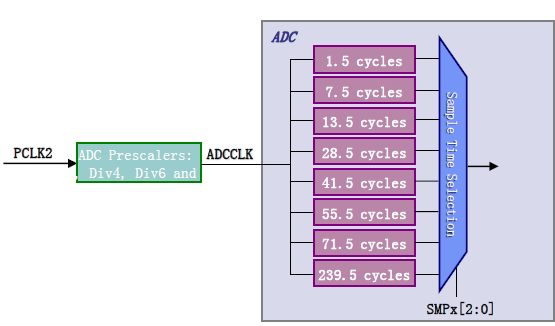

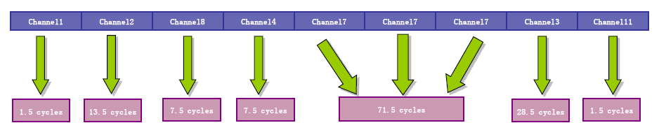

```c
typedef struct
{
    uint32_t ADC_Mode;                      //设置ADC模式-->独立模式
    FunctionalState ADC_ScanConvMode;       //设置是否开启扫描模式 --->否
    FunctionalState ADC_ContinuousConvMode; //设置是否开启连续转换模式 ---->否
    uint32_t ADC_ExternalTrigConv;          //设置启动规则转换组转换模式---->软件触发              
    uint32_t ADC_DataAlign;                 //设置数据对齐方式----->右对齐
    uint8_t ADC_NbrOfChannel;    //设置规则序列的长度---->顺序进行规则转换的ADC通道数目1
}ADC_InitTypeDef;
```


#### 2. 代码样例

##### 2.1 单电平转换

```c
#include "bsp_adc.h"
 
static void ADCx_GPIO_Config(void)
{
	GPIO_InitTypeDef GPIO_InitStructure;
	
	// 打开 ADC IO端口时钟
	ADC_GPIO_APBxClock_FUN ( ADC_GPIO_CLK, ENABLE );
	
	// 配置 ADC IO 引脚模式
	// 必须为模拟输入
	GPIO_InitStructure.GPIO_Pin = ADC_PIN;
	GPIO_InitStructure.GPIO_Mode = GPIO_Mode_AIN;
	
	// 初始化 ADC IO
	GPIO_Init(ADC_PORT, &GPIO_InitStructure);	
}
 
static void ADCx_Mode_Config(void)
{
	ADC_InitTypeDef ADC_InitStruct;
	
	ADC_APBxClock_FUN ( ADC_CLK, ENABLE );
	ADC_InitStruct.ADC_Mode = ADC_Mode_Independent;
	ADC_InitStruct.ADC_ScanConvMode = DISABLE;
	ADC_InitStruct.ADC_ContinuousConvMode = ENABLE;	
	ADC_InitStruct.ADC_ExternalTrigConv = ADC_ExternalTrigConv_None;
	ADC_InitStruct.ADC_DataAlign = ADC_DataAlign_Right;
	ADC_InitStruct.ADC_NbrOfChannel = 1;
	
	ADC_Init(ADC_x, &ADC_InitStruct);
	
	RCC_ADCCLKConfig(RCC_PCLK2_Div8);
	ADC_RegularChannelConfig(ADC_x, ADC_CHANNEL, 1, ADC_SampleTime_55Cycles5);
	
	ADC_ITConfig(ADC_x, ADC_IT_EOC, ENABLE);
	ADC_Cmd(ADC_x, ENABLE);
	
  // ADC开始校准
	ADC_StartCalibration(ADC_x);
	// 等待校准完成
	while(ADC_GetCalibrationStatus(ADC_x));
	
	ADC_SoftwareStartConvCmd(ADC_x, ENABLE);
}
 
static void ADC_NVIC_Config(void)
{
  NVIC_InitTypeDef NVIC_InitStructure;
	// 优先级分组
	NVIC_PriorityGroupConfig(NVIC_PriorityGroup_1);
 
  // 配置中断优先级
  NVIC_InitStructure.NVIC_IRQChannel = ADC_IRQ;
  NVIC_InitStructure.NVIC_IRQChannelPreemptionPriority = 1;
  NVIC_InitStructure.NVIC_IRQChannelSubPriority = 1;
  NVIC_InitStructure.NVIC_IRQChannelCmd = ENABLE;
  NVIC_Init(&NVIC_InitStructure);
}
 
void ADCx_Init(void)
{
	ADC_NVIC_Config();
	ADCx_GPIO_Config();
	ADCx_Mode_Config();
}
```

```c
 
/**
  ******************************************************************************
  * @file    main.c
  * @author  fire
  * @version V1.0
  * @date    2013-xx-xx
  * @brief   串口中断接收测试
  ******************************************************************************
  * @attention
  *
  * 实验平台:秉火 F103-霸道 STM32 开发板 
  * 论坛    :http://www.firebbs.cn
  * 淘宝    :http://firestm32.taobao.com
  *
  ******************************************************************************
  */ 
 
 
#include "stm32f10x.h"
#include "bsp_usart.h"
#include "bsp_adc.h"
 
 
extern __IO uint16_t ADC_ConvertedValue;
 
// 局部变量，用于保存转换计算后的电压值 	 
float ADC_ConvertedValueLocal;        
 
// 软件延时
void Delay(__IO uint32_t nCount)
{
  for(; nCount != 0; nCount--);
} 
 
/**
  * @brief  主函数
  * @param  无
  * @retval 无
  */
int main(void)
{	
  /*初始化USART 配置模式为 115200 8-N-1，中断接收*/
  USART_Config();
	printf("欢迎使用秉火STM32开发板\n\n\n\n");
	
	ADCx_Init();
	
  while(1)
	{	
		ADC_ConvertedValueLocal =(float) ADC_ConvertedValue/4096*3.3; 
	
		printf("\r\n The current AD value = 0x%04X \r\n",ADC_ConvertedValue); 
		printf("\r\n The current AD value = %f V \r\n",ADC_ConvertedValueLocal); 
		printf("\r\n\r\n");
 
		Delay(0xffffee); 
	}	
}
 
// 作业
 
// 1-把程序改成 ADC1/3
// 2-换成其他的通道试一试

/*********************************************END OF FILE**********************/
```

```c
void ADC_IRQHandler(void)
{
	if( ADC_GetITStatus(ADC_x, ADC_IT_EOC) == SET)
  {
		ADC_ConvertedValue = ADC_GetConversionValue(ADC_x);
	}
	ADC_ClearITPendingBit(ADC_x, ADC_IT_EOC);
}
```

##### 2.2 ADC-DMA转换

```c
// 第二步是---配置相应ADC转换的GPIO口----这里使用PC0--PC1

static void ADC1_GPIO_Config(void)
{
    GPIO_InitTypeDef GPIO_InitStructure;

    RCC_AHBPeriphClockCmd(RCC_AHBPeriph_DMA1, ENABLE);  //打开DMA1的时钟
    RCC_APB2PeriphClockCmd(RCC_APB2Periph_ADC1 | RCC_APB2Periph_GPIOC, ENABLE);

    GPIO_InitStructure.GPIO_Pin = GPIO_Pin_0 |GPIO_Pin_1;
    GPIO_InitStructure.GPIO_Mode = GPIO_Mode_AIN;  //模拟输入
    GPIO_Init(GPIOC, &GPIO_InitStructure); 
}
```

```c
// 第三步是---配置ADC的DMA----配置ADC通道等---

#define ADC1_DR_Address    ((u32)0x40012400+0x4c)  //外设地址
__IO uint16_t ADC_ConvertedValue[2];  //内存数组

static void ADC1_Mode_Config(void)
{
    DMA_InitTypeDef DMA_InitStructure;
    ADC_InitTypeDef ADC_InitStructure;

    DMA_DeInit(DMA1_Channel1);  
    //---------------ADC的DMA配置--------------------
    DMA_InitStructure.DMA_PeripheralBaseAddr = ADC1_DR_Address;  //ADC1地址---代表ADC1保存转换值的寄存器
    DMA_InitStructure.DMA_MemoryBaseAddr = (u32)&ADC_ConvertedValue;  //内存地址---用来保存DMA传输过来的ADC转换值----后面直接使用的变量地址
    DMA_InitStructure.DMA_DIR = DMA_DIR_PeripheralSRC;  //外设为数据源
    DMA_InitStructure.DMA_BufferSize = 2;  //传输总数据---2通道需要传输2个数据
    DMA_InitStructure.DMA_PeripheralInc = DMA_PeripheralInc_Disable;  //外设地址固定
    DMA_InitStructure.DMA_MemoryInc = DMA_MemoryInc_Enable;  //内存地址自增---总体表示始终从外设ADC1地址处取值---依次保存到连续的两个内存变量中---
    DMA_InitStructure.DMA_PeripheralDataSize = DMA_PeripheralDataSize_HalfWord;   //外设传输数据单元---半字16位
    DMA_InitStructure.DMA_MemoryDataSize = DMA_MemoryDataSize_HalfWord;  //内存传输数据单元---半字16位
    DMA_InitStructure.DMA_Mode = DMA_Mode_Circular;  //循环模式---2个数据依次循环接收从外设ADC1传输过来的ADC值---
    DMA_InitStructure.DMA_Priority = DMA_Priority_High;  //高优先级
    DMA_InitStructure.DMA_M2M = DMA_M2M_Disable;  //禁止内存传内存
    DMA_Init(DMA1_Channel1, &DMA_InitStructure);

    DMA_Cmd(DMA1_Channel1, ENABLE);  //再次打开DMA1

    //------------ADC模式配置------------------------
    ADC_InitStructure.ADC_Mode = ADC_Mode_Independent;  //独立模式----还有很多模式---这个比较常见
    ADC_InitStructure.ADC_ScanConvMode = ENABLE ;   //扫描模式---采集多通道使用----本程序采集2通道---所以扫描模式
    ADC_InitStructure.ADC_ContinuousConvMode = ENABLE;  //连续转换模式---不难理解---就是不停地采集---一次接一次
    ADC_InitStructure.ADC_ExternalTrigConv = ADC_ExternalTrigConv_None;  //不使用外部触发转换---触发分为外部触发---比如中断与定时器。软件触发---后面有专用函数
    ADC_InitStructure.ADC_DataAlign = ADC_DataAlign_Right;   //采集的数据右对齐---方便计算
    ADC_InitStructure.ADC_NbrOfChannel = 2;  //总共需要转换的通道个数---这里2个
    ADC_Init(ADC1, &ADC_InitStructure);

    RCC_ADCCLKConfig(RCC_PCLK2_Div8);  //配置ADC转换时钟---PCLK2的8分频
    //下面这个函数比较重要----配置ADC的通道与采样周期---前面说的PC0与PC1对应的ADC通道分别是--10与11。采集周期也有几种。
    ADC_RegularChannelConfig(ADC1, ADC_Channel_10, 1, ADC_SampleTime_55Cycles5);
    ADC_RegularChannelConfig(ADC1, ADC_Channel_11, 2, ADC_SampleTime_55Cycles5);

    ADC_DMACmd(ADC1, ENABLE);  //打开DMA1的ADC1 
    ADC_Cmd(ADC1, ENABLE);  //打开ADC1

    ADC_ResetCalibration(ADC1);  //复位校准寄存器
    while(ADC_GetResetCalibrationStatus(ADC1));  //等待校准寄存器复位完成

    ADC_StartCalibration(ADC1);  //ADC校准
    while(ADC_GetCalibrationStatus(ADC1));  //校准完成

    ADC_SoftwareStartConvCmd(ADC1, ENABLE);  //软件触发转换
}
```

```c
// 第四部分是---在硬件上使用了一个通道切换芯片----CD4052----由PC2---PC3控制通道的选择CD4052切换控制GPIO配置----

void GPIO_Config(void)
{
    GPIO_InitTypeDef GPIO_InitStructure;

    RCC_APB2PeriphClockCmd(RCC_APB2Periph_GPIOC, ENABLE);

    GPIO_InitStructure.GPIO_Pin = GPIO_Pin_2|GPIO_Pin_3;
    GPIO_InitStructure.GPIO_Mode = GPIO_Mode_Out_PP;  //推完输出
    GPIO_InitStructure.GPIO_Speed = GPIO_Speed_50MHz;
    GPIO_Init(GPIOC, &GPIO_InitStructure);
}
```

```c
// 第五部分是---主函数-----

extern __IO uint16_t ADC_ConvertedValue[2];  //声明外部变量
uint16_t My_ADC[2];  //求平均值

int main(void)
{ 
    u8 i,led=0x01;

    USART1_Config();


    ADC1_GPIO_Config();
    ADC1_Mode_Config();


    while (1)
    {
        My_ADC[0]=0;
        My_ADC[1]=0;


        for(i=0;i<10;i++)  
        {
            My_ADC[0]+=ADC_ConvertedValue[0];
            My_ADC[1]+=ADC_ConvertedValue[1];
        }
        My_ADC[0]=My_ADC[0]/10;   //采集10次求平均值
        My_ADC[1]=My_ADC[1]/10;

        ADC_ConvertedValueLocal =(float) My_ADC[0]/4096*3.3;   //转换为电压值

        printf("\r\n The current AD---0 value = 0x%04X \n", My_ADC[0]); 
        printf("The current AD---0 value = %f V \n",ADC_ConvertedValueLocal); 

        ADC_ConvertedValueLocal =(float) My_ADC[1]/4096*3.3; 

        printf("The current AD---1 value = 0x%04X \n", My_ADC[1]); 
        printf("The current AD---1 value = %f V \n",ADC_ConvertedValueLocal);  
    }
}
```

##### 2.3 单次独立模式

```c
void Adc_Init(void)
{

    ADC_InitTypeDef ADC_InitStructure;
    GPIO_InitTypeDef GPIO_InitStructure;

    /* Enable ADC1 and GPIOA clock */
    RCC_APB2PeriphClockCmd(RCC_APB2Periph_ADC1 | RCC_APB2Periph_GPIOA, ENABLE);

    RCC_ADCCLKConfig(RCC_PCLK2_Div6);//12MHZ 

    /* Configure PA.1 (ADC Channel) as analog input -------------------------*/
    GPIO_InitStructure.GPIO_Pin = GPIO_Pin_1;
    GPIO_InitStructure.GPIO_Mode = GPIO_Mode_AIN;
    GPIO_Init(GPIOA, &GPIO_InitStructure);

    //ADC_DeInit(ADC1);//在这里复位被我注释掉了、至于为什么，我待会会说

    /* ADC1 configuration ------------------------------------------------------*/
    ADC_InitStructure.ADC_Mode = ADC_Mode_Independent;//这里对应上面所讲的配置，在这里就不给出注释了
    ADC_InitStructure.ADC_ScanConvMode = DISABLE;
    ADC_InitStructure.ADC_ContinuousConvMode = DISABLE;
    ADC_InitStructure.ADC_ExternalTrigConv = ADC_ExternalTrigConv_None;
    ADC_InitStructure.ADC_DataAlign = ADC_DataAlign_Right;
    ADC_InitStructure.ADC_NbrOfChannel = 1;
    ADC_Init(ADC1, &ADC_InitStructure);

    /* Enable ADC1 *///知道我为啥要在上面提醒大家要用老外的方式来看了吧、因为这里的注释都是用英文的
    //请不要以为我装逼，我这样做是有原因的、、原因我待会会说、你也会明白我最初的标题为何那样写

    ADC_Cmd(ADC1, ENABLE);

    /* Enable ADC1 reset calibration register */   
    ADC_ResetCalibration(ADC1);
    /* Check the end of ADC1 reset calibration register */
    while(ADC_GetResetCalibrationStatus(ADC1));

    /* Start ADC1 calibration */
    ADC_StartCalibration(ADC1);
    /* Check the end of ADC1 calibration */
    while(ADC_GetCalibrationStatus(ADC1));
}
```

```c
u16 Get_val(u8 ch)
{
    u16 DataValue; //又是英文注释、、啊哈    
    /* ADC1 regular channel14 configuration */ 
    ADC_RegularChannelConfig(ADC1, ch, 1, ADC_SampleTime_239Cycles5);

    /* Start ADC1 Software Conversion */ 
    ADC_SoftwareStartConvCmd(ADC1, ENABLE);

    /* Test if the ADC1 EOC flag is set or not */ 

    while(!ADC_GetFlagStatus(ADC1, ADC_FLAG_EOC));
    //FlagStatus Status;
    //Status = ADC_GetFlagStatus(ADC1, ADC_FLAG_EOC);
    //while(!Status);---->这样做实现不了、请注意
    /*Returns the ADC1 Master data value of the last converted channel*/
    DataValue = ADC_GetConversionValue(ADC1); 
    return DataValue; 
} 

u16 ADC_Get_aveg(u8 ch,u8 n) 
{ 
    u32 ad_sum = 0; 
    u8 i; 
    for(i=0;i<n;i++) 
    { 
        ad_sum += Get_val(ch);
        delay_ms(5); 
    } 
    return (ad_sum / n);
}

adcx=ADC_Get_aveg(ADC_Channel_1,10);//获取AD数值（0~4095）

temp=(float)adcx*(3.3/4096);//获取相应的电压值
```

#### 3. 另解

##### 3.0 预备知识
**RCC： **
这个是用来设置时钟的，比如我可以设置我的系统时钟频率等 
**TIM： **
顾名思义，是timer的缩写，是定时计数器. 
**RCC 和 TIM的区别： **
RCC用来设置我32的系统时钟频率或者是一些其他硬件的时钟频率 
而TIM是在某个时钟频率下工作的一个计数器，这个频率可以来自RCC的设置，也可以来自外部 
注意，RCC设置频率的来源也可以是外部或者内部（内部不准确，我们一般不用，这也是为什么要外接8MHz晶振的原因），而后产生一个内部时钟频率送给TIM

为什么要说时钟呢？因为我要使ADC的采样率达到最大，也就是1MHz的采样率，而达到这样的采样率就需要设置ADC的时钟频率，ADC最大时钟频率是14MHz。这两者什么关系呢？ 

后面介绍，总之先知道要达到最大的采样率就需要设置我们的时钟

##### 3.1 配置RCC时钟

首先我们应该用外部接的8MHz晶振来做时钟源。外部高速晶振：HSE；内部高速晶振：HSI 
用 `void RCC_HSEConfig(u32 RCC_HSE)` 这个函数来启动，内部参数设置 `RCC_HSE_ON`

```c
RCC_HSEConfig(RCC_HSE_ON);//开启8MHz外部晶振
```

然后检测外部高速晶振是否正常启动 
用 `RCC_WaitForHSEStartUp();` 这个函数， 这个函数返回 SUCCESS 这个参数则代表正常启动

```c
ErrorStatus HSEStartUpStatus;//设置标志位
HSEStartUpStatus = RCC_WaitForHSEStartUp();
if(HSEStartUpStatus == SUCCESS)//若外部晶振正常启动
{
/* Add here PLL ans system clock config */
}
```

这时候我们要通过PLL锁相环来使 外部接的晶振作为输入，输出另一个稳定频率的时钟信号 
即我们要用PLL来进行倍频 
这里我们设置PLL输出 = 8MHz * 7 = 56MHz （那就是要进行7倍频）

```c
//RCC_PLLSource_HSE_Div1 意思是 PLL的输入时钟 = HSE时钟频率
//RCC_PLLMul_7 表示 7倍频
RCC_PLLConfig(RCC_PLLSource_HSE_Div1, RCC_PLLMul_7);
// 然后输出:
RCC_PLLCmd(ENABLE);//PLL输出使能
while(RCC_GetFlagStatus(RCC_FLAG_PLLRDY) == RESET);//等待PLL输出
// 到目前为止我们得到一个56MHz的时钟频率
// 然后我们要利用PLL输出的这个频率作为我们STM32的系统时钟

RCC_SYSCLKConfig(RCC_SYSCLKSource_PLLCLK);//设置系统时钟为56MHz
while(0x08 != RCC_GetSYSCLKSource());//等待系统时钟被正确设置
```

##### 3.2 AHB时钟

接下来的任务就是要设置AHB时钟了。`AHB(Advanced High performance Bus)`高级高性能总线 或者我们叫它 系统总线 。就是我们要设置STM32内部总线的时钟频率 

而且AHB又有高低速之分，也就是说我们要设置两个时钟分别给高速AHB和低速AHB 

AHB掌管着DMA时钟，SRAM时钟和FLITF时钟，它并不直接管ADC的时钟，那我们为什么还要设置它呢？

```c
RCC_HCLKConfig(RCC_SYSCLK_Div1);//设置AHB时钟（HCLK）
RCC_PCLK2Config(RCC_HCLK_Div1);//设置高速AHB时钟 PLCK2为56MHz (最大72MHz)
RCC_PCLK1Config(RCC_HCLK_Div2);//设置低速AHB时钟 PLCK1为28MHz (最大36MHz)
//注：这里面Div1表示一倍分频，也就是不分频。 PLCK2 = HCLK = 56MHz
//Div2表示2倍分频 PLCK1 = HCLK / 2 = 28MHz
```

总线设置好了我们就终于可以开始设置ADC的时钟频率了 
但这里又要提到一个名词APB 
APB(Advanced Peripheral Bus)外围总线 
这个才是直接管ADC时钟的总线，APB又分APB1 和 APB2 
==APB1管TIMx (x = 2， 3， 4 ……) WWDG，SPI2， USART2， USAT3， I2C， CAN的时钟 
APB2管TIM1， GPIOx， ADC1， ADC2， SPI1， USART1的时钟==

很明显我们只需要对APB2的ADC功能进行设置就行

```c
//使能ADC & GPIOA
//这里我用ADC1采样，PA0端口，具体看各个芯片的数据手册
RCC_APB2PeriphClockCmd(RCC_APB2Periph_GPIOA | RCC_APB2Periph_ADC1, ENABLE);
```

##### 3.3 ADC时钟

现在来设置ADC了！！！ 
来上函数 void ADC_ADCCLKConfig(u32 RCC_ADCCLKSource) 
看看这个参数 RCC_ADCCLKSource: 定义ADCCLK，该时钟源自APB2时钟（PCLK2）
懂了吧，为啥非要对AHB进行设置，ADC的时钟来源于AHB的PLCK2

```c
//RCC_PCLK2_Div4 意思是 ADC时钟 = PCLK2 / 4 = 14MHz
RCC_ADCCLKConfig(RCC_PCLK2_Div4);//ADC最大时钟频率是14MHz
```

至此，我们就对ADC时钟设置完了，一般来说，我们的STM32系统时钟都是设置的是72MHz，但这里我们为什么非要费那么老劲来设置RCC呢？还是上面这个函数，它的参数一共就4个 
Div2 Div4 Div6 Div8 也就是2 4 6 8 分频。 

72MHz并不能通过这四个分频得到14MHz最大时钟，所以我们特地设置56MHz，通过4分频，产生14MHz的ADC最大时钟频率。72MHz最大能做到 72 / 6 = 12MHz

##### 3.1-3.3完整代码

```c
static void RCC_ConfigInitail()
{
    ErrorStatus HSEStartUpStatus;
    FlagStatus Status;

    //RCC配置
    RCC_DeInit();//重置
    RCC_HSEConfig(RCC_HSE_ON);//外部8MHz晶振启动！
    HSEStartUpStatus = RCC_WaitForHSEStartUp();
    if(SUCCESS == HSEStartUpStatus)//若启动成功
    {
        RCC_PLLConfig(RCC_PLLSource_HSE_Div1, RCC_PLLMul_7);//56MHz PLL输出
        RCC_PLLCmd(ENABLE);//PLL输出使能
        while(RCC_GetFlagStatus(RCC_FLAG_PLLRDY) == RESET);//等待PLL输出成功  

        //设置系统时钟56MHz
        RCC_SYSCLKConfig(RCC_SYSCLKSource_PLLCLK);
        while(0x08 != RCC_GetSYSCLKSource());//等待设置成功       

        RCC_HCLKConfig(RCC_SYSCLK_Div1);
        RCC_PCLK2Config(RCC_HCLK_Div1);//PLCK2 56MHz
        RCC_PCLK1Config(RCC_HCLK_Div2);//PLCK1 28MHz 
        //使能APB2外设时钟 ADC & GPIOA
        RCC_APB2PeriphClockCmd(RCC_APB2Periph_GPIOA | RCC_APB2Periph_ADC1, ENABLE);
        RCC_ADCCLKConfig(RCC_PCLK2_Div4);//ADC1时钟频率 14MHz
    }
}
```

##### 3.4 ADC配置

```c
ADC_InitTypeDef ADC_InitStructure;
GPIO_InitTypeDef GPIO_InitStructure;

//GPIO配置
GPIO_InitStructure.GPIO_Pin = GPIO_Pin_0;
GPIO_InitStructure.GPIO_Mode = GPIO_Mode_AIN;//GPIO采用模拟输入
GPIO_Init(GPIOA, &GPIO_InitStructure);//对PA0初始化
//因为我使用的是ADC1_IN0就是通道0，而这对应STM32C8T6的PA0口
//对于其它型号的要具体看芯片手册

//ADC配置
ADC_DeInit(ADC1);//重置

ADC_InitStructure.ADC_Mode = ADC_Mode_Independent;//ADC1和ADC2单独工作，互不影响
ADC_InitStructure.ADC_ContinuousConvMode = DISABLE;//ADC单次采样，即采样一次就停止
ADC_InitStructure.ADC_ScanConvMode = DISABLE;   //ADC单通道采样(ENABLE是多通道扫描)
ADC_InitStructure.ADC_ExternalTrigConv = ADC_ExternalTrigConv_None;//软件触发ADC
ADC_InitStructure.ADC_DataAlign = ADC_DataAlign_Right;//数据右对齐
ADC_InitStructure.ADC_NbrOfChannel = 1;//ADC通道转换数目，我们只用一个ADC，那么就是1
//对于多通道采集才使这个值 >= 2， 取值范围是1~16

ADC_Init(ADC1,&ADC_InitStructure);//初始化
ADC_Cmd(ADC1, ENABLE);//使能

//ADC校准
ADC_ResetCalibration(ADC1);//重置ADC校准器
while(ADC_GetResetCalibrationStatus(ADC1));//等待重置结束

ADC_StartCalibration(ADC1);//开始校准
while(ADC_GetCalibrationStatus(ADC1));//等待校准完成

ADC_RegularChannelConfig(ADC1, ADC_Channel_0, 1, ADC_SampleTime_1Cycles5);//最后一句话是重点 
```

这句话是重点，看函数名就知道是对ADC通道配置的，主攻配置周期。

`ADC_SampleTime_1Cycles5` 含义是：1.5个周期，同样的有：`ADC_SampleTime_7Cycles5`  7.5周期

```c
static u16 Get_ADC_Value()
{
    ADC_SoftwareStartConvCmd(ADC1, ENABLE);//软件启动，ADC开始转换
    while(ADC_GetSoftwareStartConvStatus(ADC1));//等待转换完成
    return ADC_GetConversionValue(ADC1);//返回得到的ADC值
}
```

#### 4. DMA-ADC

```c
/*基于DMA的ADC多通道采集*/

volatile uint16 ADCConvertedValue[10][3];//用来存放ADC转换结果，也是DMA的目标地址,3通道，每通道采集10次后面取平均数

void DMA_Init(void)
{

    DMA_InitTypeDef DMA_InitStructure;

    RCC_AHBPeriphClockCmd(RCC_AHBPeriph_DMA1, ENABLE);//使能时钟

    DMA_DeInit(DMA1_Channel1);    //将通道一寄存器设为默认值
    DMA_InitStructure.DMA_PeripheralBaseAddr = (uint32_t)&(ADC1->DR);//该参数用以定义DMA外设基地址
    DMA_InitStructure.DMA_MemoryBaseAddr = (uint32_t)&ADCConvertedValue;//该参数用以定义DMA内存基地址(转换结果保存的地址)
    DMA_InitStructure.DMA_DIR = DMA_DIR_PeripheralSRC;//该参数规定了外设是作为数据传输的目的地还是来源，此处是作为来源
    DMA_InitStructure.DMA_BufferSize = 3*10;//定义指定DMA通道的DMA缓存的大小,单位为数据单位。这里也就是ADCConvertedValue的大小
    DMA_InitStructure.DMA_PeripheralInc = DMA_PeripheralInc_Disable;//设定外设地址寄存器递增与否,此处设为不变 Disable
    DMA_InitStructure.DMA_MemoryInc = DMA_MemoryInc_Enable;//用来设定内存地址寄存器递增与否,此处设为递增，Enable
    DMA_InitStructure.DMA_PeripheralDataSize = DMA_PeripheralDataSize_HalfWord;//数据宽度为16位
    DMA_InitStructure.DMA_MemoryDataSize = DMA_MemoryDataSize_HalfWord;//数据宽度为16位
    DMA_InitStructure.DMA_Mode = DMA_Mode_Circular; //工作在循环缓存模式
    DMA_InitStructure.DMA_Priority = DMA_Priority_High;//DMA通道拥有高优先级 分别4个等级 低、中、高、非常高
    DMA_InitStructure.DMA_M2M = DMA_M2M_Disable;//使能DMA通道的内存到内存传输
    DMA_Init(DMA1_Channel1, &DMA_InitStructure);//根据DMA_InitStruct中指定的参数初始化DMA的通道

    DMA_Cmd(DMA1_Channel1, ENABLE);//启动DMA通道一
}
```

```c
void Adc_Init(void)
{
    ADC_InitTypeDef ADC_InitStructure;
    GPIO_InitTypeDef GPIO_InitStructure;
    /*3个IO口的配置（PA0、PA1、PA2）*/
    GPIO_InitStructure.GPIO_Pin = GPIO_Pin_0;
    GPIO_InitStructure.GPIO_Mode = GPIO_Mode_AIN;
    GPIO_Init(GPIOA, &GPIO_InitStructure);

    GPIO_InitStructure.GPIO_Pin = GPIO_Pin_1;
    GPIO_InitStructure.GPIO_Mode = GPIO_Mode_AIN;
    GPIO_Init(GPIOA, &GPIO_InitStructure);

    GPIO_InitStructure.GPIO_Pin = GPIO_Pin_2;
    GPIO_InitStructure.GPIO_Mode = GPIO_Mode_AIN;
    GPIO_Init(GPIOA, &GPIO_InitStructure);
    /*IO和ADC使能时钟*/
    RCC_APB2PeriphClockCmd(RCC_APB2Periph_ADC1|RCC_APB2Periph_GPIOA,ENABLE);
    RCC_ADCCLKConfig(RCC_PCLK2_Div6);

    ADC_InitStructure.ADC_Mode = ADC_Mode_Independent;
    ADC_InitStructure.ADC_ScanConvMode = ENABLE;
    ADC_InitStructure.ADC_ContinuousConvMode = ENABLE; //连续转换
    ADC_InitStructure.ADC_ExternalTrigConv = ADC_ExternalTrigConv_None;
    ADC_InitStructure.ADC_DataAlign = ADC_DataAlign_Right;
    ADC_InitStructure.ADC_NbrOfChannel = 3;
    ADC_Init(ADC1, &ADC_InitStructure);

    //通道一转换结果保存到ADCConvertedValue[0~10][0]
    ADC_RegularChannelConfig(ADC1,ADC_Channel_0,1,ADC_SampleTime_239Cycles5);
    //通道二转换结果保存到ADCConvertedValue[0~10][1]
    ADC_RegularChannelConfig(ADC1,ADC_Channel_1,2,ADC_SampleTime_239Cycles5);
    //通道三转换结果保存到ADCConvertedValue[0~10][2]
    ADC_RegularChannelConfig(ADC1,ADC_Channel_2,3,ADC_SampleTime_239Cycles5);

    ADC_DMACmd(ADC1, ENABLE);//开启ADC的DMA支持
    ADC_Cmd(ADC1, ENABLE);

    ADC_ResetCalibration(ADC1);
    while(ADC_GetResetCalibrationStatus(ADC1));
    ADC_StartCalibration(ADC1);
    while(ADC_GetCalibrationStatus(ADC1));
}
```

```c
int main(void)
{
    int sum;
    u8 i,j;
    float ADC_Value[3];//用来保存经过转换得到的电压值
    ADC_Init();
    DMA_Init();

    ADC_SoftwareStartConvCmd(ADC1, ENABLE);//开始采集

    while(1)
    {
        for(i=0;i<3;i<++)
        {
            sum=0;
            for(j=0;j<10;j++)
            {
                sum+=ADCConvertedValue[j][i];
            }
            ADC_Value[i]=(float)sum/(10*4096)*3.3;//求平均值并转换成电压值
            //打印（略）
        }
        //延时（略）
    }
}

```

#### 5. 附

```c
// 常用库函数
void ADC_Init(ADC_TypeDef* ADCx, ADC_InitTypeDef* ADC_InitStruct); //ADC的初始化函数
void ADC_DeInit(ADC_TypeDef* ADCx)；
void ADC_Cmd(ADC_TypeDef* ADCx, FunctionalState NewState); //ADC使能函数
void ADC_ITConfig(ADC_TypeDef* ADCx, uint16_t ADC_IT, FunctionalState NewState); //中断配置函数
void ADC_SoftwareStartConvCmd(ADC_TypeDef* ADCx, FunctionalState NewState); //软件启动转换函数
void ADC_RegularChannelConfig(ADC_TypeDef* ADCx, uint8_t ADC_Channel, uint8_t Rank, uint8_t ADC_SampleTime); // 配置规则通道
uint16_t ADC_GetConversionValue(ADC_TypeDef* ADCx); // ADC获取转换结果函数


// 校准函数：
void ADC_ResetCalibration(ADC_TypeDef* ADCx);
FlagStatus ADC_GetResetCalibrationStatus(ADC_TypeDef* ADCx);
void ADC_StartCalibration(ADC_TypeDef* ADCx);
FlagStatus ADC_GetCalibrationStatus(ADC_TypeDef* ADCx);
// 例如：
ADC_ResetCalibration(ADC1);    //使能复位校准  
while(ADC_GetResetCalibrationStatus(ADC1));    //等待复位校准结束
ADC_StartCalibration(ADC1);     //开启AD校准
while(ADC_GetCalibrationStatus(ADC1));     //等待校准结束


typedef struct
{   
    uint32_t ADC_Mode;//ADC模式：配置ADC_CR1寄存器的位[19:16]  ：DUALMODE[3:0]位   
    FunctionalState ADC_ScanConvMode; //是否使用扫描模式。ADC_CR1位8：SCAN位   
    FunctionalState ADC_ContinuousConvMode; //单次转换OR连续转换：ADC_CR2的位1：CONT
    uint32_t ADC_ExternalTrigConv;  //触发方式：ADC_CR2的位[19:17] ：EXTSEL[2:0]                   
    uint32_t ADC_DataAlign;   //对齐方式：左对齐还是右对齐：ADC_CR2的位11：ALIGN           
    uint8_t ADC_NbrOfChannel;//规则通道序列长度：ADC_SQR1的位[23:20]： L[3:0]        
}ADC_InitTypeDef;
// 例：
void ADC_Init(ADC_TypeDef*ADCx,ADC_InitTypeDef*ADC_InitStruct)
ADC_InitStructure.ADC_Mode = ADC_Mode_Independent; //独立模式
ADC_InitStructure.ADC_ScanConvMode = DISABLE; //不开启扫描 
ADC_InitStructure.ADC_ContinuousConvMode = DISABLE; //单次转换模式
ADC_InitStructure.ADC_ExternalTrigConv = ADC_ExternalTrigConv_None; //触发软件 
ADC_InitStructure.ADC_DataAlign = ADC_DataAlign_Right; //ADC数据右对齐
ADC_InitStructure.ADC_NbrOfChannel = 1; //顺序进行规则转换的ADC通道的数目


ADC使能函数ADC_Cmd()
例如：ADC_Cmd(ADC1，ENABLE)；//使能指定的ADC1
ADC使能软件转换函数ADC void ADC_SoftwareStartConvCmd();
例如：ADC_SoftwareStartConvCmd(ADC1,ENABLE);//使能ADC1的软件转换启动
ADC规则通道配置函数voidADC_RegularChannelConfig()
例如：ADC_RegularChannelConfig(ADC1，ADC_Channel_1,1,ADC_SampleTime_239Cycles5);//在ADC1的通道1，规则序列中的第1个转换，采样时间。ADC_RegularChannelConfig（用哪个ADC，哪个通道, 通道在规则序列中的序号, 采样时间);
ADC获取转换结果函数ADC_GetConversionValue();如ADC_GetConversionValue(ADC1)；//获取ADC1转换结果
```

### 四、DAC

STM32 的 DAC 模块(数字/模拟转换模块)是 12 位数字输入，电压输出型的DAC。DAC 可以配置为 8 位或 12 位模式，也可以与 DMA 控制器配合使用。DAC工作在 12 位模式时，数据可以设置成左对齐或右对齐。DAC 模块有 2 个输出通道，每个通道都有单独的转换器。在双DAC 模式下，2 个通道可以独立地进行转换，也可以同时进行转换并同步地更新 2 个通道的输出。DAC 可以通过引脚输入参考电压 VREF+以获得更精确的转换结果。

STM32 的 DAC 模块主要特点有：

①  2 个 DAC 转换器：每个转换器对应 1 个输出通道 

②  8 位或者 12 位单调输出 

③  12 位模式下数据左对齐或者右对齐 

④  同步更新功能 

⑤  噪声波形生成 

⑥  三角波形生成 

⑦  双 DAC 通道同时或者分别转换

⑧  每个通道都有 DMA 功能 

#### 0. 一般步骤

1）开启 PA 口时钟，设置 PA4 为模拟输入。

STM32F103ZET6 的 DAC 通道 1 在 PA4 上，所以，我们先要使能 PORTA 的时钟，然后设置 PA4 为模拟输入。DAC 本身是输出，但是为什么端口要设置为模拟输入模式呢？因为一但使能 DACx 通道之后，相应的 GPIO 引脚（PA4 或者 PA5）会自动与 DAC 的模拟输出相连，设置为输入，是为了避免额外的干扰。

使能 GPIOA 时钟：

`RCC_APB2PeriphClockCmd(RCC_APB2Periph_GPIOA, ENABLE );    //使能 PORTA 时钟`

设置 PA1 为模拟输入只需要设置初始化参数即可：

`GPIO_InitStructure.GPIO_Mode = GPIO_Mode_AIN;        //模拟输入`

2）使能 DAC1 时钟。

同其他外设一样，要想使用，必须先开启相应的时钟。 STM32 的 DAC 模块时钟是由 APB1提供的，所以我们调用函数 RCC_APB1PeriphClockCmd()设置 DAC 模块的时钟使能。 

`RCC_APB1PeriphClockCmd(RCC_APB1Periph_DAC, ENABLE );    //使能 DAC 通道时钟 `

3）初始化 DAC,设置 DAC 的工作模式。

该部分设置全部通过 DAC_CR 设置实现，包括：DAC 通道 1 使能、DAC 通道 1 输出缓存关闭、不使用触发、不使用波形发生器等设置。这里 DMA  初始化是通过函数 DAC_Init 完成的：

`void DAC_Init(uint32_t DAC_Channel, DAC_InitTypeDef* DAC_InitStruct) `

参数设置结构体类型 DAC_InitTypeDef 的定义：

```c
typedef struct
{

    uint32_t DAC_Trigger; //设置是否使用触发功能
    uint32_t DAC_WaveGeneration; //设置是否使用波形发生
    uint32_t DAC_LFSRUnmask_TriangleAmplitude; //设置屏蔽/幅值选择器，这个变量只在使用波形发生器的时候才有用
    uint32_t DAC_OutputBuffer;  //设置输出缓存控制位
}DAC_InitTypeDef;

// 实例代码
DAC_InitTypeDef DAC_InitType;

DAC_InitType.DAC_Trigger = DAC_Trigger_None;  //不使用触发功能  TEN1=0
DAC_InitType.DAC_WaveGeneration = DAC_WaveGeneration_None;//不使用波形发生
DAC_InitType.DAC_LFSRUnmask_TriangleAmplitude = DAC_LFSRUnmask_Bit0;
DAC_InitType.DAC_OutputBuffer = DAC_OutputBuffer_Disable ;  //DAC1 输出缓存关闭 
DAC_Init(DAC_Channel_1,&DAC_InitType);    //初始化 DAC 通道 1
```

4）使能 DAC 转换通道

初始化 DAC 之后，理所当然要使能 DAC 转换通道，库函数方法是：

`DAC_Cmd(DAC_Channel_1, ENABLE);   //使能 DAC1`

5）设置 DAC 的输出值。

通过前面 4 个步骤的设置，DAC 就可以开始工作了，我们使用 12 位右对齐数据格式，所以我们通过设置 DHR12R1，就可以在 DAC 输出引脚（PA4）得到不同的电压值了。库函数的函数是：

`DAC_SetChannel1Data(DAC_Align_12b_R, 0);`

第一个参数设置对齐方式，可以为 12 位右对齐 DAC_Align_12b_R，12 位左对齐DAC_Align_12b_L 以及 8 位右对齐 DAC_Align_8b_R 方式。第二个参数就是 DAC 的输入值了，这个很好理解，初始化设置为 0。

这里，还可以读出 DAC 的数值，函数是：

`DAC_GetDataOutputValue(DAC_Channel_1);`

```c
// 完整代码
//DAC通道1输出初始化
void Dac1_Init(void)
{
    GPIO_InitTypeDef GPIO_InitStructure;
    DAC_InitTypeDef DAC_InitType;

    RCC_APB2PeriphClockCmd(RCC_APB2Periph_GPIOA, ENABLE );     //使能PORTA通道时钟
    RCC_APB1PeriphClockCmd(RCC_APB1Periph_DAC, ENABLE );     //使能DAC通道时钟

    GPIO_InitStructure.GPIO_Pin = GPIO_Pin_4;                 // 端口配置
    GPIO_InitStructure.GPIO_Mode = GPIO_Mode_AIN;          //模拟输入
    GPIO_InitStructure.GPIO_Speed = GPIO_Speed_50MHz;
    GPIO_Init(GPIOA, &GPIO_InitStructure);
    GPIO_SetBits(GPIOA,GPIO_Pin_4)    ;//PA.4 输出高

    DAC_InitType.DAC_Trigger=DAC_Trigger_None;    //不使用触发功能 TEN1=0
    DAC_InitType.DAC_WaveGeneration=DAC_WaveGeneration_None;//不使用波形发生
    DAC_InitType.DAC_LFSRUnmask_TriangleAmplitude=DAC_LFSRUnmask_Bit0;//屏蔽、幅值设置
    DAC_InitType.DAC_OutputBuffer=DAC_OutputBuffer_Disable ;    //DAC1输出缓存关闭 BOFF1=1
    DAC_Init(DAC_Channel_1,&DAC_InitType);     //初始化DAC通道1

    DAC_Cmd(DAC_Channel_1, ENABLE); //使能DAC1
    DAC_SetChannel1Data(DAC_Align_12b_R, 0); //12位右对齐数据格式设置DAC值
}
//设置通道1输出电压
//vol:0~3300,代表0~3.3V
void Dac1_Set_Vol(u16 vol)
{
    float temp=vol;
    temp/=1000;
    temp=temp*4096/3.3;
    DAC_SetChannel1Data(DAC_Align_12b_R,temp);//12位右对齐数据格式设置DAC值
}
```

#### 1. 定时器触发DAC

```c
#include "stm32f10x.h"
#include "stm32f10x_rcc.h"
#include "system_stm32f10x.h"
#include "stm32f10x_dac.h"
#include "stm32f10x_gpio.h"
#include "stm32f10x_tim.h"

/*DAC输出 = Vref x (DOR/4095)*/

//DAC的两个通道可以配置使用
//相同触发源/不同触发源
//同时触发/独立触发    DAC_DualSoftwareTriggerCmd函数设置软件同时触发
//使用波形发生器/不使用波形发生器
//使用三角波发生器/使用噪声发生器/不使用波形发生器
//设置相同DAC_LFSRUnmask_TriangleAmplitude的值/设置不相同DAC_LFSRUnmask_TriangleAmplitude的值
//等等以上各种情况可以任意组合，互不影响。
void DAC_Configuration(void)
{
    GPIO_InitTypeDef GPIO_InitStruct;
    DAC_InitTypeDef DAC_InitStruct;
    //第一步  使能时钟
    RCC_APB2PeriphClockCmd(RCC_APB2Periph_GPIOA,ENABLE);
    RCC_APB1PeriphClockCmd(RCC_APB1Periph_DAC,ENABLE);
    //第二步  配置参数
    /*一旦使能DACx通道，相应的GPIO引脚就会自动与DAC的模拟输出相连，为了避免寄生的干扰和额外的功耗，引脚PA4/PA5在之前应当设置成“模拟输入”
		注意是“模拟输入“，因为STM32中没有模拟输出，所以虽然PA4 PA5是输出模拟信号，也只能设置成GPIO_Mode_AIN*/
    GPIO_InitStruct.GPIO_Pin = GPIO_Pin_4 | GPIO_Pin_5;
    GPIO_InitStruct.GPIO_Mode = GPIO_Mode_AIN;
    GPIO_InitStruct.GPIO_Speed = GPIO_Speed_50MHz;
    GPIO_Init(GPIOA,&GPIO_InitStruct);
    GPIO_SetBits(GPIOA,GPIO_Pin_4 | GPIO_Pin_5)	;//PA.4  PA.5输入高	，上拉输入起抗干扰的作用

    //	/*DAC 通道1  PA4 产生噪声*/
    //	DAC_InitStruct.DAC_WaveGeneration = DAC_WaveGeneration_Noise;
    //	DAC_InitStruct.DAC_Trigger = DAC_Trigger_T6_TRGO;//DAC_Trigger_T6_TRGO;
    //	DAC_InitStruct.DAC_OutputBuffer = DAC_OutputBuffer_Disable;//输出缓存可以用来减少输出阻抗，无需外部运放即可直接驱动外部负载
    //	DAC_InitStruct.DAC_LFSRUnmask_TriangleAmplitude = DAC_LFSRUnmask_Bits10_0;//每次触发计算一次LSFR算法，并将得到的值再加上DAC_DHRx的数值，去掉溢出位后写入DAC_DORx寄存器，输出特定的电压
    //	DAC_Init(DAC_Channel_1,&DAC_InitStruct);//参与LSFR算法的位数由DAC_LFSRUnmask_TriangleAmplitude来确定，DAC_LFSRUnmask_Bits10_0数值表示有10位参与LSFR计算

    /*DAC 通道1  PA4 普通数模转换*/
    DAC_InitStruct.DAC_WaveGeneration = DAC_WaveGeneration_None;//关闭波形发生器
    DAC_InitStruct.DAC_Trigger = DAC_Trigger_T6_TRGO;//DAC_Trigger_Software/DAC_Trigger_Ext_IT9
    DAC_InitStruct.DAC_OutputBuffer = DAC_OutputBuffer_Disable;//输出缓存可以用来减少输出阻抗，无需外部运放即可直接驱动外部负载
    DAC_InitStruct.DAC_LFSRUnmask_TriangleAmplitude = DAC_LFSRUnmask_Bit0;//该参数与噪声/三角波发生器相关，普通DAC转换是设置为0即可
    DAC_Init(DAC_Channel_1,&DAC_InitStruct);																 

    /*DAC 通道2  PA5 产生三角波*/
    DAC_InitStruct.DAC_WaveGeneration = DAC_WaveGeneration_Triangle;
    DAC_InitStruct.DAC_Trigger = DAC_Trigger_T6_TRGO;
    DAC_InitStruct.DAC_OutputBuffer = DAC_OutputBuffer_Disable;
    DAC_InitStruct.DAC_LFSRUnmask_TriangleAmplitude = DAC_TriangleAmplitude_4095;//内部的三角波计数器每次触发时候之后累加1，该计数器的值与DAC_DHRx的数值相加，去掉溢出位后写入DAC_DORx寄存器，输出电压
    DAC_Init(DAC_Channel_2,&DAC_InitStruct);//三角波计数器的最大值由DAC_LFSRUnmask_TriangleAmplitude来确定，当计数器达到这个最大值，然后三角波计数器开始递减

    //第三步  使能器件
    //DAC_SetDualChannelData(DAC_Align_12b_R,4095,0);等价于DAC_SetChannel1Data(DAC_Align_12b_R, 4095); DAC_SetChannel2Data(DAC_Align_12b_R, 0);  
    /*DAC 通道1  PA4 使能*/
    DAC_SetChannel1Data(DAC_Align_12b_R, 4095);  //12位右对齐数据格式设置DAC值  设置值最大为4095，设置成4096则溢出，DORx即为0
    DAC_Cmd(DAC_Channel_1, ENABLE);  //使能DAC1

    /*DAC 通道2  PA5 使能*/
    DAC_Cmd(DAC_Channel_2, ENABLE);  //使能DAC1
    DAC_SetChannel2Data(DAC_Align_12b_R, 0);  //12位右对齐数据格式设置DAC值
}

//基本定时器
void TIM6_Configuration()
{
    TIM_TimeBaseInitTypeDef TIM_TimeBaseInitStruct;
    //第一步  使能时钟
    RCC_APB1PeriphClockCmd(RCC_APB1Periph_TIM6, ENABLE); //时钟使能

    //第二步 配置参数
    TIM_TimeBaseInitStruct.TIM_Period = 10 -1;
    TIM_TimeBaseInitStruct.TIM_Prescaler = 72;
    TIM_TimeBaseInitStruct.TIM_ClockDivision = 0;
    TIM_TimeBaseInitStruct.TIM_CounterMode = TIM_CounterMode_Up;
    TIM_TimeBaseInitStruct.TIM_RepetitionCounter = 0;
    TIM_TimeBaseInit(TIM6,&TIM_TimeBaseInitStruct);//  TIMx->EGR.UG   

/* TIM6,7可以输出3种类型的TRGO信号
#define TIM_TRGOSource_Reset               ((uint16_t)0x0000) //复位 UG
#define TIM_TRGOSource_Enable              ((uint16_t)0x0010) //使能 CEN
#define TIM_TRGOSource_Update              ((uint16_t)0x0020) //更新事件
*/

    TIM_SelectOutputTrigger(TIM6,TIM_TRGOSource_Update);//输出触发TRGO信号  这里TRGO信号就是定时器溢出产生的更新信号

    //第三步  使能器件
    TIM_Cmd(TIM6,ENABLE);//CEN  位
}

int main()
{
    DAC_Configuration();
    TIM6_Configuration();
    while(1)
    {
    }
}

```

#### 2. DAC正弦波

DAC的触发源有6个定时器的更新时间和一个外部触发，一般外部触发我们用于DAC的直流产生，所以我们这次使用的是定时器触发。

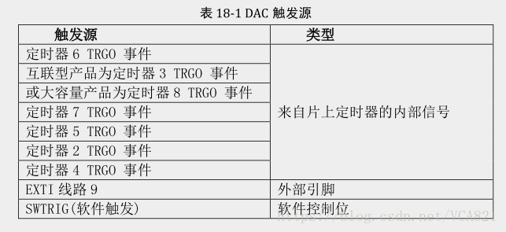


```c
static void DAC_Config(void)
{
    GPIO_InitTypeDef GPIO_InitStructure;
    DAC_InitTypeDef  DAC_InitStructure;
    RCC_APB2PeriphClockCmd(RCC_APB2Periph_GPIOA, ENABLE);	  //开启APB2的gpioa的时钟

    RCC_APB1PeriphClockCmd(RCC_APB1Periph_DAC, ENABLE);   //开启APB1的DAC时钟，DAC挂载于APB1的通道4

    GPIO_InitStructure.GPIO_Pin =  GPIO_Pin_4 | GPIO_Pin_5;    //开启GPIOA4 和 A5
    GPIO_InitStructure.GPIO_Mode = GPIO_Mode_AIN;     //设置为模拟输入（看上面注意点，重要）
    GPIO_Init(GPIOA, &GPIO_InitStructure);     //写入结构体


    DAC_InitStructure.DAC_Trigger = DAC_Trigger_T2_TRGO;	  //设置为TIM2更新，即设置TIM2作为触发源					
    DAC_InitStructure.DAC_WaveGeneration = DAC_WaveGeneration_None;	//不使用波形发生器
    DAC_InitStructure.DAC_OutputBuffer = DAC_OutputBuffer_Disable;	//不适用输出缓冲，若如要输出电流可配置
    DAC_Init(DAC_Channel_1, &DAC_InitStructure);             //初始化通道一
    DAC_Init(DAC_Channel_2, &DAC_InitStructure);             //初始化通道二

    DAC_Cmd(DAC_Channel_1, ENABLE);    //使能通道一

    DAC_Cmd(DAC_Channel_2, ENABLE);   //使能通道二

    DAC_DMACmd(DAC_Channel_2, ENABLE);   //使能DAC对DMA的请求
}
static void DAC_TIM_Config(void)
{

    TIM_TimeBaseInitTypeDef    TIM_TimeBaseStructure;

    RCC_APB1PeriphClockCmd(RCC_APB1Periph_TIM2, ENABLE);    //使能定时器2

    // TIM_TimeBaseStructInit(&TIM_TimeBaseStructure); 
    TIM_TimeBaseStructure.TIM_Period = 19;      //计时到20会更新一次   								
    TIM_TimeBaseStructure.TIM_Prescaler = 0x0;      // 内部1分频，也就是计数器时钟为72M  						
    TIM_TimeBaseStructure.TIM_ClockDivision = 0x0;    	//外部不分频（没用到）				
    TIM_TimeBaseStructure.TIM_CounterMode = TIM_CounterMode_Up;  	//向上计数
    TIM_TimeBaseInit(TIM2, &TIM_TimeBaseStructure);
    TIM_SelectOutputTrigger(TIM2, TIM_TRGOSource_Update);   // 配置触发源
    TIM_Cmd(TIM2, ENABLE);   //使能 TIM2

}
static void DAC_DMA_Config(void)
{	
    DMA_InitTypeDef  DMA_InitStructure;

    RCC_AHBPeriphClockCmd(RCC_AHBPeriph_DMA2, ENABLE);  //使能DMA2

    DMA_InitStructure.DMA_PeripheralBaseAddr = DAC_DHR12RD_Address;      //定义为双通道模式，其他模式请看手册				
    DMA_InitStructure.DMA_MemoryBaseAddr = (uint32_t)&DualSine12bit ;    //定义的写入寄存器的32位数组			
    DMA_InitStructure.DMA_DIR = DMA_DIR_PeripheralDST;	               //传输方向为内存到外设					
    DMA_InitStructure.DMA_BufferSize = 32;		               //缓存大小32位					
    DMA_InitStructure.DMA_PeripheralInc = DMA_PeripheralInc_Disable;     //外设地址固定	
    DMA_InitStructure.DMA_MemoryInc = DMA_MemoryInc_Enable;	       //内存地址自增	
    DMA_InitStructure.DMA_PeripheralDataSize = DMA_PeripheralDataSize_Word;	//外设传输一个字节
    DMA_InitStructure.DMA_MemoryDataSize = DMA_MemoryDataSize_Word;		//内存传输一个字节			
    DMA_InitStructure.DMA_Mode = DMA_Mode_Circular;	                        //循环输出					
    DMA_InitStructure.DMA_Priority = DMA_Priority_High;				//优先级为高					
    DMA_InitStructure.DMA_M2M = DMA_M2M_Disable;					//禁止内存间传输					
    DMA_Init(DMA2_Channel4, &DMA_InitStructure);                                  //开启DMA通道4	
    DMA_Cmd(DMA2_Channel4, ENABLE);                                               //使能
}

```

```c
#define DAC_DHR12RD_Address      0x40007420 //0x40007420    


const uint16_t Sine12bit[32] = {
    2448,2832,3186,3496,3751,3940,4057,4095,4057,3940,
    3751,3496,3186,2832,2448,2048,1648,1264,910,600,345,
    156,39,0,39,156,345,600,910,1264,1648,2048
};

uint32_t DualSine12bit[32];

void DAC_Mode_Init(void)
{
    uint32_t Idx = 0;  

    DAC_Config();   //DAC初始化
    DAC_TIM_Config();    //定时器触发配置
    DAC_DMA_Config();    //DMA配置
    for (Idx = 0; Idx < 32; Idx++)           //for循环给Dualsin12bit赋值，双通道输出原因看下图
    {
        DualSine12bit[Idx] = (Sine12bit[Idx] << 16) + (Sine12bit[Idx]);   //每次传输一个12位数值+该值左移16位从而得到一个32位数值
    }
}

int main(void)
{
    DAC_Mode_Init();   //DAC模式初始化
    while(1);	 
}

```


### 五、其他

#### 1. 中断函数名

和普通的ARm裸板开发不同。使用stm32库函数编程时，中断函数名是固定死的。 

具体函数名可以在启动文件startup_stm32fxxx_xd.s的Vector Table Mapped（中断函数向量表）中查看。

启动文件 startup_stm32fxxx_xd.s里面都是汇编代码

```c
 ; Vector Table Mapped to Address 0 at Reset
                AREA    RESET, DATA, READONLY
                EXPORT  __Vectors
                EXPORT  __Vectors_End
                EXPORT  __Vectors_Size

__Vectors       DCD     __initial_sp               ; Top of Stack
                DCD     Reset_Handler              ; Reset Handler
                DCD     NMI_Handler                ; NMI Handler
                DCD     HardFault_Handler          ; Hard Fault Handler
                DCD     MemManage_Handler          ; MPU Fault Handler
                DCD     BusFault_Handler           ; Bus Fault Handler
                DCD     UsageFault_Handler         ; Usage Fault Handler
                DCD     0                          ; Reserved
                DCD     0                          ; Reserved
                DCD     0                          ; Reserved
                DCD     0                          ; Reserved
                DCD     SVC_Handler                ; SVCall Handler
                DCD     DebugMon_Handler           ; Debug Monitor Handler
                DCD     0                          ; Reserved
                DCD     PendSV_Handler             ; PendSV Handler
                DCD     SysTick_Handler            ; SysTick Handler

                ; External Interrupts
                DCD     WWDG_IRQHandler            ; Window Watchdog
                DCD     PVD_IRQHandler             ; PVD through EXTI Line detect
                DCD     TAMPER_IRQHandler          ; Tamper
                DCD     RTC_IRQHandler             ; RTC
                DCD     FLASH_IRQHandler           ; Flash
                DCD     RCC_IRQHandler             ; RCC
                DCD     EXTI0_IRQHandler           ; EXTI Line 0
                DCD     EXTI1_IRQHandler           ; EXTI Line 1
                DCD     EXTI2_IRQHandler           ; EXTI Line 2
                DCD     EXTI3_IRQHandler           ; EXTI Line 3
                DCD     EXTI4_IRQHandler           ; EXTI Line 4
                DCD     DMA1_Channel1_IRQHandler   ; DMA1 Channel 1
                DCD     DMA1_Channel2_IRQHandler   ; DMA1 Channel 2
                DCD     DMA1_Channel3_IRQHandler   ; DMA1 Channel 3
                DCD     DMA1_Channel4_IRQHandler   ; DMA1 Channel 4
                DCD     DMA1_Channel5_IRQHandler   ; DMA1 Channel 5
                DCD     DMA1_Channel6_IRQHandler   ; DMA1 Channel 6
                DCD     DMA1_Channel7_IRQHandler   ; DMA1 Channel 7
                DCD     ADC1_2_IRQHandler          ; ADC1_2
                DCD     USB_HP_CAN1_TX_IRQHandler  ; USB High Priority or CAN1 TX
                DCD     USB_LP_CAN1_RX0_IRQHandler ; USB Low  Priority or CAN1 RX0
                DCD     CAN1_RX1_IRQHandler        ; CAN1 RX1
                DCD     CAN1_SCE_IRQHandler        ; CAN1 SCE
                DCD     EXTI9_5_IRQHandler         ; EXTI Line 9..5
                DCD     TIM1_BRK_IRQHandler        ; TIM1 Break
                DCD     TIM1_UP_IRQHandler         ; TIM1 Update
                DCD     TIM1_TRG_COM_IRQHandler    ; TIM1 Trigger and Commutation
                DCD     TIM1_CC_IRQHandler         ; TIM1 Capture Compare
                DCD     TIM2_IRQHandler            ; TIM2
                DCD     TIM3_IRQHandler            ; TIM3
                DCD     TIM4_IRQHandler            ; TIM4
                DCD     I2C1_EV_IRQHandler         ; I2C1 Event
                DCD     I2C1_ER_IRQHandler         ; I2C1 Error
                DCD     I2C2_EV_IRQHandler         ; I2C2 Event
                DCD     I2C2_ER_IRQHandler         ; I2C2 Error
                DCD     SPI1_IRQHandler            ; SPI1
                DCD     SPI2_IRQHandler            ; SPI2
                DCD     USART1_IRQHandler          ; USART1
                DCD     USART2_IRQHandler          ; USART2
                DCD     USART3_IRQHandler          ; USART3
                DCD     EXTI15_10_IRQHandler       ; EXTI Line 15..10
                DCD     RTCAlarm_IRQHandler        ; RTC Alarm through EXTI Line
                DCD     USBWakeUp_IRQHandler       ; USB Wakeup from suspend
__Vectors_End
```


