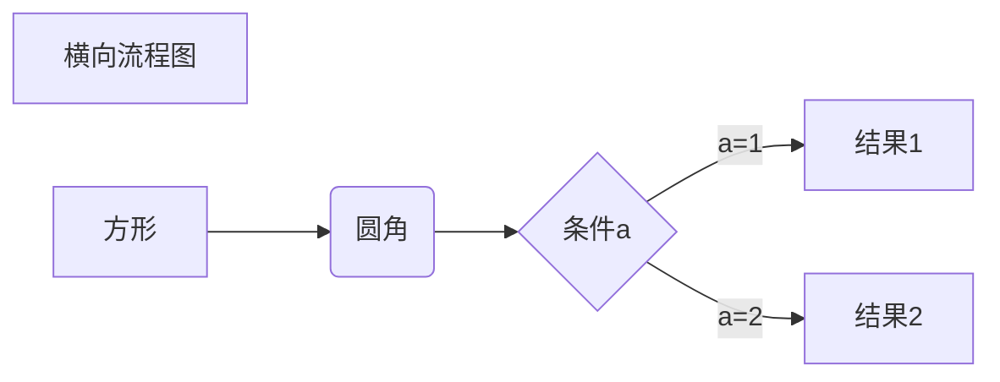
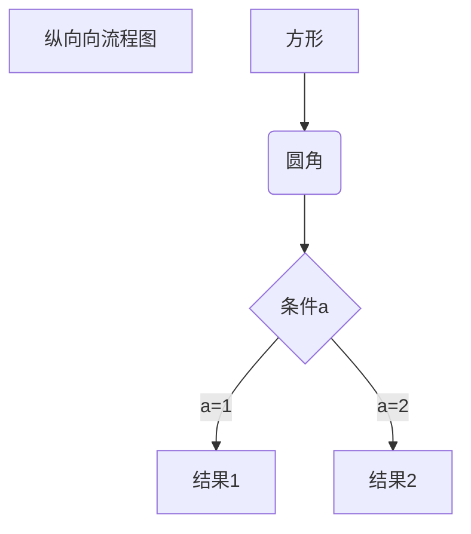
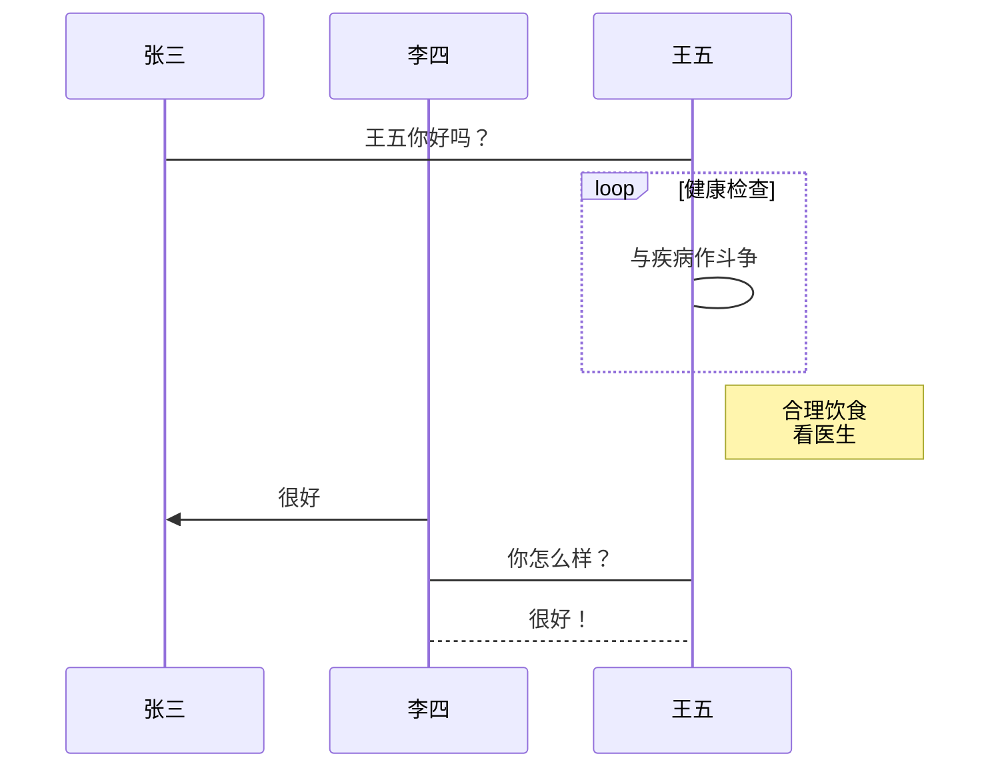
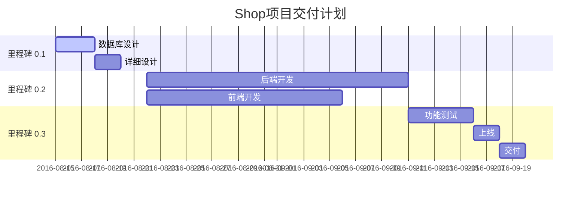

# 一级标题
## 二级标题
### 三级标题
#### 四级标题
##### 五级标题
###### 六级标题
####### 七级标题 看来没有七级标题

---

*斜体*<br>
**黑体**

***

##1.无序列表
- 第一行
- 第二行
 * 第二行的二级目录
 * 第2.2行 
* 第三行
* 第四行

##2. 有序目录
1. ABC
2. DEF
 1. 难道
3. ghi

##3.引用
> 看看引用对不对呢？
> 肯定没问题啊 
> 如果是怎么办 
> df

##4. 代码C
``` python 
import sys


def printHello():
	pass
	 
```
C++
```c
#include “stdio.h”

int main()
{
    printf("Hello World! %d");
}
```


------


$$
F_N(X) = k_{N}*X^{N}+K_{N-1}*X^{N-1}+K_{N-2}*X^{N-2}\cdots+K_1*X+K_0
$$

$$
e^{i\pi} +1 = 0
$$

$$
\frac{2}{10}
$$

$$
f(x) = \int_{0}^{\infty}G(x)dx + \sum{S_n} + \prod_{n=1}^{99}{x*x}
$$


---

## 流程图





```flow
st=>start: 开始框
op=>operation: 处理框
cond=>condition: 判断框(是或否?)
sub1=>subroutine: 子流程
io=>inputoutput: 输入输出框
e=>end: 结束框

st->op->cond
cond(yes)->io->e
cond(no)->sub1(right)->op
```

```flow
st=>start: 开始框
op=>operation: 处理框
cond=>condition: 判断框(是或否?)
sub1=>subroutine: 子流程
io=>inputoutput: 输入输出框
e=>end: 结束框

st(right)->op(right)->cond
cond(yes)->io(bottom)->e
cond(no)->sub1(right)->op
```

```sequence
Title: 标题：复杂使用

对象A->对象B: 对象B你好吗?（请求）

Note right of 对象B: 对象B的描述

Note left of 对象A: 对象A的描述(提示)

对象B-->对象A: 我很好(响应)

对象B->小三: 你好吗

小三-->>对象A: 对象B找我了

对象A->对象B: 你真的好吗？

Note over 小三,对象B: 我们是朋友

participant C

Note right of C: 没人陪我玩
```





> 第一次甘特图竟然失败，原因是第一行不能有注释，否则无法显示视图

