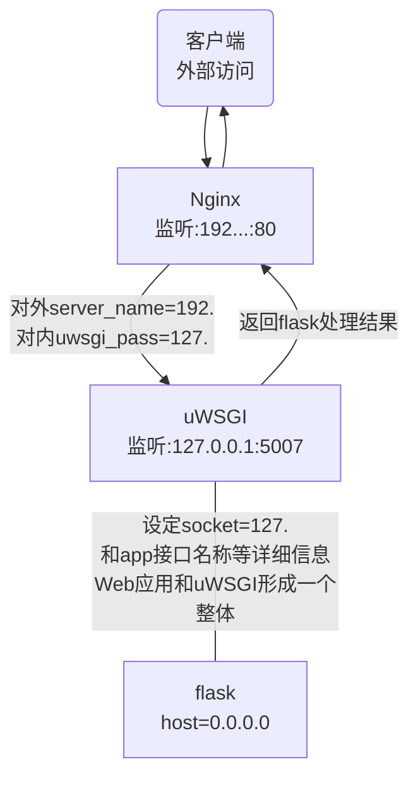

1. Pycharm开发flask时，IDE默认的IP为127.0.0.1，port=5000，如需修改需要在*Configurations 窗口中，Additional options栏添加如下命令：* **--host=192.168.191.1 --port=5002**


## 一、 Flask环境配置

### 1.1 概述

- 物理环境：**ubuntu 16.04.6 LTS ARM64**	(已开始选用最新的18.04，但配置过程中发现依赖包要求比较复杂，使得运行环境配置较困难，故退一步使用16.04)

-  虚拟机环境使用**VirtualBox**, 正常操作加载ios系统盘，安装即可。
- 本节选择使用python3版本，当前系统自带python3.5.7

### 1.2 配置uwsgi+flask启动框架

```sh
# 备注：一般而言需下载python3的配置环境即python3-dev 通过apt-get install下载
# 安装pip3 工具
sudo apt-get install python3-pip
# 验证如下
pip3 --version
# 安装虚拟机
sudo apt-get install python3-virtualenv
或者： pip3 install virtualenv
```

安装完成python虚拟环境后则需配置运行环境如下

```sh
# 在主目录中创建一个虚拟机环境主目录
sudo mkdir /home/lto/PyEnvs
# 在该主目录中创建一个基于python3的虚拟环境
:~/PyEnvs$virtualenv -p /usr/bin/python3 py3FlaskEnv
# 激活该虚拟环境
$source ./py3FlaskEnv/bin/activate
# 退出该虚拟环境
$deactivate
```

安装uwsgi环境、Flask包

```sh
(py3FlaskEnv)...$pip install uwsgi
# 安装完成后可能需要安装部分系统文件
(py3FlaskEnv)...$sudo apt-get install uwsgi-core
(py3FlaskEnv)...$sudo apt-get install uwsgi-plugin-python3
...
# 如上安装包酌情安装
# 安装flask相关包
(py3FlaskEnv)...$pip install flask
```

拷贝flask工程文件到指定位置，并在目录： *.../My_project/flaskWeb/*  创建uwsgi.ini文件

```tex
[uwsgi]
http = 0.0.0.0:5007  # http 协议对客户端开发的端口号，客户端通过此端口访问 flask web 服务接口
pythonpath = .../my_project/my_app  # 应用目录，即python代码所在目录
wsgi-file = .../my_project/my_app/run_app.py # web 应用python主程序
callable = app  # 一般在主运行程序 run_app.py 里指定 app = Flask(__name__)
processes = 1 # 表示启动的服务占3个进程
threads = 10
daemonize = .../my_project/log/serve.log # 指定日志文件；如果使用 supervisors 需要注释掉，否则，supervisors 不能自动拉起 uwsgi 程序
home = .../my_project/venv # python 虚拟环境目录
buffer-size = 32768
```

> 备注：
>
> 1. http项可能需要更改为http-socket。**官方文档中Django使用http，而flask使用socket**
> 2. 如果报错url地址长度超出(默认max=4096)，则需要在末尾添加 buffer-size = 32768
> 3. 有时也许加上master = true的配置信息（启动主进程）
> 4. workers = 8 服务器启动的进程数
> 5. module web应用的入口模块名称

**PS: 另一个版本**

```
[uwsgi]
module = run:app
master = true
processes = 3
chdir = /home/nianshi/flask_project
socket = /home/nianshi/flask_project/myproject.sock
socket = 127.0.0.1:8000
logto = /home/nianshi/flask_project/myproject.log
chmod-socket = 660
vacuum = true
```

> **module** : 指明了要启动的模块，run 就是项目启动文件 run.py 去掉扩展名，app 是 run.py 文件中的变量 app，即 Flask 实例
>
> **socket ：**此处包含两个，一个是指定了暴露的端口，另外指定了一个`myproject.sock`文件保存socker信息。

启动：

```sh
uwsgi uwsgi.ini --plugin=python3
# 只启动ini文件显然是不够的，会报各种环境错误，此时需要加上plugin记录如上所示。
```

#### 1.2.1 关闭 uwsgi

```sh
# 线程方式关闭
sudo killall -9 uwsgi
# uwsgi文件方式
# 创建目录uwsgi,以及pid文件、status文件
my_project/uwsgi/uwsgi.pid
my_project/uwsgi/uwsgi.status
# 关闭如下
uwsgi --stop uwsgi/uwsgi.pid
# 重启
uwsgi --reload uwsgi/uwsgi.pid
```


### 1.3 安装nginx配置代理

```sh
# 下载nginx
sudo apt-get install nginx
# nginx 开启
sudo /etc/init.d/nginx start
或者：$ service nginx start
$service nginx stop
```

配置**Nginx.conf**文件，地址：`/home/lto/PyCode/my_project/nginx.conf`

```
worker_processes 4;
events { worker_connections 1024; }
http {
    include       mime.types;
    default_type  application/octet-stream;
    server {
        listen 80;
        location / {	# 指定反向代理信息
            include uwsgi_params;
            uwsgi_pass 127.0.0.1:8000;
        }
    }
}
```

下面，我们启动Nginx服务：

```
nginx -c /home/nianshi/flask_project/nginx.conf
```

### 1.4 uwsgid 启动配置

uwsgid 文件写入。位置：/etc/init.d/

```sh
#! /bin/sh
# chkconfig: 2345 55 25
# Description: Startup script for uwsgi webserver on Debian. Place in /etc/init.d and
# run 'update-rc.d -f uwsgi defaults', or use the appropriate command on your
# distro. For CentOS/Redhat run: 'chkconfig --add uwsgi'

### BEGIN INIT INFO
# Provides:          uwsgid
# Required-Start:    $all
# Required-Stop:     $all
# Default-Start:     2 3 4 5
# Default-Stop:      0 1 6
# Short-Description: starts the uwsgi web server
# Description:       starts uwsgi using start-stop-daemon
### END INIT INFO

# Author:   licess
# website:  http://lnmp.org

PATH=/usr/local/sbin:/usr/local/bin:/sbin:/bin:/usr/sbin:/usr/bin
DESC="uwsgi daemon"
NAME=uwsgi
DAEMON=/usr/bin/uwsgi
CONFIGFILE=/usr/local/webtest/$NAME.ini
PIDFILE=/var/run/$NAME.pid
SCRIPTNAME=/etc/init.d/uwsgid

set -e
[ -x "$DAEMON" ] || exit 0

do_start() {
    $DAEMON $CONFIGFILE || echo -n "uwsgi already running"
}

do_stop() {
    $DAEMON --stop $PIDFILE || echo -n "uwsgi not running"
    rm -f $PIDFILE
    echo "$DAEMON STOPED."
}

do_reload() {
    $DAEMON --reload $PIDFILE || echo -n "uwsgi can't reload"
}

do_status() {
    ps aux|grep $DAEMON | grep -v grep
}

case "$1" in
 status)
    echo -en "Status $NAME: \n"
    do_status
 ;;
 start)
    echo -en "Starting $NAME: \n"
    do_start
 ;;
 stop)
    echo -en "Stopping $NAME: \n"
    do_stop
 ;;
 reload|graceful)
    echo -en "Reloading $NAME: \n"
    do_reload
 ;;
 *)
    echo "Usage: $SCRIPTNAME {start|stop|reload}" >&2
    exit 3
 ;;
esac

exit 0

uwsgid
```

创建完成后，赋予执行权限，加入开机启动

```sh
[root@hcloud ~]$ chmod +x /etc/init.d/uwsgid 
[root@hcloud ~]$ chkconfig --add uwsgid
[root@hcloud ~]$ chkconfig --level 2345 uwsgid on
```

检查下

```sh
[root@hcloud ~]$ chkconfig --list uwsgid
uwsgid             0:off    1:off    2:on    3:on    4:on    5:on    6:off
```

启动uwsgid

```sh
[root@hcloud ~]$ service uwsgid start
Starting uwsgi: 
[uWSGI] getting INI configuration from /usr/local/webtest/uwsgi.ini
```

验证下监听端口（注：这里我们使用127.0.0.1 作监听，是为了后期在使用时，对外只有nginx可以访问web应用）：

```sh
[root@hcloud ~]$ netstat -aultnp | grep :8000
tcp        0      0 127.0.0.1:8000        0.0.0.0:*       LISTEN      8945/uwsgi
```

### 1.5 结构说明



### 1.6 实操问题总结

#### 1.6.1 问题一：502 Bad Gateway

遇到nginx+uwsgi 开启后，nginx无法代理的情况，出现**502 Bad Gateway**。

因如上问题，采用各种解决方式可以断定出在uwsgi响应上因此从如下几个方面处理

1. uwsgi.ini文件添加： plugin=python3，可能是需要部分python3的库文件
2. uwsgi.ini文件添加超时配置：uwsgi_read_timeout = 600
3. 因配置python环境时，仅添加了python3的`python3-dev`以及`uwsgi-plugin-python3`，所以重新下载了`python-dev`以及`uwsgi-plugin-python`，即可使用。


**Nginx配置文件：** `/etc/nginx/conf.d 或 /etc/nginx/sistes-enables/...`(前者为配置文件，后者为虚拟配置文件，实则均可做配置)


#### 1.6.2 问题二：数据通信异常

关于uwsgi中的连接配置：

- 使用ip地址通信：在nginx配置中使用如下参数`uwsgi_pass 127.0.0.1:5000`
- 使用socket通信：同样在nginx配置中使用如下参数`uwsgi_pass unix:/../my_project/manage.sock`

如上两种方式必须和uwsgi的配置方式对应:

```tex
[uwsgi]
master = true
chdir = /home/lto/PyCode/FlaskHello
wsgi-file = %(chdir)/app.py
callable = app
processes = 1
#threads = 2
#socket = %(chdir)/flaskhello.sock

socket = 127.0.0.1:5000
daemonize = %(chdir)/Server.log
home = /home/lto/PyEnvs/py3FlaskEnv
buffer-size = 65535
chmod-socket = 666	# 套接字权限
#uwsgi_read_timeout = 600
#plugin=python

stats = %(chdir)/uwsgi/uwsgi.status
pidfile = %(chdir)/uwsgi/uwsgi.pid
```

如上配置中最容易出问题的是socket项配置，该项配置有三种情形

`socket 、http-socket 、http`同样取值也有两种分别对应 *ip:port*格式以及*unix:/.../\*.sock*

在实际使用中发现填写socket是 uwsgi无法访问，nginx可以访问。

使用http-socket和http时，uwsgi可以访问，nginx无法访问。

至于为什么，只能后续分析了。

#### 1.6.3 问题三：开机配置

```sh
# uwsgi 相关命令
# 开启命令
$uwsgi --ini uwsgi.ini
= $uwsgi uwsgi.ini
# 关闭和重启
$uwsgi --stop uwsig/uwsig.pid
$uwsgi --reload uwsig/uwsig.pid
# 查看uwsgi是否启动
$ps -ef|grep uwsgi
# 此处一定要注意的是重复的uwsgi服务启动也会导致通信异常
```

```sh
# nginx 相关命令
# 开启
sudo service nginx start
sudo service nginx stop
# 默认是开机自启动，当然可以自设定
sudo systemctl disable nginx.service
sudo systemctl enable nginx.service
# 查看开机启动项
systemctl list-units --type=service

# 查看nginx是否启动,同样注意不能重复启动
$ps -ef|grep nginx
```

## 二、Flask部署中模块相关测试

### 2.1 Flask部署其他程序

​	经过测试，仅需做如下操作

```python
from FuncX import FuncX

app = Flask(__name__)
basedir = os.path.dirname(__file__)  # 当前文件所在路径
fun = FuncX()

```

### 2.2 经测试框架，遇如下配置问题

- 无法完成文件传输功能，怀疑和*uwsgi*配置有关
- uwsgi关于支线程的配置问题，用以完成socket客户端刷新问题
- 下载的源程序出现包异常的问题，可能关于python环境配置上需考虑


## 三、使用Ajax动态刷新

### 3.1 基本样式

```html
$.ajax({
    url: '/ajaxLong',	<!-- url返回地址 -->
    type: 'GET',	<!-- 返回数据类型 -->
    data: {info: indx, pageId:pageId},	<!-- 返回数据 -->
    dataType: 'JSON',	<!-- 接收数据类型 -->
    success:function (res) {	<!-- 接收数据处理 -->
        if(res.enable==true)
        {	<!-- res = {'subTime':' ', 'count':'  '} JSON格式数据直接取元素值-->
         	res.subTime + ' ---- ' + res.count;
        }
    },
    error:function (request, status, error) {
		<!-- 错误异常数据捕获 -->
    }
})
```

备注，ajax属于*JavaScript*实现的，因此必须加上引用连接

```html
<script src="http://lib.sinaapp.com/js/jquery/1.9.1/jquery-1.9.1.min.js"></script>
```

### 3.2 轮询

​	**轮询**的基本使用方式就是*Web端定时发送请求获取值更新页面数据。*

```html
<!-- 核心语句 -->
window.setInterval(Start,2000);
<!-- Start为函数，无参数传递 -->
<!-- 2000位Timeout值，单位毫秒，此处为2秒 -->
```

​	Ajax轮询为：

```html
window.setInterval(function f(){$.ajax(getting)}, 2000)
```

### 3.3 长轮询

​	**长轮询**实则为ajax单次轮询的嵌套，在获取本次结果后在执行一次请求，类似递归式的嵌套。该处理的特点是，后一次的请求必须是以前一次请求获取到结果后才发出，即没结果的时候，web服务器端可以先挂起，等到有结果了再返回结果，如果超时则再发送一次请求，如下：

```html
function Start() {
    var pageId = document.getElementById("pageId").innerText;
    var indx = document.getElementById("XHR_Info").innerText;
    $.ajax({
        url: '/ajaxLong',
        type: 'GET',
        data: {info: indx, pageId:pageId},
        dataType: 'JSON',
        success:function (res) {
            if(res.enable==true)
            {
                = res.subTime + ' ---- ' + res.count;
                Start();	<!-- 获取到结果并处理完后立刻再发一次请求 -->
            }
        },
        error:function (request, status, error) {
        	Start();  <!-- 超时或异常时，则立刻再发一次请求 -->
        }
    })
}
```

**改良版本：**

在单次请求获取后，在定时发送一次请求：

```html
$.ajax({
    ...
    success:function (res) {	<!-- 接收数据处理 -->
		setTimeout(Start, 2000);
    },
    error:function (request, status, error) {
		<!-- 错误异常数据捕获 -->
		setTimeout(Start, 2000);
    }
})
```

### 3.4 后台程序说明

```python
from gevent import monkey
from flask import Flask, render_template, request, jsonify
import os
import uuid			#生成唯一标识码
from time import sleep		#延时
from FuncX import FuncX
# 异步响应，默认为同步相应即前一个请求阻塞时，后一个请求则强制阻塞
monkey.patch_all()

app = Flask(__name__)
basedir = os.path.dirname(__file__)  # 当前文件所在路径
fun = FuncX()
CommInfo = fun.XXXX()
AjaxStatus = True

QUEQUE_DICT = {
    # 'xxxxxxxx':Queue()
}
DATA_SHOW = {
    "subTime" : "123",
    "count" : "abc",
    "enable" : False,
}

def AddAndPrintUUID(userid):
    if userid not in QUEQUE_DICT:
        QUEQUE_DICT[userid] = 0
    else:
        QUEQUE_DICT[userid] += 1
    print(userid, QUEQUE_DICT[userid])
    return QUEQUE_DICT[userid]

def UnifyPageIDByUUID(userid):
    if userid not in QUEQUE_DICT:
        QUEQUE_DICT[userid] = 0
    for k in QUEQUE_DICT.keys():
        QUEQUE_DICT[k] = QUEQUE_DICT[userid]

def SetDATAs(p1,p2,p3):
    DATA_SHOW['subTime'] = str(p1)
    DATA_SHOW['count'] = str(p2)
    DATA_SHOW["enable"] = p3
    print(DATA_SHOW)
    return jsonify(DATA_SHOW)	# JSON格式数据发送

@app.route('/')
def hello_world():
    id = str(uuid.uuid4())[:5]
    return render_template('h_ajax_long.html', pageID = id)

@app.route('/ajaxLong', methods=['GET'])
def ajaxLong():
    num = fun.Get_Reload()
    try:
        print(request.values.get('info'))
        da = int(str(request.values.get('info')).split('----')[0])
    except:
        da = -1
    print("第%d次进入 S" % (num), da, fun.GetBias())
    while not fun.CheckX(da):
        pass
    print('Out Result!')
    return SetDATAs(str(fun.GetCount()), AddAndPrintUUID(request.values.get('pageId')), AjaxStatus)

@app.route('/pageID_unify', methods=['GET'])
def pageID_unify():
    UnifyPageIDByUUID(request
                      .values.get('pageId'))
    return '成功'
```

### 3.5 使用ajax发送button请求

```html
<script>
function BtnComm(th) {
            $.ajax({
                url: th.value,
                type: 'GET',
                dataType: 'text',
                success:function(succtx) {

                }
            })
        }
</script>
...
<button type="button" value="/ajaxStop"  onclick="BtnComm(this)">停止</button>
```

```python
@app.route('/ajaxStart', methods=['GET'])
def ajaxStart():
    global AjaxStatus
    AjaxStatus = True
    return '..'

@app.route('/ajaxStop', methods=['GET'])
def ajaxStop():
    global AjaxStatus
    AjaxStatus = False
    return '..'
```

### 3.6 实操问题

​	再用IE访问目标页面时，通过button提交请求。发现服务器并未接收到请求。

​	*F12*进入开发界面，通过分析请求以及回复情况表得知：**该button第一次请求获取了实际结果，但之后的请求均未发出而是使用缓存数据。**这显然与我们的需求不一致。经查询后得知原委：

```
	我们都知道IE会针对ajax请求的地址缓存请求结果,直到缓存过期之前,针对相同地址发出的请求,只有第一次会请求会真正发送到服务端.在某种情况下,这种缓存机制确实能提高web的响应速度,但是有时候并不是我们需要的,有时候我们需要获取即时信息,那么有哪几种方式来解决这个问题呢,下面列举了几种解决方案!
1. 通过URL添加后缀的方式
例如:
本来请求的地址是: /home/action?
加查询参数后缀后:/home/action?ran=Match.Random();
2. 通过Jquery的Ajax  API设置相关属性
<script type="text/javascript">
        var LoadTime = function () {
			$.ajaxSetup({ cache: false });	# **重点就是这一句**
            $.ajax({
                url: '@Url.Action("currTime")',
                success: function (result) {
                    $("#currTime").html(result);
                }
            })
        }
</script>
```


