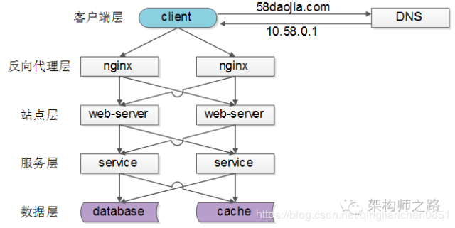
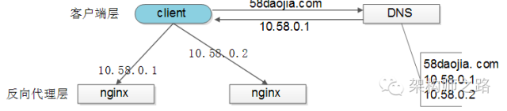
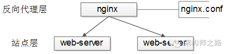
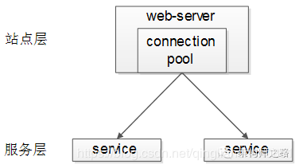
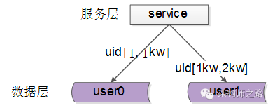
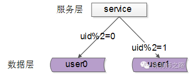
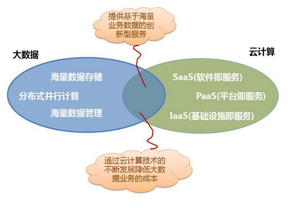
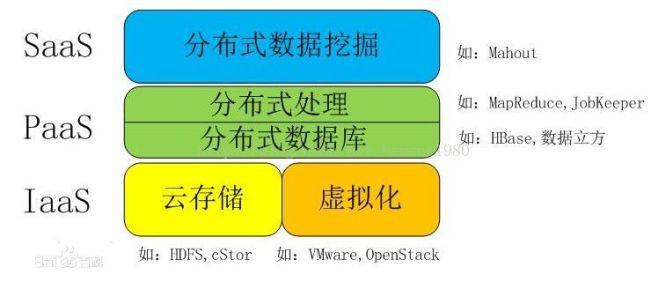
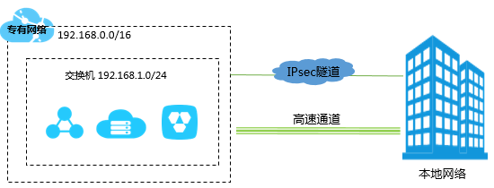

## 0. 常见缩写

**ECS** ： 云服务器 (Elastic Compute Service, 简称 *ECS*)

**SLB** ：服务器负载均衡(Server Load Balancing)

**PPS** ：packets per second 每秒发包数量, 衡量网络性能的指标之一

Q1: 一个数据包大小？

Ans:  

1. UDP协议中包含数据包长度，长度部分占用16位，故最大UDP数据包为 0~$2^{16}-1$ 之间。即最大65535.

2. 通信术语 最大传输单元(Maximum Transmission Unit，*MTU*)。
3. 接受/发送端都是以太网，它们的MTU都是1500。MTU-IP头长度-TCP头长度 = 1500-20-20=1460。虽然总是希望它能很大(如1460)，但是大多数BSD实现，它都是512的倍数，如1024。
4. 在以太网中，数据包的大小范围是在64—1518字节之间，如果除去头部开销，则实际的数据大小为46—1500字节之间。 一般情况下，数据包的大小都是在这个范围内，如果数据包小于64字节，称为碎片；而如果大于1518字节，称为特大数据包。这两种类型的数据包都是非正常的以太网数据包，它们将影响网络的正常运行。无论是碎片或特大数据包，都会增加网络的负载，导致网络故障的发生。

**RDS** ：*RDS*是关系型数据库服务（Relational Database Service）

**DRDS** ： 分布式关系型数据库服务（Distribution Relational Database Service）

**IPSec** ：（英语：Internet Protocol Security，缩写为IPsec），是一个协议包，通过对IP协议分组进行[加密](https://baike.baidu.com/item/加密)和[认证](https://baike.baidu.com/item/认证)来保护IP协议的[网络传输协议](https://baike.baidu.com/item/网络传输协议)族（一些相互关联的协议的集合）。

**ISP** ： ISP：全称为Internet Service Provider，即因特网服务提供商，能提供拨号上网服务、网上浏览、下载文件、收发电子邮件等服务，是网络最终用户进入Internet的入口和桥梁。

**ICP**： [ICP](https://baike.baidu.com/item/ICP)（Internet Content Provider）是互联网内容提供商，向广大用户综合提供互联网信息业务和增值业务的电信运营商。

**NAT**：Network Address Translation，网络地址转换。

**SaaS**：Software-as-a-Service（软件即服务）提供给客户的服务是运营商运行在云计算基础设施上的应用程序，用户可以在各种设备上通过客户端界面访问，如浏览器。消费者不需要管理或控制任何云计算基础设施，包括网络、服务器、操作系统、存储等等；

**PaaS**：Platform-as-a-Service（平台即服务）提供给消费者的服务是把客户采用提供的开发语言和工具（例如Java，python, .Net等）开发的或收购的应用程序部署到供应商的云计算基础设施上去。

客户不需要管理或控制底层的云基础设施，包括网络、服务器、操作系统、存储等，但客户能控制部署的应用程序，也可能控制运行应用程序的托管环境配置；

**IaaS**：Infrastructure-as-a-Service（基础设施即服务）提供给消费者的服务是对所有计算基础设施的利用，包括处理CPU、内存、存储、网络和其它基本的计算资源，用户能够部署和运行任意软件，包括操作系统和应用程序。

消费者不管理或控制任何云计算基础设施，但能控制操作系统的选择、存储空间、部署的应用，也有可能获得有限制的网络组件（例如路由器、，防火墙，、负载均衡器等）的控制。

**H/W**：Hardware，指硬件。

**F/W**： Firmware，指固件。

**SAN**：存储区域网络（英语：**storage area network**，缩写作 **SAN**）是一种连接外接存储设备和服务器的架构。

**MOM**：Message Oriented Middleware 面向消息中间件。使用消息传送提供者来协调消息传送操作。MOM 需要提供 API 和管理工具。客户端使用api调用，把消息发送到由提供者管理的目的地。在发送消息之后，客户端会继续执行其他工作，并且在接收方收到这个消息确认之前，提供者一直保留该消息。

**OSS**：（Operation Support Systems）系统即操作支持系统，是[电信业务](https://baike.baidu.com/item/电信业务/5935617)开展和运营时所必需的支撑平台。

----

## 一、负载均衡(SLB)

[引](https://blog.csdn.net/qinglianchen0851/article/details/84306448)	关于负载均衡，其实在网上有许多的定义。而作为云计算的从业者，最经常接触到的就是云负载均衡SLB，我总结了两个特点和作用：分流和灾备；
负载均衡（Load Balance）是分布式系统架构设计中必须考虑的因素之一，它通常是指，将请求/数据均匀分摊到多个操作单元上执行，负载均衡的关键在于**分发** ！！！

各种负载均衡的算法，也都是为了满足这个==分发==二字；

### 1.1 、客户端到反向代理

客户端 **->** 反向代理层的负载均衡。这里主要是通过 ”DNS轮询“实现。通俗来讲，即DNS-server对于一个域名设置多个解析IP（这里指负载均衡的IP），这里的主要的算法是利用了"轮询"算法。

### 1.2、反向代理到站点层

反向代理，即将客户端的请求转发到服务器上，然后服务器返回的结果转发给客户端。
反向代理层到站点层的负载均衡主要是通过”nginx“本身实现（七层转发），nginx是泛指反向代理，但是也是应用最广泛的反向代理服务器。

而转发的规则（算法），主要是通过修改nginx.conf的配置文件实现：
这里介绍主要几种算法：**1. 请求轮询; 2. 最少连接数; 3. 加权**

> 画外音：站点层可以存储session，但强烈不建议这么做，站点层无状态是分布式架构设计的基本原则之一，session最好放到数据层存储。

### 1.3、站点层到服务层

服务层也叫中间层，通过增加抽象，解耦两个交互的逻辑关系。服务层只提供有限的通用接口，理论上服务集群能够提供无限性能，性能出现瓶颈，服务层一处集中优化

站点层到服务层的负载均衡，是通过“服务连接池”实现的。

上游连接池会建立与下游服务多个连接，每次请求会“随机”选取连接来访问下游服务。除了负载均衡，服务连接池还能够实现***故障转移、超时处理、限流限速、ID串行化***等诸多功能。

### 1.4 数据层

在数据量很大的情况下，由于数据层（db/cache）涉及数据的水平切分，所以数据层的负载均衡更为复杂一些，它分为“数据的均衡”，与“请求的均衡”。

* 数据的均衡是指：水平切分后的每个服务（db/cache），数据量是均匀的。

* 请求的均衡是指：水平切分后的每个服务（db/cache），请求量是均匀的。

同时，根据水平切分的方式，主要又分为range水平切分和ID哈希水平切分。

#### 1.4.1 range水平切分

每一个数据服务，存储一定范围的数据：

* user0服务：存储uid范围1-1kw
* user1服务：存储uid范围1kw-2kw.

**优点**：

> 规则简单，service只需判断一下uid范围就能路由到对应的存储服务
> 数据均衡性较好
> 比较容易扩展，可以随时加一个uid[2kw,3kw]的数据服务

**不足 :**

> 请求的负载不一定均衡，一般来说，新注册的用户会比老用户更活跃，大range的服务请求压力会更大

#### 1.4.2 id哈希水平切分

每一个数据服务，存储某个key值hash后的部分数据：

* user0服务：存储偶数uid数据
* user1服务：存储奇数uid数据

**优点：**

> 规则简单，service只需对uid进行hash能路由到对应的存储服务
> 数据均衡性较好
> 请求均匀性较好

**不足：**

> 不容易扩展，扩展一个数据服务，hash方法改变时候，可能需要进行数据迁移

### 1.5 总结

负载均衡（Load Balance）是分布式系统架构设计中必须考虑的因素之一，它通常是指，将请求/数据均匀分摊到多个操作单元上执行，其的关键在于均匀：

* 反向代理层的负载均衡，是通过“DNS轮询”实现的。

* 站点层的负载均衡，是通过“nginx”实现的。

* 服务层的负载均衡，是通过“服务连接池”实现的。

* 数据层的负载均衡，要考虑“数据的均衡”与“请求的均衡”两个点，常见的方式有“按照范围水平切分”与“hash水平切分”。

## 二、SaaS/PaaS/IaaS

介绍如0所述。此处对其区别加以说明：

SaaS 是软件的开发、管理、部署都交给第三方，不需要关心技术问题，可以拿来即用。普通用户接触到的互联网服务，几乎都是 SaaS，下面是一些例子。

- 客户管理服务 Salesforce
- 团队协同服务 Google Apps
- 储存服务 Box
- 储存服务 Dropbox
- 社交服务 Facebook / Twitter / Instagram

PaaS 提供软件部署平台（runtime），抽象掉了硬件和操作系统细节，可以无缝地扩展（scaling）。开发者只需要关注自己的业务逻辑，不需要关注底层。下面这些都属于 PaaS。

- Heroku
- Google App Engine
- OpenShift

IaaS 是云服务的最底层，主要提供一些基础资源。它与 PaaS 的区别是，用户需要自己控制底层，实现基础设施的使用逻辑。下面这些都属于 IaaS。

- Amazon EC2

- Digital Ocean

- RackSpace Cloud

### 2.1 附加
Paas:  就是加入了中间件和数据库，常见的有GAE/SAE/BAE这些

  

## 三、现有云平台

用户的手机、pc、笔记本统称为端;网络的服务称为云。端和云的网络格局。可以从“端”通过“云”(网络)获得强大的计算能力，数据处理能力及其它。每个端也可以为整个云贡献自己的计算能力。——云计算

狭义云计算指IT基础设施的交付和使用模式，指通过网络以按需、易扩展的方式获得所需资源;

广义云计算指服务的交付和使用模式，指通过网络以按需、易扩展的方式获得所需服务。这种服务可以是IT和软件、互联网相关，也可是其他服务。

云计算的核心思想，是将大量用网络连接的计算资源统一管理和调度，构成一个计算资源池向用户按需服务。提供资源的网络被称为“云”。“云”中的资源在使用者看来是可以无限扩展的，并且可以随时获取，按需使用，随时扩展，按使用付费。

云计算的产业三级分层：云设备、云平台、云软件

### 3.1 常见云比较

| <18.03摘>    | 百度云                                                       | 阿里云                   | 腾讯云                   |
| ------------ | ------------------------------------------------------------ | ------------------------ | ------------------------ |
| 网址         | yun.baidu.com                                                | www.aliyun.com           | www.qcloud.com           |
| 云服务器     | /                                                            | 有                       | 有                       |
| 应用程序引擎 | BAE                                                          | ACE                      | 待出                     |
| 开发环境     | - Node.js - PHP - Python - Java - Static        | - PHP - Java         | - PHP - Java         |
| 云数据库     | - MySQL - MongoDB - Redis                            | - MySQL - SQL Serve   | - MySQL                  |
| 其他服务     | 1. 语音识别 2. 人脸识别 3. 百度翻译 4. 百度地图 5. 云推送 | 阿里系应用 的良好对接 | 腾讯系应用 的良好对接 |
| 备注         | - 很成熟 - 后台硬                                        | 成熟 硬                  | 收费高 硬                |

## 四、私有网络(VPC)

VPC全称是Virtual Private Cloud，翻译成中文是虚拟私有云。但是在有些场合也被翻译成私有网络或者专有网络等。这里其实就有些让人迷惑，VPC究竟是指云还是网络？答案是，VPC即是一种云，也是一种网络模式，不过应该从服务和技术的角度分别来看。私有网络是针对公有云的基础网络(经典网络)来定义的一种概念。

VPC 是公有云上自定义的逻辑隔离网络空间，是一块可我们自定义的网络空间，与我们在数据中心运行的传统网络相似，托管在VPC内的是我们在私有云上的服务资源，如云主机、负载均衡、云数据库等。我们可以自定义网段划分、IP地址和路由策略等，并通过安全组和网络ACL等实现多层安全防护。同时也可以通过VPN或专线连通VPC与我们的数据中心，灵活部署混合云。

VPC主要是一个网络层面的功能，其目的是让我们可以在云平台上构建出一个隔离的、自己能够管理配置和策略的虚拟网络环境，从而进一步提升我们在AWS环境中的资源的安全性。我们可以在VPC环境中管理自己的子网结构，IP地址范围和分配方式，网络的路由策略等。由于我们可以掌控并隔离VPC中的资源，因此对我们而言这就像是一个自己私有的云计算环境。

我们可以通过VPC及其他相关的云服务来把企业自己的数据中心与其在云上的环境进行集成，构成一个混合云的架构。 

