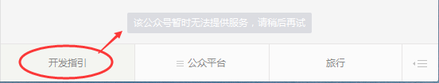

## 0、概述

​	微信公众平台是运营者通过公众号为微信用户提供资讯和服务的平台，而公众平台开发接口则是提供服务的基础，开发者在公众平台网站中创建公众号、获取接口权限后，可以根据实际需求开发。

​	为了识别用户，每个用户针对每个公众号会产生一个安全的OpenID，如果需要在多公众号、移动应用之间做用户共通，则需前往微信开放平台，将这些公众号和应用绑定到一个开放平台账号下，绑定后，一个用户虽然对多个公众号和应用有多个不同的OpenID，但他对所有这些同一开放平台账号下的公众号和应用，只有一个UnionID，可以在用户管理-获取用户基本信息（UnionID机制）文档了解详情。

请开发者注意：

1、微信公众平台开发是指为微信公众号进行业务开发，为移动应用、PC端网站、公众号第三方平台（为各行各业公众号运营者提供服务）的开发，请前往微信开放平台接入。

2、在申请到认证公众号之前，你可以先通过测试号申请系统，快速申请一个接口测试号，立即开始接口测试开发。 3、在开发过程中，可以使用接口调试工具来在线调试某些接口。

4、每个接口都有每日接口调用频次限制，可以在公众平台官网-开发者中心处查看具体频次。 5、在开发出现问题时，可以通过接口调用的返回码，以及报警排查指引（在公众平台官网-开发者中心处可以设置接口报警），来发现和解决问题。

6、公众平台以access_token为接口调用凭据，来调用接口，所有接口的调用需要先获取access_token，access_token在2小时内有效，过期需要重新获取，但1天内获取次数有限，开发者需自行存储，详见获取接口调用凭据（access_token）文档。

7、公众平台接口调用仅支持80端口。

公众号主要通过公众号消息会话和公众号内网页来为用户提供服务的，下面分别介绍这两种情况：

**1、公众号消息会话**

公众号是以微信用户的一个联系人形式存在的，消息会话是公众号与用户交互的基础。目前公众号内主要有这样几类消息服务的类型，分别用于不同的场景。

- 群发消息
- 被动回复消息。(需开发者预先在开发者中心设置的服务器地址，5s内无回复重复发送，可加密。）
- 客服消息
- 模板消息

**2、公众号内网页**

许多复杂的业务场景，需要通过网页形式来提供服务，这时需要用到：

1. 网页授权获取用户基本信息：通过该接口，可以获取用户的基本信息（获取用户的OpenID是无需用户同意的，获取用户的基本信息则需用户同意）

2. 微信JS-SDK：是开发者在网页上通过JavaScript代码使用微信原生功能的工具包，开发者可以使用它在网页上录制和播放微信语音、监听微信分享、上传手机本地图片、拍照等许多能力。


## 一、入门概念指引

​		此处入门指引皆根据[微信官方文档](https://developers.weixin.qq.com/doc/offiaccount/Getting_Started/Getting_Started_Guide.html)整理而来。仅作入门了解。

​		**先手：搭建服务器，须有一个有效的URL地址。购买云或者自搭建云皆可。**

### 1.0 简易web响应

以web.py网络框，python搭建。

1. 需配置环境，安装web.py环境。代码如下

```python
# -*- coding: utf-8 -*-
# filename: main.py
import web

urls = (
    '/wx', 'Handle',
)

class Handle(object):
    def GET(self):
        return "hello, this is handle view"

if __name__ == '__main__':
    app = web.application(urls, globals())
    app.run()
```

2. 如果出现“socket.error: No socket could be created“错误信息，可能为80端口号被占用，可能是没有权限，请自行查询解决办法。如果遇见其他错误信息，请到[web.py官方文档](http://www.webpy.org/)，学习webpy 框架3执行命令：sudo python main.py 80 。

3. url填写：http://外网IP/wx 。如下图，一个简单的web应用已搭建。


### 1.1 平台开发者配置说明

1) 公众平台官网登录之后，找到“基本配置”菜单栏


2） 填写配置

url填写：http://外网IP/wx 。外网IP请到腾讯云购买成功处查询。 http的端口号固定使用80，不可填写其他。

Token：自主设置，这个token与公众平台wiki中常提的access_token不是一回事。这个token只用于验证开发者服务器。


3） 现在选择提交肯定是验证token失败，因为还需要完成代码逻辑。改动原先main.py文件，新增handle.py

```python
# -*- coding: utf-8 -*-
# filename: main.py
import web
from handle import Handle

urls = (
    '/wx', 'Handle',
)

if __name__ == '__main__':
    app = web.application(urls, globals())
    app.run()
```


**注意点**：

1. 此处为消息校验流程，主要是提取主要信息，以及校验信息。hashcode为校验信息，signature为附带校验码。如果本地计算出来的`hashcode == signature`,则说明信息正确。
2. 后续所有开发均有该流程。

3. 代码如下：

```python
# -*- coding: utf-8 -*-
# filename: handle.py

import hashlib
import web

class Handle(object):
    def GET(self):
        try:
            data = web.input()
            if len(data) == 0:
                return "hello, this is handle view"
            signature = data.signature
            timestamp = data.timestamp
            nonce = data.nonce
            echostr = data.echostr
            token = "xxxx" #请按照公众平台官网\基本配置中信息填写

            list = [token, timestamp, nonce]
            list.sort()
            sha1 = hashlib.sha1()
            map(sha1.update, list)
            hashcode = sha1.hexdigest()
            print "handle/GET func: hashcode, signature: ", hashcode, signature
            if hashcode == signature:
                return echostr
            else:
                return ""
        except Exception, Argument:
            return Argument
```

4） 重新启动成功后（python main.py 80），点击提交按钮。若提示”token验证失败”, 请认真检查代码或网络链接等。若token验证成功，会自动返回基本配置的主页面，点击启动按钮

### 1.2 实例分析


主要有三个部分：负责业务逻辑部分的服务器，负责对接微信API的API-Proxy服务器，以及唯一的AccessToken中控服务器

1）AccessToken中控服务器：

负责： 提供主动刷新和被动刷新机制来刷新accessToken并存储（为了防止并发刷新，注意加并发锁），提供给业务逻辑有效的accessToken。

优点： 避免业务逻辑方并发获取access_token，避免AccessToken互相覆盖，提高业务功能的稳定性。

2）API-Proxy服务器：

负责：专一与微信API对接，不同的服务器可以负责对接不同的业务逻辑，更可进行调用频率、权限限制。

优点：某台API-proxy异常，还有其余服务器支持继续提供服务，提高稳定性，

避免直接暴漏内部接口，有效防止恶意攻击，提高安全性。

#### 1.2.1 被动消息实例

粉丝给公众号一条文本消息，公众号立马回复一条文本消息给粉丝，不需要通过公众平台网页操作。

```xml
<!-- 服务器接 收到 的消息 -->
<xml>
    <ToUserName><![CDATA[公众号]]></ToUserName>
    <FromUserName><![CDATA[粉丝号]]></FromUserName>
    <CreateTime>1460537339</CreateTime>
    <MsgType><![CDATA[text]]></MsgType>
    <Content><![CDATA[欢迎开启公众号开发者模式]]></Content>
    <MsgId>6272960105994287618</MsgId>
</xml>
```

```xml
<!-- 服务器接 返回 的消息 -->
<xml>
    <ToUserName><![CDATA[粉丝号]]></ToUserName>
    <FromUserName><![CDATA[公众号]]></FromUserName>
    <CreateTime>1460541339</CreateTime>
    <MsgType><![CDATA[text]]></MsgType>
    <Content><![CDATA[test]]></Content>
</xml>
```

1. `CreateTime`, 是消息生成的时间戳。
2. `MsgType`,是消息类型。包括文本消息，图片消息，语音消息，视频消息，地理位置消息，链接消息等等。
3. `ToUserName`(接收者)、`FromUserName`(发送者)。`text`用于标记，说明此次为文本消息。
4. **文本换行使用`'\n'`**
5. 收到粉丝消息后不想或者不能5秒内回复时，需回复“success”或者“”（空串）。否则微信服务器会连发三次该请求，如果均不回复，则粉丝会接收到 ：    *该公众号暂时无法提供服务，请稍后再试。*
6. 客服接口在满足一定条件下随时调用。（可与客服接口切换）

#### 1.2.2 内容回复流程：


#### 1.2.3 实现代码

```python
# -*- coding: utf-8 -*-
# filename: handle.py
import hashlib
import reply
import receive
import web

class Handle(object):
    def POST(self):
        try:
            webData = web.data()
            print "Handle Post webdata is ", webData   #后台打日志
            recMsg = receive.parse_xml(webData)
            
            if isinstance(recMsg, receive.Msg):		# 消息解析，并返回被动消息
                toUser = recMsg.FromUserName
                fromUser = recMsg.ToUserName
                if recMsg.MsgType == 'text':
                    content = "test"
                    replyMsg = reply.TextMsg(toUser, fromUser, content)
                    return replyMsg.send()
                if recMsg.MsgType == 'image':
                    mediaId = recMsg.MediaId
                    replyMsg = reply.ImageMsg(toUser, fromUser, mediaId)
                    return replyMsg.send()
                else:
                    return reply.Msg().send()
                
			if isinstance(recMsg, receive.EventMsg):	# 1.5关于自定义菜单部分的处理
                if recMsg.Event == 'CLICK':
                    if recMsg.Eventkey == 'mpGuide':
                        content = u"编写中，尚未完成".encode('utf-8')
                        replyMsg = reply.TextMsg(toUser, fromUser, content)
                        return replyMsg.send()
                    
            print "暂且不处理"
            return reply.Msg().send()
        except Exception, Argment:
            return Argment
```

根据需求衍生出两个文件分别负责：接收(`receive.py`)和发送(`reply.py`)。

```python
# -*- coding: utf-8 -*-
# filename: receive.py
import xml.etree.ElementTree as ET

def parse_xml(web_data):
    if len(web_data) == 0:
        return None
    xmlData = ET.fromstring(web_data)
    msg_type = xmlData.find('MsgType').text
    if msg_type == 'event':		# 1.5 自定义菜单部分流程确认
        event_type = xmlData.find('Event').text
        if event_type == 'CLICK':
            return Click(xmlData)
        #elif event_type in ('subscribe', 'unsubscribe'):
            #return Subscribe(xmlData)
        #elif event_type == 'VIEW':
            #return View(xmlData)
        #elif event_type == 'LOCATION':
            #return LocationEvent(xmlData)
        #elif event_type == 'SCAN':
            #return Scan(xmlData)
            
    elif msg_type == 'text':	# 1.2 被动消息回复类型分支
        return TextMsg(xmlData)
    elif msg_type == 'image':
        return ImageMsg(xmlData)

class Msg(object):
    def __init__(self, xmlData):
        self.ToUserName = xmlData.find('ToUserName').text
        self.FromUserName = xmlData.find('FromUserName').text
        self.CreateTime = xmlData.find('CreateTime').text
        self.MsgType = xmlData.find('MsgType').text
        self.MsgId = xmlData.find('MsgId').text

class TextMsg(Msg):
    def __init__(self, xmlData):
        Msg.__init__(self, xmlData)
        self.Content = xmlData.find('Content').text.encode("utf-8")

class ImageMsg(Msg):
    def __init__(self, xmlData):
        Msg.__init__(self, xmlData)
        self.PicUrl = xmlData.find('PicUrl').text
        self.MediaId = xmlData.find('MediaId').text
        
#---------------1.5关于自定义菜单部分的响应----------------
class EventMsg(object):
    def __init__(self, xmlData):
        self.ToUserName = xmlData.find('ToUserName').text
        self.FromUserName = xmlData.find('FromUserName').text
        self.CreateTime = xmlData.find('CreateTime').text
        self.MsgType = xmlData.find('MsgType').text
        self.Event = xmlData.find('Event').text
        
class Click(EventMsg):
    def __init__(self, xmlData):
        EventMsg.__init__(self, xmlData)
        self.Eventkey = xmlData.find('EventKey').text
```

```python
# -*- coding: utf-8 -*-
# filename: reply.py
import time

class Msg(object):
    def __init__(self):
        pass
    def send(self):
        return "success"
    
class TextMsg(Msg):
    def __init__(self, toUserName, fromUserName, content):
        self.__dict = dict()
        self.__dict['ToUserName'] = toUserName
        self.__dict['FromUserName'] = fromUserName
        self.__dict['CreateTime'] = int(time.time())
        self.__dict['Content'] = content
        
    def send(self):
        XmlForm = """
        <xml>
        <ToUserName><![CDATA[{ToUserName}]]></ToUserName>
        <FromUserName><![CDATA[{FromUserName}]]></FromUserName>
        <CreateTime>{CreateTime}</CreateTime>
        <MsgType><![CDATA[text]]></MsgType>
        <Content><![CDATA[{Content}]]></Content>
        </xml>
        """
        return XmlForm.format(**self.__dict)

class ImageMsg(Msg):
    def __init__(self, toUserName, fromUserName, mediaId):
        self.__dict = dict()
        self.__dict['ToUserName'] = toUserName
        self.__dict['FromUserName'] = fromUserName
        self.__dict['CreateTime'] = int(time.time())
        self.__dict['MediaId'] = mediaId
        
	def send(self):
        XmlForm = """
        <xml>
        <ToUserName><![CDATA[{ToUserName}]]></ToUserName>
        <FromUserName><![CDATA[{FromUserName}]]></FromUserName>
        <CreateTime>{CreateTime}</CreateTime>
        <MsgType><![CDATA[image]]></MsgType>
        <Image>
        <MediaId><![CDATA[{MediaId}]]></MediaId>
        </Image>
        </xml>
        """
        return XmlForm.format(**self.__dict)
```

#### 1.2.4 在线测试

微信公众平台有提供一个[在线测试的平台](http://mp.weixin.qq.com/debug/)方便开发者模拟场景测试代码逻辑。在线测试目的在于测试开发者代码逻辑是否有误、是否符合预期。即便测试成功也不会发送内容给粉丝。所以可以随意测试。


测试结果：

1）”请求失败”，说明代码有问题，请检查代码逻辑。


2）“请求成功”，然后根据返回结果查看是否符合预期。


#### 1.2.5 真实测试

以开发人员的身份作为粉丝，做消息交互。

注意，此处必须已经通过所有的在线测试项目才可以进行，否则影响其他粉丝使用公众号。

### 1.3 Access_token

access_token是公众号的全局唯一接口调用凭据，公众号调用各接口时都需使用access_token。开发者需要进行妥善保存。access_token的存储至少要保留512个字符空间。access_token的有效期目前为2个小时，需定时刷新，重复获取将导致上次获取的access_token失效

**查看appid及appsecret** ：公众平台官网查看， 其中AppSecret 不点击重置时候，则一直保持不变。


**获取accessToken**：(临时获取方法)，使用[在线测试的平台](http://mp.weixin.qq.com/debug/)获取。


**代码获取：**

再次重复说明，下面代码只是为了简单说明接口获取方式。实际中并不推荐，尤其是业务繁重的公众号，更需要中控服务器，统一的获取accessToken。

```python
# -*- coding: utf-8 -*-
# filename: basic.py
import urllib
import time
import json

class Basic:
    def __init__(self):
        self.__accessToken = ''
        self.__leftTime = 0
        
	def __real_get_access_token(self):
        appId = "xxxxx"
        appSecret = "xxxxx"
        postUrl = ("https://api.weixin.qq.com/cgi-bin/token?grant_type="
                   "client_credential&appid=%s&secret=%s" % (appId, appSecret))
        urlResp = urllib.urlopen(postUrl)
        urlResp = json.loads(urlResp.read())
        self.__accessToken = urlResp['access_token']
        self.__leftTime = urlResp['expires_in']
        
	def get_access_token(self):
        if self.__leftTime < 10:
            self.__real_get_access_token()
            return self.__accessToken
	
    def run(self):
        while(True):
            if self.__leftTime > 10:
                time.sleep(2)
                self.__leftTime -= 2
            else:
                self.__real_get_access_token()
```

### 1.4 平台素材

公众号经常有需要用到一些临时性的多媒体素材的场景，例如在使用接口特别是发送消息时，对多媒体文件、多媒体消息的获取和调用等操作，是通过MediaID来进行的。

根据实际使用及成本考虑分为：永久素材 和 临时素材。

因为永久素材有数量的限制，但是公众号又需要临时性使用一些素材，因而产生了临时素材。这类素材不在微信公众平台后台长期存储，所以在公众平台官网的素材管理中查询不到，但是可以通过接口对其操作。

### 1.5 自定义菜单

自定义菜单意义作用请参考[创建接口](https://developers.weixin.qq.com/doc/offiaccount/Custom_Menus/Creating_Custom-Defined_Menu.html) 介绍。

目标：三个菜单栏，体验click、view、media_id 三种类型的菜单按钮，其他类型在本小节学习之后，自行请查询公众平台wiki说明领悟。

#### 1.5.1 创建菜单界面

1）根据公众平台wiki 给的json 数据编写代码，其中涉及media_id部分请阅读"永久素材"章节。

```python
# -*- coding: utf-8 -*-
# filename: menu.py
import urllib
from basic import Basic

class Menu(object):
    def __init__(self):
        pass
    def create(self, postData, accessToken):
        postUrl = ("https://api.weixin.qq.com/cgi-bin/menu/create?access_token=%s" %accessToken)
        if isinstance(postData, unicode):
            postData = postData.encode('utf-8')
        urlResp = urllib.urlopen(url=postUrl, data=postData)
        print urlResp.read()

    def query(self, accessToken):
        postUrl = "https://api.weixin.qq.com/cgi-bin/menu/get?access_token=%s" %accessToken
        urlResp = urllib.urlopen(url=postUrl)
        print urlResp.read()

    def delete(self, accessToken):
        postUrl = "https://api.weixin.qq.com/cgi-bin/menu/delete?access_token=%s" %accessToken
        urlResp = urllib.urlopen(url=postUrl)
        print urlResp.read()
        
    #获取自定义菜单配置接口
    def get_current_selfmenu_info(self, accessToken):
        postUrl = "https://api.weixin.qq.com/cgi-bin/get_current_selfmenu_info?access_token=%s" % accessToken
        urlResp = urllib.urlopen(url=postUrl)
        print urlResp.read()

if __name__ == '__main__':
    myMenu = Menu()
    postJson = """
    {
        "button":
        [
            {
                "type": "click",
                "name": "开发指引",
                "key":  "mpGuide"
            },
            {
                "name": "公众平台",
                "sub_button":
                [
                    {
                        "type": "view",
                        "name": "更新公告",
                        "url": "http://mp.weixin.qq.com/wiki?t=resource/res_main&id=mp1418702138&token=&lang=zh_CN"
                    },
                    {
                        "type": "view",
                        "name": "接口权限说明",
                        "url": "http://mp.weixin.qq.com/wiki?t=resource/res_main&id=mp1418702138&token=&lang=zh_CN"
                    },
                    {
                        "type": "view",
                        "name": "返回码说明",
                        "url": "http://mp.weixin.qq.com/wiki?t=resource/res_main&id=mp1433747234&token=&lang=zh_CN"
                    }
                ]
            },
            {
                "type": "media_id",
                "name": "旅行",
                "media_id": "z2zOokJvlzCXXNhSjF46gdx6rSghwX2xOD5GUV9nbX4"
            }
          ]
    }
    """
    accessToken = Basic().get_access_token()
    #myMenu.delete(accessToken)
    myMenu.create(postJson, accessToken)
```

#### 1.5.2 查看

1. 重新关注公众号后即可看到新创建菜单界面，题外话，如果不重新关注，公众号界面也会自动更改，但又时间延迟。如下图所示，点击子菜单“更新公告“（view类型），弹出网页（pc版本）


2. 点击旅行（media_id类型），公众号显示了一篇图文消息，如下图所示：


3. 点击开发指引（click类型），发现公众号系统提示：“该公众号暂时无法提供服务“。



#### 1.5.3 流程图


## $\infty$ 附件：

### 1. 接口权限说明

不同的公众号类型具备不同的接口权限，具体如下表： 请注意：

1、微博认证视作未认证,因此微博认证的公众号不会拥有微信认证公众号特有的接口。

2、微信认证分为资质认证和名称认证两部分，只需要资质认证通过，就可获得接口。

| 接口名称                                                     | 未认证订阅号 | 微信认证订阅号 | 未认证服务号 | 微信认证服务号 |
| :----------------------------------------------------------- | :----------- | :------------- | :----------- | :------------- |
| 基础支持-获取access_token                                    | 有           | 有             | 有           | 有             |
| 基础支持-获取微信服务器IP地址                                | 有           | 有             | 有           | 有             |
| 接收消息-验证消息真实性、接收普通消息、接收事件推送、接收语音识别结果 | 有           | 有             | 有           | 有             |
| 发送消息-被动回复消息                                        | 有           | 有             | 有           | 有             |
| 发送消息-客服接口                                            |              | 有             |              | 有             |
| 发送消息-群发接口                                            |              | 有             |              | 有             |
| 发送消息-模板消息接口（发送业务通知）                        |              |                |              | 有             |
| 发送消息-一次性订阅消息接口                                  |              | 有             |              | 有             |
| 用户管理-用户分组管理                                        |              | 有             |              | 有             |
| 用户管理-设置用户备注名                                      |              | 有             |              | 有             |
| 用户管理-获取用户基本信息                                    |              | 有             |              | 有             |
| 用户管理-获取用户列表                                        |              | 有             |              | 有             |
| 用户管理-获取用户地理位置                                    |              |                |              | 有             |
| 用户管理-网页授权获取用户openid/用户基本信息                 |              |                |              | 有             |
| 推广支持-生成带参数二维码                                    |              |                |              | 有             |
| 推广支持-长链接转短链接口                                    |              |                |              | 有             |
| 界面丰富-自定义菜单                                          |              | 有             | 有           | 有             |
| 素材管理-素材管理接口                                        |              | 有             |              | 有             |
| 智能接口-语义理解接口                                        |              |                |              | 有             |
| 多客服-获取多客服消息记录、客服管理                          |              |                |              | 有             |
| 微信支付接口                                                 |              |                |              | 需申请         |
| 微信小店接口                                                 |              |                |              | 需申请         |
| 微信卡券接口                                                 |              | 需申请         |              | 需申请         |
| 微信设备功能接口                                             |              |                |              | 需申请         |
| 微信发票接口                                                 |              | 有             |              | 有             |
| 微信JS-SDK-基础接口                                          | 有           | 有             | 有           | 有             |
| 微信JS-SDK-分享接口                                          |              | 有             |              | 有             |
| 微信JS-SDK-图像接口                                          | 有           | 有             | 有           | 有             |
| 微信JS-SDK-音频接口                                          | 有           | 有             | 有           | 有             |
| 微信JS-SDK-智能接口（网页语音识别）                          | 有           | 有             | 有           | 有             |
| 微信JS-SDK-设备信息                                          | 有           | 有             | 有           | 有             |
| 微信JS-SDK-地理位置                                          | 有           | 有             | 有           | 有             |
| 微信JS-SDK-界面操作                                          | 有           | 有             | 有           | 有             |
| 微信JS-SDK-微信扫一扫                                        | 有           | 有             | 有           | 有             |
| 微信JS-SDK-微信小店                                          |              |                |              | 有             |
| 微信JS-SDK-微信卡券                                          |              | 有             |              | 有             |
| 微信JS-SDK-微信支付                                          |              |                |              | 有             |

### 2. 全局返回码说明

公众号每次调用接口时，可能获得正确或错误的返回码，开发者可以根据返回码信息调试接口，排查错误。

**全局返回码说明如下：**

| 返回码  | 说明                                                         |
| :------ | :----------------------------------------------------------- |
| -1      | 系统繁忙，此时请开发者稍候再试                               |
| 0       | 请求成功                                                     |
| 40001   | 获取 access_token 时 AppSecret 错误，或者 access_token 无效。请开发者认真比对 AppSecret 的正确性，或查看是否正在为恰当的公众号调用接口 |
| 40002   | 不合法的凭证类型                                             |
| 40003   | 不合法的 OpenID ，请开发者确认 OpenID （该用户）是否已关注公众号，或是否是其他公众号的 OpenID |
| 40004   | 不合法的媒体文件类型                                         |
| 40005   | 不合法的文件类型                                             |
| 40006   | 不合法的文件大小                                             |
| 40007   | 不合法的媒体文件 id                                          |
| 40008   | 不合法的消息类型                                             |
| 40009   | 不合法的图片文件大小                                         |
| 40010   | 不合法的语音文件大小                                         |
| 40011   | 不合法的视频文件大小                                         |
| 40012   | 不合法的缩略图文件大小                                       |
| 40013   | 不合法的 AppID ，请开发者检查 AppID 的正确性，避免异常字符，注意大小写 |
| 40014   | 不合法的 access_token ，请开发者认真比对 access_token 的有效性（如是否过期），或查看是否正在为恰当的公众号调用接口 |
| 40015   | 不合法的菜单类型                                             |
| 40016   | 不合法的按钮个数                                             |
| 40017   | 不合法的按钮个数                                             |
| 40018   | 不合法的按钮名字长度                                         |
| 40019   | 不合法的按钮 KEY 长度                                        |
| 40020   | 不合法的按钮 URL 长度                                        |
| 40021   | 不合法的菜单版本号                                           |
| 40022   | 不合法的子菜单级数                                           |
| 40023   | 不合法的子菜单按钮个数                                       |
| 40024   | 不合法的子菜单按钮类型                                       |
| 40025   | 不合法的子菜单按钮名字长度                                   |
| 40026   | 不合法的子菜单按钮 KEY 长度                                  |
| 40027   | 不合法的子菜单按钮 URL 长度                                  |
| 40028   | 不合法的自定义菜单使用用户                                   |
| 40029   | 无效的 oauth_code                                            |
| 40030   | 不合法的 refresh_token                                       |
| 40031   | 不合法的 openid 列表                                         |
| 40032   | 不合法的 openid 列表长度                                     |
| 40033   | 不合法的请求字符，不能包含 \uxxxx 格式的字符                 |
| 40035   | 不合法的参数                                                 |
| 40038   | 不合法的请求格式                                             |
| 40039   | 不合法的 URL 长度                                            |
| 40048   | 无效的url                                                    |
| 40050   | 不合法的分组 id                                              |
| 40051   | 分组名字不合法                                               |
| 40060   | 删除单篇图文时，指定的 article_idx 不合法                    |
| 40117   | 分组名字不合法                                               |
| 40118   | media_id 大小不合法                                          |
| 40119   | button 类型错误                                              |
| 40120   | button 类型错误                                              |
| 40121   | 不合法的 media_id 类型                                       |
| 40125   | 无效的appsecret                                              |
| 40132   | 微信号不合法                                                 |
| 40137   | 不支持的图片格式                                             |
| 40155   | 请勿添加其他公众号的主页链接                                 |
| 40163   | oauth_code已使用                                             |
| 41001   | 缺少 access_token 参数                                       |
| 41002   | 缺少 appid 参数                                              |
| 41003   | 缺少 refresh_token 参数                                      |
| 41004   | 缺少 secret 参数                                             |
| 41005   | 缺少多媒体文件数据                                           |
| 41006   | 缺少 media_id 参数                                           |
| 41007   | 缺少子菜单数据                                               |
| 41008   | 缺少 oauth code                                              |
| 41009   | 缺少 openid                                                  |
| 42001   | access_token 超时，请检查 access_token 的有效期，请参考基础支持 - 获取 access_token 中，对 access_token 的详细机制说明 |
| 42002   | refresh_token 超时                                           |
| 42003   | oauth_code 超时                                              |
| 42007   | 用户修改微信密码， accesstoken 和 refreshtoken 失效，需要重新授权 |
| 43001   | 需要 GET 请求                                                |
| 43002   | 需要 POST 请求                                               |
| 43003   | 需要 HTTPS 请求                                              |
| 43004   | 需要接收者关注                                               |
| 43005   | 需要好友关系                                                 |
| 43019   | 需要将接收者从黑名单中移除                                   |
| 44001   | 多媒体文件为空                                               |
| 44002   | POST 的数据包为空                                            |
| 44003   | 图文消息内容为空                                             |
| 44004   | 文本消息内容为空                                             |
| 45001   | 多媒体文件大小超过限制                                       |
| 45002   | 消息内容超过限制                                             |
| 45003   | 标题字段超过限制                                             |
| 45004   | 描述字段超过限制                                             |
| 45005   | 链接字段超过限制                                             |
| 45006   | 图片链接字段超过限制                                         |
| 45007   | 语音播放时间超过限制                                         |
| 45008   | 图文消息超过限制                                             |
| 45009   | 接口调用超过限制                                             |
| 45010   | 创建菜单个数超过限制                                         |
| 45011   | API 调用太频繁，请稍候再试                                   |
| 45015   | 回复时间超过限制                                             |
| 45016   | 系统分组，不允许修改                                         |
| 45017   | 分组名字过长                                                 |
| 45018   | 分组数量超过上限                                             |
| 45047   | 客服接口下行条数超过上限                                     |
| 46001   | 不存在媒体数据                                               |
| 46002   | 不存在的菜单版本                                             |
| 46003   | 不存在的菜单数据                                             |
| 46004   | 不存在的用户                                                 |
| 47001   | 解析 JSON/XML 内容错误                                       |
| 48001   | api 功能未授权，请确认公众号已获得该接口，可以在公众平台官网 - 开发者中心页中查看接口权限 |
| 48002   | 粉丝拒收消息（粉丝在公众号选项中，关闭了 “ 接收消息 ” ）     |
| 48004   | api 接口被封禁，请登录 mp.weixin.qq.com 查看详情             |
| 48005   | api 禁止删除被自动回复和自定义菜单引用的素材                 |
| 48006   | api 禁止清零调用次数，因为清零次数达到上限                   |
| 48008   | 没有该类型消息的发送权限                                     |
| 50001   | 用户未授权该 api                                             |
| 50002   | 用户受限，可能是违规后接口被封禁                             |
| 50005   | 用户未关注公众号                                             |
| 61451   | 参数错误 (invalid parameter)                                 |
| 61452   | 无效客服账号 (invalid kf_account)                            |
| 61453   | 客服帐号已存在 (kf_account exsited)                          |
| 61454   | 客服帐号名长度超过限制 ( 仅允许 10 个英文字符，不包括 @ 及 @ 后的公众号的微信号 )(invalid   kf_acount length) |
| 61455   | 客服帐号名包含非法字符 ( 仅允许英文 + 数字 )(illegal character in     kf_account) |
| 61456   | 客服帐号个数超过限制 (10 个客服账号 )(kf_account count exceeded) |
| 61457   | 无效头像文件类型 (invalid   file type)                       |
| 61450   | 系统错误 (system error)                                      |
| 61500   | 日期格式错误                                                 |
| 63001   | 部分参数为空                                                 |
| 63002   | 无效的签名                                                   |
| 65301   | 不存在此 menuid 对应的个性化菜单                             |
| 65302   | 没有相应的用户                                               |
| 65303   | 没有默认菜单，不能创建个性化菜单                             |
| 65304   | MatchRule 信息为空                                           |
| 65305   | 个性化菜单数量受限                                           |
| 65306   | 不支持个性化菜单的帐号                                       |
| 65307   | 个性化菜单信息为空                                           |
| 65308   | 包含没有响应类型的 button                                    |
| 65309   | 个性化菜单开关处于关闭状态                                   |
| 65310   | 填写了省份或城市信息，国家信息不能为空                       |
| 65311   | 填写了城市信息，省份信息不能为空                             |
| 65312   | 不合法的国家信息                                             |
| 65313   | 不合法的省份信息                                             |
| 65314   | 不合法的城市信息                                             |
| 65316   | 该公众号的菜单设置了过多的域名外跳（最多跳转到 3 个域名的链接） |
| 65317   | 不合法的 URL                                                 |
| 87009   | 无效的签名                                                   |
| 9001001 | POST 数据参数不合法                                          |
| 9001002 | 远端服务不可用                                               |
| 9001003 | Ticket 不合法                                                |
| 9001004 | 获取摇周边用户信息失败                                       |
| 9001005 | 获取商户信息失败                                             |
| 9001006 | 获取 OpenID 失败                                             |
| 9001007 | 上传文件缺失                                                 |
| 9001008 | 上传素材的文件类型不合法                                     |
| 9001009 | 上传素材的文件尺寸不合法                                     |
| 9001010 | 上传失败                                                     |
| 9001020 | 帐号不合法                                                   |
| 9001021 | 已有设备激活率低于 50% ，不能新增设备                        |
| 9001022 | 设备申请数不合法，必须为大于 0 的数字                        |
| 9001023 | 已存在审核中的设备 ID 申请                                   |
| 9001024 | 一次查询设备 ID 数量不能超过 50                              |
| 9001025 | 设备 ID 不合法                                               |
| 9001026 | 页面 ID 不合法                                               |
| 9001027 | 页面参数不合法                                               |
| 9001028 | 一次删除页面 ID 数量不能超过 10                              |
| 9001029 | 页面已应用在设备中，请先解除应用关系再删除                   |
| 9001030 | 一次查询页面 ID 数量不能超过 50                              |
| 9001031 | 时间区间不合法                                               |
| 9001032 | 保存设备与页面的绑定关系参数错误                             |
| 9001033 | 门店 ID 不合法                                               |
| 9001034 | 设备备注信息过长                                             |
| 9001035 | 设备申请参数不合法                                           |
| 9001036 | 查询起始值 begin 不合法                                      |

### 3. 消息说明(C2S)

当普通微信用户向公众账号发消息时，微信服务器将==POST==消息的**XML数据包**到开发者填写的URL上。

请注意：

1、关于重试的消息排重，推荐使用msgid排重。

2、微信服务器在五秒内收不到响应会断掉连接，并且重新发起请求，总共重试三次。假如服务器无法保证在五秒内处理并回复，可以直接回复空串，微信服务器不会对此作任何处理，并且不会发起重试。详情请见“发送消息-被动回复消息”。

3、如果开发者需要对用户消息在5秒内立即做出回应，即使用“发送消息-被动回复消息”接口向用户被动回复消息时，可以在公众平台官网的开发者中心处设置消息加密。开启加密后，用户发来的消息和开发者回复的消息都会被加密（但开发者通过客服接口等API调用形式向用户发送消息，则不受影响）。

#### 3.1 文本消息

```xml
<xml>
    <ToUserName><![CDATA[toUser]]></ToUserName>
    <FromUserName><![CDATA[fromUser]]></FromUserName>
    <CreateTime>1348831860</CreateTime>
    <MsgType><![CDATA[text]]></MsgType>
    <Content><![CDATA[this is a test]]></Content>
    <MsgId>1234567890123456</MsgId>
</xml>
```

| 参数         | 描述                     |
| :----------- | :----------------------- |
| ToUserName   | 开发者微信号             |
| FromUserName | 发送方帐号（一个OpenID） |
| CreateTime   | 消息创建时间 （整型）    |
| MsgType      | 消息类型，文本为text     |
| Content      | 文本消息内容             |
| MsgId        | 消息id，64位整型         |

#### 3.2 图片消息

```xml
<xml>
    <ToUserName><![CDATA[toUser]]></ToUserName>
    <FromUserName><![CDATA[fromUser]]></FromUserName>
    <CreateTime>1348831860</CreateTime>
    <MsgType><![CDATA[image]]></MsgType>
    <PicUrl><![CDATA[this is a url]]></PicUrl>
    <MediaId><![CDATA[media_id]]></MediaId>
    <MsgId>1234567890123456</MsgId>
</xml>
```

| 参数         | 描述                                               |
| :----------- | :------------------------------------------------- |
| ToUserName   | 开发者微信号                                       |
| FromUserName | 发送方帐号（一个OpenID）                           |
| CreateTime   | 消息创建时间 （整型）                              |
| MsgType      | 消息类型，图片为image                              |
| PicUrl       | 图片链接（由系统生成）                             |
| MediaId      | 图片消息媒体id，可以调用获取临时素材接口拉取数据。 |
| MsgId        | 消息id，64位整型                                   |

#### 3.3 语音消息

```xml
<xml>
    <ToUserName><![CDATA[toUser]]></ToUserName>
    <FromUserName><![CDATA[fromUser]]></FromUserName>
    <CreateTime>1357290913</CreateTime>
    <MsgType><![CDATA[voice]]></MsgType>
    <MediaId><![CDATA[media_id]]></MediaId>
    <Format><![CDATA[Format]]></Format>
    <MsgId>1234567890123456</MsgId>
</xml>
```

**注意**：**开通语音识别**后，用户每次发送语音给公众号时，微信会在推送的语音消息XML数据包中，增加一个Recognition字段（注：由于客户端缓存，开发者开启或者关闭语音识别功能，对新关注者立刻生效，对已关注用户需要24小时生效。开发者可以重新关注此帐号进行测试）。开启语音识别后的语音XML数据包如下：

```xml
<xml>
    <ToUserName><![CDATA[toUser]]></ToUserName>
    <FromUserName><![CDATA[fromUser]]></FromUserName>
    <CreateTime>1357290913</CreateTime>
    <MsgType><![CDATA[voice]]></MsgType>
    <MediaId><![CDATA[media_id]]></MediaId>
    <Format><![CDATA[Format]]></Format>
    <Recognition><![CDATA[腾讯微信团队]]></Recognition>
    <MsgId>1234567890123456</MsgId>
</xml>

```

| 参数         | 描述                                               |
| :----------- | :------------------------------------------------- |
| ToUserName   | 开发者微信号                                       |
| FromUserName | 发送方帐号（一个OpenID）                           |
| CreateTime   | 消息创建时间 （整型）                              |
| MsgType      | 语音为voice                                        |
| MediaID      | 语音消息媒体id，可以调用获取临时素材接口拉取该媒体 |
| Format       | 语音格式：amr                                      |
| Recognition  | 语音识别结果，UTF8编码                             |
| MsgID        | 消息id，64位整型                                   |

#### 3.4 视频消息

```xml
<xml>
    <ToUserName><![CDATA[toUser]]></ToUserName>
    <FromUserName><![CDATA[fromUser]]></FromUserName>
    <CreateTime>1357290913</CreateTime>
    <MsgType><![CDATA[video]]></MsgType>
    <MediaId><![CDATA[media_id]]></MediaId>
    <ThumbMediaId><![CDATA[thumb_media_id]]></ThumbMediaId>
    <MsgId>1234567890123456</MsgId>
</xml>
```

| 参数         | 描述                                                         |
| :----------- | :----------------------------------------------------------- |
| ToUserName   | 开发者微信号                                                 |
| FromUserName | 发送方帐号（一个OpenID）                                     |
| CreateTime   | 消息创建时间 （整型）                                        |
| MsgType      | 视频为video                                                  |
| MediaId      | 视频消息媒体id，可以调用获取临时素材接口拉取数据。           |
| ThumbMediaId | 视频消息缩略图的媒体id，可以调用多媒体文件下载接口拉取数据。 |
| MsgId        | 消息id，64位整型                                             |

#### 3.5 小视频消息

```xml
<xml>
    <ToUserName><![CDATA[toUser]]></ToUserName>
    <FromUserName><![CDATA[fromUser]]></FromUserName>
    <CreateTime>1357290913</CreateTime>
    <MsgType><![CDATA[shortvideo]]></MsgType>
    <MediaId><![CDATA[media_id]]></MediaId>
    <ThumbMediaId><![CDATA[thumb_media_id]]></ThumbMediaId>
    <MsgId>1234567890123456</MsgId>
</xml>
```

| 参数         | 描述                                                       |
| :----------- | :--------------------------------------------------------- |
| ToUserName   | 开发者微信号                                               |
| FromUserName | 发送方帐号（一个OpenID）                                   |
| CreateTime   | 消息创建时间 （整型）                                      |
| MsgType      | 小视频为shortvideo                                         |
| MediaId      | 视频消息媒体id，可以调用获取临时素材接口拉取数据。         |
| ThumbMediaId | 视频消息缩略图的媒体id，可以调用获取临时素材接口拉取数据。 |
| MsgId        | 消息id，64位整型                                           |

#### 3.6 地理位置消息

```xml
<xml>
    <ToUserName><![CDATA[toUser]]></ToUserName>
    <FromUserName><![CDATA[fromUser]]></FromUserName>
    <CreateTime>1351776360</CreateTime>
    <MsgType><![CDATA[location]]></MsgType>
    <Location_X>23.134521</Location_X>
    <Location_Y>113.358803</Location_Y>
    <Scale>20</Scale>
    <Label><![CDATA[位置信息]]></Label>
    <MsgId>1234567890123456</MsgId>
</xml>
```

| 参数         | 描述                         |
| :----------- | :--------------------------- |
| ToUserName   | 开发者微信号                 |
| FromUserName | 发送方帐号（一个OpenID）     |
| CreateTime   | 消息创建时间 （整型）        |
| MsgType      | 消息类型，地理位置为location |
| Location_X   | 地理位置维度                 |
| Location_Y   | 地理位置经度                 |
| Scale        | 地图缩放大小                 |
| Label        | 地理位置信息                 |
| MsgId        | 消息id，64位整型             |

#### 3.7 链接消息

```xml
<xml>
    <ToUserName><![CDATA[toUser]]></ToUserName>
    <FromUserName><![CDATA[fromUser]]></FromUserName>
    <CreateTime>1351776360</CreateTime>
    <MsgType><![CDATA[link]]></MsgType>
    <Title><![CDATA[公众平台官网链接]]></Title>
    <Description><![CDATA[公众平台官网链接]]></Description>
    <Url><![CDATA[url]]></Url>
    <MsgId>1234567890123456</MsgId>
</xml>
```

| 参数         | 描述                                       |
| :----------- | :----------------------------------------- |
| ToUserName   | 接收方微信号                               |
| FromUserName | 发送方微信号，若为普通用户，则是一个OpenID |
| CreateTime   | 消息创建时间                               |
| MsgType      | 消息类型，链接为link                       |
| Title        | 消息标题                                   |
| Description  | 消息描述                                   |
| Url          | 消息链接                                   |
| MsgId        | 消息id，64位整型                           |