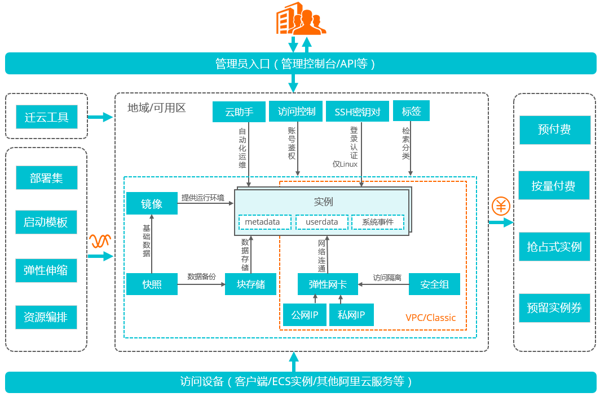

思路：以云服务器为切入，串联学习其他相关概念。

关键字：[云服务器ECS](https://help.aliyun.com/product/25365.html?spm=a2c4g.750001.list.2.f08e7b13JTYrcP)			[轻量应用服务器](https://help.aliyun.com/document_detail/58612.html?spm=5176.161059.847529.2.35d67fdaQd1igq)

## 一、ECS学习路径[引](https://help.aliyun.com/learn/learningpath/ecs.html?spm=5176.8789780.1092586.4.620155caTnCXfN&accounttraceid=9575ff94-81a7-4d0a-9c77-80976b59a1ff)

### 1.0 概述

云服务器（Elastic Compute Service，简称ECS）是阿里云提供的性能卓越、稳定可靠、弹性扩展的IaaS（Infrastructure as a Service）级别云计算服务。云服务器ECS免去了您采购IT硬件的前期准备，让您像使用水、电、天然气等公共资源一样便捷、高效地使用服务器，实现计算资源的即开即用和弹性伸缩。

**云服务器ECS优点：**

- 无需自建机房，无需采购以及配置硬件设施。
- 分钟级交付，快速部署，缩短应用上线周期。
- 快速接入部署在全球范围内的数据中心和BGP机房。
- 成本透明，按需使用，支持根据业务波动随时扩展和释放资源。
- 提供GPU和FPGA等异构计算服务器、弹性裸金属服务器以及通用的x86架构服务器。
- 支持通过内网访问其他阿里云服务，形成丰富的行业解决方案，降低公网流量成本。
- 提供虚拟防火墙、角色权限控制、内网隔离、防病毒攻击及流量监控等多重安全方案。
- 提供性能监控框架和主动运维体系。
- 提供行业通用标准API，提高易用性和适用性。

**产品架构**

云服务器ECS主要包含以下功能组件：

- [实例](https://help.aliyun.com/document_detail/25374.html#concept-i1k-fv2-5db)：等同于一台虚拟服务器，内含CPU、内存、操作系统、网络配置、磁盘等基础的计算组件。实例的计算性能、内存性能和适用业务场景由[实例规格](https://help.aliyun.com/document_detail/25378.html#concept-sx4-lxv-tdb)决定，其具体性能指标包括实例vCPU核数、内存大小、网络性能等。
- [镜像](https://help.aliyun.com/document_detail/25389.html#concept-qql-3zb-wdb)：提供实例的操作系统、初始化应用数据及预装的软件。操作系统支持多种Linux发行版和多种Windows Server版本。
- [块存储](https://help.aliyun.com/document_detail/63136.html#concept-pl4-tzb-wdb)：块设备类型产品，具备高性能和低时延的特性。提供基于分布式存储架构的[云盘](https://help.aliyun.com/document_detail/25383.html#concept-n1s-rzb-wdb)、[共享块存储](https://help.aliyun.com/document_detail/108902.html#concept-abt-gpv-xgb)（公测中）以及基于物理机本地存储的[本地盘](https://help.aliyun.com/document_detail/63138.html#concept-g3w-qzv-tdb)。
- [快照](https://help.aliyun.com/document_detail/25391.html#concept-qft-2zw-ydb)：某一时间点一块云盘或共享块存储的数据状态文件。常用于数据备份、数据恢复和制作自定义镜像等。
- [安全组](https://help.aliyun.com/document_detail/25387.html#concept-o2y-mqw-ydb)：由同一地域内具有相同保护需求并相互信任的实例组成，是一种虚拟防火墙，用于设置实例的网络访问控制。
- 网络：
  - [专有网络VPC](https://help.aliyun.com/document_detail/34217.html#concept-kbk-cpz-ndb)：逻辑上彻底隔离的云上私有网络。您可以自行分配私网IP地址范围、配置路由表和网关等。
  - 经典网络：所有经典网络类型实例都建立在一个共用的基础网络上。由阿里云统一规划和管理网络配置。

