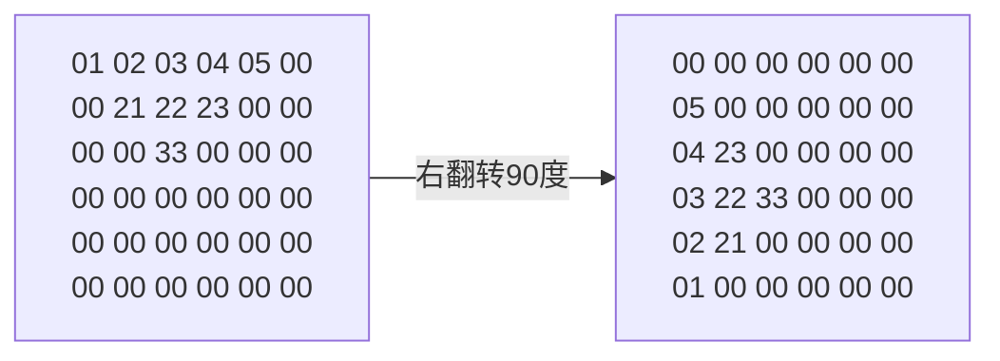
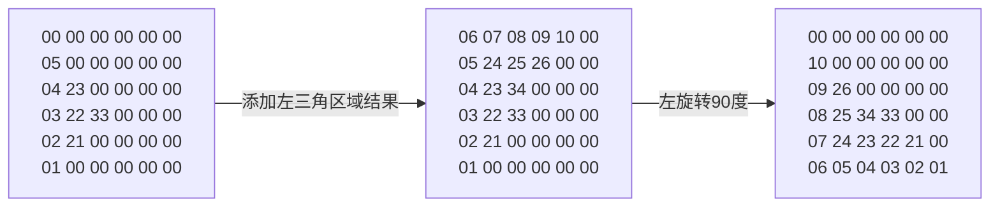
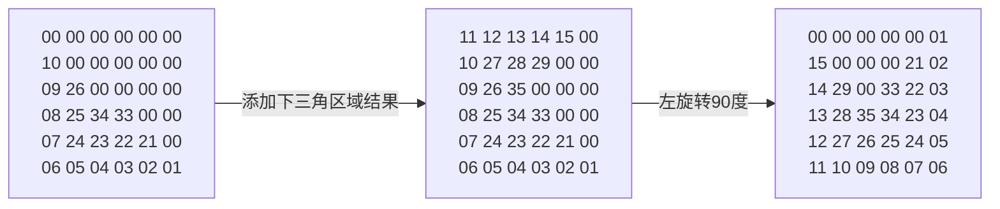
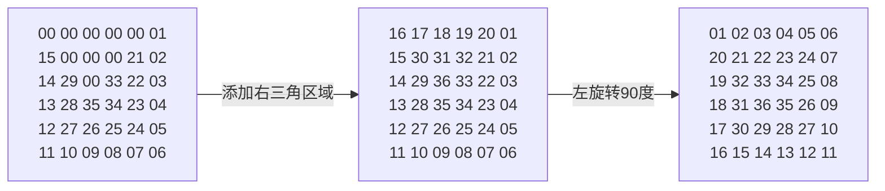
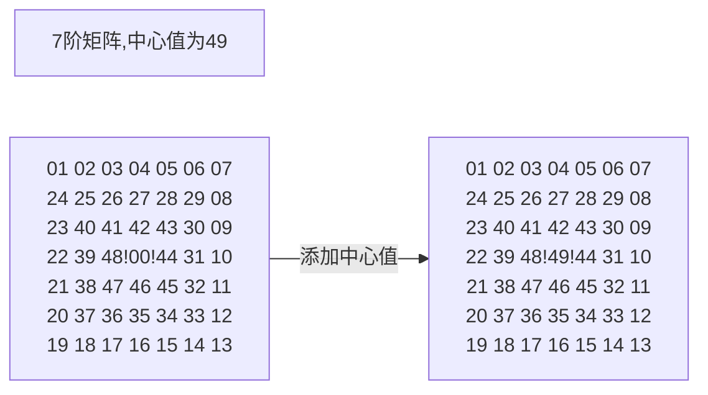

# 螺旋矩阵实现

## python版本

### 一、概述

螺旋矩阵样例如下：

```
==============
  1   2   3   4   5   6 
 20  21  22  23  24   7 
 19  32  33  34  25   8 
 18  31  36  35  26   9 
 17  30  29  28  27  10 
 16  15  14  13  12  11 
==============
```

### 二、解法分析

拆分如上矩阵有:

```
# 6阶矩阵时
==============
  1   2   3   4   5   0 
  0  21  22  23   0   0 
  0   0  33   0   0   0 
  0   0   0   0   0   0 
  0   0   0   0   0   0 
  0   0   0   0   0   0 
==============
  0   0   0   0   0   6 
  0   0   0   0  24   7 
  0   0   0  34  25   8 
  0   0   0   0  26   9 
  0   0   0   0   0  10 
  0   0   0   0   0   0 
==============
  0   0   0   0   0   0 
  0   0   0   0   0   0 
  0   0   0   0   0   0 
  0   0   0  35   0   0 
  0   0  29  28  27   0 
  0  15  14  13  12  11 
==============
  0   0   0   0   0   0 
 20   0   0   0   0   0 
 19  32   0   0   0   0 
 18  31  36   0   0   0 
 17  30   0   0   0   0 
 16   0   0   0   0   0 
==============
```

如上三角的规律显而易见：

1. 倒三角的个数为5、3、1
2. 且四个方位的形状完全一致
3. 倒三角起始个数为**阶数-1**

因此解题思路为：

1. 填倒三角的值
2. 矩阵左旋转90度，再填倒三角的值

### 三、实现细节

#### 3.1 倒三角的计算：

​	**设：**上右下左，顺时针四个方位的倒三角顺位标号为1,2,3,4。预设阶数为**De(Degree)**，则有如下分析：

```
倒三角的行数如下： Sn = {L1, L2, L3 ...; {LN = (De-1)-2n, n=0,1,2...}, LN > 0}
第1圈x顺位的起始位为：0 + (De-1)*(x-1)
第2圈x顺位的起始位为：4*(De-1) + (De-1-2)*(x-1)
...
由上规律可得：圈数由内往外从1开始以Dgx为数，由顺位标号为tx，取1,2,3,4。则有如下伪代码：
```

```c
Res[De][De] = {0} //赋值矩阵坐标
Cylstart = 0 //默认第一圈外无值则此处为零,并从第一圈开始计算
step_N = De-1
while step_N >0 :
	start = Cylstart + L_n * (tx-1)	//当前圈按顺位偏移
    for(int bias = 0;bias < stepN;bias++)	//倒三角赋值
		Res[Dgx][Dgx+bias] = start+bias
	//完成一行赋值进行下一行圈偏移有
	Cylstart += step_N*4
	//从定位
	Dgx += 1 //坐标偏移至下一行
	step_N -= 2	//计算L_n-1
```

#### 3.2 矩阵旋转

使用numpy的部分操作完成

```python
import numpy as np


class FlipMatrix2D:
    @staticmethod
    def flip180(arr):
        new_arr = arr.reshape(arr.size)
        new_arr = new_arr[::-1]
        new_arr = new_arr.reshape(arr.shape)
        return new_arr
    @staticmethod
    def flip90_left(arr):
        new_arr = np.transpose(arr)
        new_arr = new_arr[::-1]
        return new_arr
    @staticmethod
    def flip90_right(arr):
        new_arr = arr.reshape(arr.size)
        new_arr = new_arr[::-1]
        new_arr = new_arr.reshape(arr.shape)
        new_arr = np.transpose(new_arr)[::-1]
        return new_arr
```

#### 3.3 完成逻辑如下

- 计算上三角区域面积并翻转



- 计算左三角区域并翻转



- 计算下三角区域并翻转



- 计算右三角区域并翻转



- 阶数为奇数时，则倒三角区域按如上计算会空出中心位置，因此需要加上中心位置的值(De*De)



### 四、代码实现

```python
class spiralList:
    def __init__(self, N):  # N为阶数
        self.Degree = N
        self.ResList = np.array(0)

    # 输出矩阵
    def PrintList(self, lx):
        for l in lx:
            str = ''
            for x in l:
                str += ("%02d "%x)
            print(str)
        print('==============')

    # 倒三角计算，tx为顺位计数
    def WriteInNabla(self, tx):
        step_N = self.Degree - 1
        Dgx = 0
        Cylstart = 0
        while step_N >= 0:
            start = Cylstart + step_N * (tx - 1)
            for i in range(step_N):
                self.ResList[Dgx][Dgx+i] = start + i + 1
            Cylstart += step_N*4
            Dgx += 1
            step_N -= 2
	# 生成螺旋矩阵
    def CalSprialList(self):
        # 生成矩阵
        self.ResList = np.zeros((self.Degree,self.Degree), dtype=int)
        # self.PrintList(self.ResList)
        for s in range(4):
            # 写入倒三角
            self.WriteInNabla(s+1)
            # 翻转90度
            self.ResList = FlipMatrix2D.flip90_left(self.ResList)
        # 如为奇数则中心位共用
        if self.Degree % 2 == 1:
            n = int(self.Degree/2)
            self.ResList[n][n] = self.Degree*self.Degree
        self.PrintList(self.ResList)

if __name__=="__main__":
    tx = spiralList(7)
    tx.CalSprialList()
```


