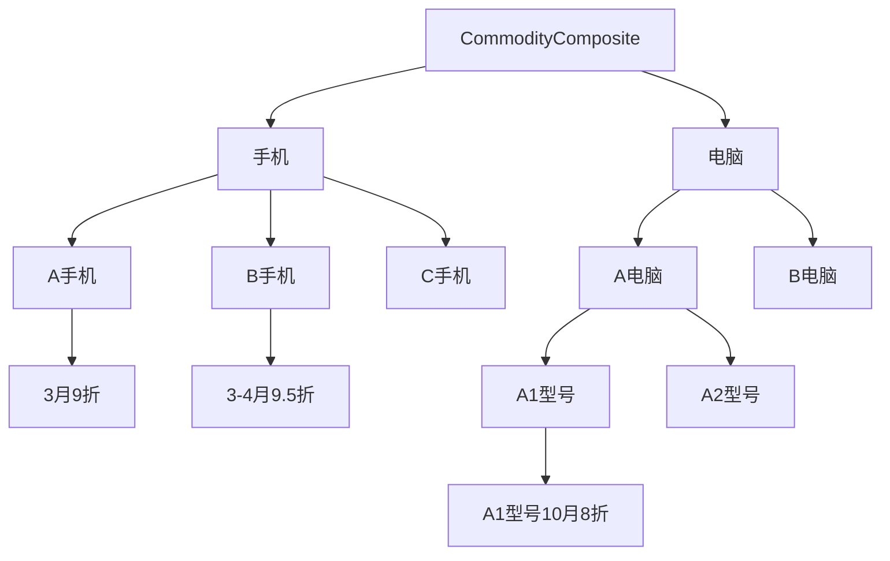

资料来源： https://www.jdon.com/designpatterns/


​	GOF设计模式分三种类型：结构型、创建型和行为型，这三者类型其实对应着一个系统的三个阶段：设计阶段、创建阶段和运行阶段。

​	结构型模式指出如何设计出系统的结构，也就是一个系统的孕育，如同人的十月怀胎过程。

​	创建型模式指出系统起初如何被创建，也就是宇宙大爆炸前一刻，是系统从纸上落地，如同人的出生和养育，是从无到有的创建过程。

​	行为型模式是针对系统创建后进入自我运行阶段，这时再也无需创建者和设计者干预，如同人的成年结婚生子。也就是宇宙形成后的运行状态。

---

## 一、创建模式

### 1. 工厂模式(Factory Method) 

```java
public class Factory{
　　public static Sample creator(int which){
　　//getClass 产生Sample 一般可使用动态类装载装入类。
　　if (which==1)
　　　　return new SampleA();
　　else if (which==2)
　　　　return new SampleB();
　　}
}
// 使用时如下
Sample sample = Factory.creator(1)
```

​	用于包装同一个类别Sample，Sample有对象SampleA和SampleB...。工厂模式的出现就是为了区别生成基类Sample的concrete对象。

​	在获取sample实例对象过程中，就不涉及到Sample的具体子类，从而达到封装效果，减少错误修改的机会。而类的生成，通过which来区分生成。通过类的种类区分，以前置条件隔离，达到更好的灵活性以及封装效果。

例如：用户等级划分时，用户不同的级别对应了不同的权限以及不同的业务流程。

S——普通客户、S1——初级客户、S2——中级客户、S3——高级客户...

以此类推，通过不同的前置条件*<用户等级>* 来达到不同的用户生成流程，以此来确定不同用户类型、用户权限、用户界面等等。

### 2. 抽象工厂(Abstract Factory)

​	与工厂方法比较，这两个模式区别在于需要创建对象的复杂程度上。如果我们创建对象的方法变得复杂了,如上面工厂方法中是创建一个对象Sample,如果我们还有新的产品接口Sample2。那么，我们就将上例中Factory变成抽象类,将共同部分封装在抽象类中,不同部分使用子类实现，下面就是将上例中的Factory拓展成抽象工厂。

```java
public abstract class Factory{
　　public abstract Sample creator();
　　public abstract Sample2 creator(String name);
}

public class SimpleFactory extends Factory{
　　public Sample creator(){
　　　　.........
　　　　return new SampleA
　　}
　　public Sample2 creator(String name){
　　　　.........
　　　　return new Sample2A
　　}
}

public class BombFactory extends Factory{
　　public Sample creator(){
　　　　......
　　　　return new SampleB 
　　}
　　public Sample2 creator(String name){
　　　　......
　　　　return new Sample2B
　　}
}
```

​	从上例中可见，一个抽象工厂统领了多个抽象工厂，意义何在？因为 SimpleFactory内，生产Sample和生产Sample2的方法之间有一定联系，所以才要将这两个方法捆绑在一个类中，这个工厂类有其本身特征，也许制造过程是统一的，比如：制造工艺比较简单，所以名称叫SimpleFactory。

高级语言中关于工厂模式最常用的一种前置条件配置为：*反射*

```java
className =  "com.jivesoftware.forum.database.DbForumFactory";
//动态转载类
Class c = Class.forName(className);
factory = (ForumFactory)c.newInstance();
```

### 3. 单态模式(Singleton)

​	*Singleton模式主要作用是保证在Java应用程序中，一个类Class只有一个实例存在。*

​	在很多操作中，比如建立目录 数据库连接都需要这样的单线程操作。

​	Singleton能够被状态化；这样，多个单态类可以组成一个状态仓库对外提供服务。比如，论坛中的帖子计数器，每次浏览需要一次计数，单态类能够保持住这个计数，且可异步操作。如果需要对这个单态下的数据做业务处理，则可以在不修改单态接口的情况下方便的做到。

​	Singleton也可以被无状态化，提供工具性质的功能。

​	Singleton的好处也在于可以节省内存，因为他实际限制了实例的个数，且重复的使用相同的实例提供不同的服务。同样，该类可以和工厂模式结合，达到资源的有效利用。

```java
// 饿汉模式——在类的装载过程中即静态创建实例
public class Singleton {
    private Singleton(){}
	//在自己内部定义自己一个实例。
	//注意这是private 只供内部调用
	private static Singleton instance = new Singleton();
	//这里提供了一个供外部访问本class的静态方法，可以直接访问　　
	public static Singleton getInstance() {
      return instance; 　　
  } 
}
// 懒汉模式——在需要使用的时候再行创建实例
public class Singleton {	//此例为线程安全模式
    private static Singleton instance = null;
    public static synchronized Singleton getInstance() {	// 应对多线程操作下的同步操作
        if (instance==null)
            instance＝new Singleton();
        return instance;
    }
}
// 双重检查 Double-Check locking(DCL)
public class Singleton {
    private static volatile Singleton singleton;
    private Singleton() {}
    public static Singleton getInstance() {
        if (singleton == null) {
            synchronized (Singleton.class) {
                if (singleton == null) {
                    singleton = new Singleton();
                }
            }
        }
        return singleton;
    }
}
// volatile 并发可见性关键字
```

需要注意的是单态模式依然存在局限性，例如分布式EJB下，单例模式几乎已经失去了作用。

### 4. 构建者模式(Builder)

*将一个复杂对象的构建与它的表示分离，使得同样的构建过程可以创建不同的表示。*

> Builder模式是一步一步创建一个复杂的对象,它允许用户可以只通过指定复杂对象的类型和内容就可以构建它们.用户不知道内部的具体构建细节.Builder模式是非常类似抽象工厂模式,细微的区别大概只有在反复使用中才能体会到.

​	Builder父类和子类主要提供用于对象的表示方法，用另一个类来完成对这些方法的有机组合，这个类的职责就是**‘监工’**。在监工类（Director）中，将父类组合进去，然后调用父类的操作来抽象的实现一件事情，这就是面向接口（抽象）变成的妙处了，当然这个Builder可以使接口也可以是抽象类，在这里我们使用抽象类。

```java
// Builder抽象类
public abstract class Builder {
    public abstract void makeString(String str);
    public abstract void makeTitle(String title);
    public abstract void makeItems(String[] items);
    public abstract void close();
}
// Builder子类1 完成对Html格式内容的表示
public class HtmlBuilder extends Builder {
    private String filename;
    public void makeTitle(String title) {}
    public void makeString(String str) {}
    public void makeItems(String[] items) {}
    public void close() {}
    public String getResult(){
        return filename;
    }
}
// Builder子类2 完成对text格式内容的表示
public class TextBuilder extends Builder {
    private  StringBuffer sb=new StringBuffer();
    public void makeTitle(String title) {}
    public void makeString(String str) {}
    public void makeItems(String[] items) {}
    public void close() {}
    public String getResult(){
        return filename;
    }
}
```

```java
// Director监工类——完成对内容的添加与构建。
public class Director {
    private Builder builder;
    public Director(Builder builder){
        this.builder=builder;
    }
    public void construct(){
        String [] items1=new String[]{"奏国歌","升国旗"};
        String [] items2=new String[]{"观众鼓掌","有序撤离"};
        builder.makeTitle("今日头条");
        builder.makeString("毕业典礼");
        builder.makeItems(items1);
        builder.makeString("典礼结束");
        builder.makeItems(items2);
        builder.close();
    }
}
```

```java
// 外部调用——依次生成Builder类以及Director监工类，以此完成对内容的创建和表示。
public class Main {
    public static void main(String[] args) {
        //String choice="plain";
        String choice="html";
        if(choice=="plain") {
            TextBuilder t=new TextBuilder();
            Director d=new Director(t); d.construct();
            System.out.println(t.getResult());
        }else if(choice=="html") {
            HtmlBuilder html=new HtmlBuilder();
            Director d=new Director(html); d.construct();
            System.out.println(html.getResult());
        }
    }
}
```

如上处理的目的是松耦合的隔离效果，表示层的生成，可以外内容与格式完全不变的情况下完成。例如软件界面风格的切换，即是表示层的切换。隔离的设计好处是复用。通过增加监工增加了对象的创建形式，通过增加Builder子类完成表示层的创建。

### 5. 原型模式(Prototype)

*用原型实例指定创建对象的种类,并且通过拷贝这些原型创建新的对象.*

Prototype模式允许一个对象再创建另外一个可定制的对象，根本无需知道任何如何创建的细节,工作原理是:通过将一个原型对象传给那个要发动创建的对象，这个要发动创建的对象通过请求原型对象拷贝它们自己来实施创建。

```java
public abstract class AbstractSpoon implements Cloneable{ 
　　String spoonName; 
　　public void setSpoonName(String spoonName) {this.spoonName = spoonName;}
　　public String getSpoonName() {return this.spoonName;}
　　public Object clone(){
　　　　Object object = null;
　　　　try {
　　　　　　object = super.clone();
　　　　} catch (CloneNotSupportedException exception) {
　　　　　　System.err.println("AbstractSpoon is not Cloneable");
　　　　}
　　　　return object;
　　}
}
```

java语言的特性让设计模式可以更好的实现，直接使用java中的clone()就可以实现该模式。

## 二、结构模式

### 1. 外观模式(Facade)

*为子系统中的一组接口提供一个一致的界面.*

外观模式的目的不是给予子系统添加新的功能接口，而是为了让外部减少与子系统内多个模块的交互，松散耦合，从而让外部能够更简单地使用子系统。

外观模式的本质是：封装交互，简化调用。

```java
// 外部调用一个复杂功能
public class FacadeTest {
    public static void main(String[] args) {
        System.out.println("开始办理行政手续...");
        ApproveFacade af = new ApproveFacade();
        af.wholeApprove();
        System.out.println("行政手续终于办完了");
    }
}
// 该复杂功能包括多个子功能，子功能的执行通过封装来实现，对外仅提供一个接口
class ApproveFacade {
    public ApproveFacade() { }
    public void wholeApprove() {
        new HealthOffice().approve();
        new RevenueOffice().approve();
        new SaicOffice().approve();
    }
}
```

### 2. 代理模式(Proxy)

*为其他对象提供一种代理以控制对这个对象的访问.*

**作用：**

1. 授权机制。
2. 某个客户端不能直接操作到某个对象，但又必须和其互动。

总之原则是,对于开销很大的对象,只有在使用它时才创建,这个原则可以为我们节省很多宝贵的Java内存. 所以,有些人认为Java耗费资源内存,我以为这和程序编制思路也有一定的关系.

```java
// 事件类
interface Things{
    public void th1();
    public void th2();
}
// 事件类执行
class Shopping implements Things{
    @Override
    public void th1(){
        //买毛巾
    }
    @Override
    public void th2(){
        //买衣服
    }
}
// 权限类
class ShopPermissions {
    /**
    * Permission to shop Th1.
    */
    public static final int ShopTh1 = 0;
    ...
}
// 代理类
class ShopProxy implements Things{
    private Shopping people;
    private ShopPermissions permissions;
    
    public Broker(Shopping people, ShopPermissions permissions) {
        this.people = people;
        this.permissions = permissions;
    }
    @Override
    public void Th1() {
        if(this.permissions.ShopTh1 == 1)	//只有当其权限时才可以执行购买
        	this.people.Th1();
    }
    // Th2也是类似情况。通过代理模式来执行实际的操作对象。
}
```

从代码的结构上来看，有点像一堵墙，其他程序只能通过Proxy来对实例对象做交互，即只能和Proxy来交互。

回到开头的作用。1.权限操作，如上示例即为权限部分。2. 不能直接操作，但需要互动。如对一个多线程操作，如果前一个行为未完成的情况下，需要执行该行为，通过代理模式就可以返回该行为的运行状态。例如返回提示，当前忙碌无法执行操作。

**延伸：copy-on-write操作，即使用Proxy代理完成**

​	在多线程操作中，需要对公共数据做读写操作，读操作不改变数据故无太大问题，但写操作时，如果需要做读操作，怎么办？加锁，如果碰到一个连续的读操作，期间需要做写操作时，对目标数据就需要做更新处理，但如果加了锁，则无法进行写操作。

​	此时为了解决锁的问题，提出一种方案，即读写分离操作。即在写入(增/删/改)操作时，拷贝一份数据进行写操作。而读操作继续对原始数据做处理。当写操作完成时更新原始数据。

### 3. 适配器模式(Adapter)

*将两个不兼容的类纠合在一起使用，属于结构型模式,需要有Adaptee(被适配者)和Adaptor(适配器)两个身份*

**在具体的实现过程中，又可以基于其实现层次是类层次还是对象层次，将其分为类适配器和对象适配器。**

```java
public class PegAdapter extends SquarePeg{
    private RoundPeg roundPeg;
    public PegAdapter(RoundPeg peg)(this.roundPeg=peg;)
        public void insert(String str){
        super.insert(str); 	//先继承父类方法，再执行适配接口操作。
        roundPeg.insertIntoHole(str);
    }
}
```

如上示例可见SquarePeg为适配者Adapter，.PegAdapter是Adapter,将Adaptee(被适配者RoundPeg)和Target(目标SquarePeg)进行适配.实际上这是将组合方法(composition)和继承(inheritance)方法综合运用.

使得行为或数据方向从SquarePeg--> roundPeg。完成不兼容接口的整理。

```java
// 下面是新的PegAdapter,叫做two-way adapter:
public class PegAdapter implements IRoundPeg,ISquarePeg{
    private RoundPeg roundPeg;
    private SquarePeg squarePeg;

    // 构造方法
    public PegAdapter(RoundPeg peg){this.roundPeg=peg;}
    // 构造方法
    public PegAdapter(SquarePeg peg)(this.squarePeg=peg;)
    	public void insert(String str){ 
    	roundPeg.insertIntoHole(str);
	}
}
```

**另解：适配器模式是指，定义一个类，将一个已经存在的类，转换成目标接口所期望的行为形式。**

```java
class UserAdapter extends UserInfo implements UserInterface {
    @Override
    public String getName() {
        return (String) super.getUserBaseInfo().get("name");
    }
    @Override
    public String getTelNumber() {
        return (String) super.getUserBaseInfo().get("telNumber");
    }
}
/*
UserInterface：目标角色——目标接口，系统所期待实现的目标；
UserInfo：源角色——当前已经存在的原有的实现类，即将被适配的类；
UserAdapter：适配器角色——将原有实现装换为目标接口的实现。
*/
```

**适配器模式是指定义一个适配器类，将一个已经存在的类，转换成目标接口所期望的行为形式。同时，一般来说，基于更多的推荐使用组合而不是继承，因此，对象适配器可能使用更多。**

### 4. 组合模式(Composite)

*将对象以树形结构组织起来,以达成 “部分－整体” 的层次结构，使得客户端对单个对象和组合对象的使用具有一致性.*

​	组合模式中当然在组合对象中含有被组合对象的引用，只是不同的是，组合模式在概念上更加严格，通常是指引用的被组合对象类型就是组合对象的类型。如此一来，使得组合对象和被组合对象处理起来具有一致性。当然，前提是组合被对象和被组合对象在本身的概念层次上具有此一致性。

```java
class TreeNode {
    private String name;
    private TreeNode parent;
    private Vector<TreeNode> children = new Vector<TreeNode>();
    
    public TreeNode() { }
    public TreeNode(String name) { this.name = name; }
    public String getName() { return name; }
    public void setName(String name) { this.name = name; }
    public TreeNode getParent() { return parent; }
    public void setParent(TreeNode parent) { this.parent = parent; }
    public Vector<TreeNode> getChildren() { return children; }
    public void setChildren(Vector<TreeNode> children) { this.children = children; }
    // 添加孩子结点
    public void addChild(TreeNode child) { children.add(child); }
    // 删除子结点
    public void removeChild(TreeNode child) { children.remove(child); }
    // 获取子结点
    public Enumeration<TreeNode> getChileren() { return children.elements(); }
}
```

如上结构，对应的业务处理为，节点的增删改业务。比如论坛中的回复就位树形结构，增删改操作即可在外部调用组合实现。

```java
//使用List存放，使用java内置的next函数来访问
abstract class CompositeEquipment extends Equipment
{
　　private int i=0; 
　　//定义一个Vector 用来存放'儿子'
　　private Lsit equipment=new ArrayList();
　　public CompositeEquipment(String name) { super(name); }
　　public boolean add(Equipment equipment) { this.equipment.add(equipment);return true; }

    public double netPrice() 
    {
        double netPrice=0.;
        Iterator iter=equipment.iterator();
        for(iter.hasNext())
        	netPrice += ((Equipment)iter.next()).netPrice();
        return netPrice;
    }
    public double discountPrice() 
    {
        double discountPrice=0.;
        Iterator iter=equipment.iterator();
        for(iter.hasNext())
        	discountPrice += ((Equipment)iter.next()).discountPrice();
        return discountPrice;
    }

	//注意这里，这里就提供用于访问自己组合体内的部件方法。
	//上面dIsk 之所以没有，是因为Disk是个单独(Primitive)的元素.
	public Iterator iter() { return equipment.iterator(); }
    //重载Iterator方法
    public boolean hasNext() { return i<equipment.size(); }
    //重载Iterator方法
    public Object next()
    {
        if(hasNext())
        	return equipment.elementAt(i++);
        else 
        	throw new NoSuchElementException();
    }
}
```



例如：如上树形结构，每一个节点均包含价格。此时如果外部程序调用3月份的手机价格如何。则会依次遍历手机分支下的价格，如果存在折扣，则计算折扣，否则不计算。

如此就能对一组存在树形结构的对象，做统一处理，而不用分别遍历。

**形式结构与逻辑结构相统一。便于业务实现。**

### 5. 装饰器模式(Decorator)

*动态给一个对象添加一些额外的职责,就象在墙上刷油漆.使用Decorator模式相比用生成子类方式达到功能的扩充显得更为灵活.*

我们通常可以使用继承来实现功能的拓展,如果这些需要拓展的功能的种类很繁多,那么势必生成很多子类,增加系统的复杂性,同时,使用继承实现功能拓展,我们必须可预见这些拓展功能,这些功能是编译时就确定了,是静态的.

使用Decorator的理由是:这些功能需要由用户动态决定加入的方式和时机.Decorator提供了"即插即用"的方法,在运行期间决定何时增加何种功能.

```java
// 首先建立一个接口类
public interface Work { 
　　public void insert();
}
// 创建需求子类
public class SquarePeg implements Work{
　　public void insert(){
　　　　System.out.println("方形桩插入");
　　}
}
// 创建适配器
public class Decorator implements Work{

　　private Work work;
　　//额外增加的功能被打包在这个List中
　　private ArrayList others = new ArrayList();

　　//在构造器中使用组合new方式,引入Work对象;
　　public Decorator(Work work) {
　　　　this.work=work;
　　　　others.add("挖坑");
　　　　others.add("钉木板");
　　}
　　public void insert() {
　　　　newMethod();
　　}
　　//在新方法中,我们在insert之前增加其他方法,这里次序先后是用户灵活指定的 　　 
　　public void newMethod() {
　　　　otherMethod();
　　　　work.insert();
　　} 
　　public void otherMethod() {
　　　　ListIterator listIterator = others.listIterator();
　　　　while (listIterator.hasNext()) {
　　　　　　System.out.println(((String)(listIterator.next())) + " 正在进行");
　　　　}
　　} 
}
```

```java
// 实际调用如下
Work squarePeg = new SquarePeg(); 
Work decorator = new Decorator(squarePeg);
decorator.insert();
```

基于实例，可见此处的装饰器模式即为在基类work的基础上衍生出很多的相似类，然后基于这些相似类完成适配器的统一类。例如：工作总结，每个人每个部门的工作均不同，但都可以做一个统一的工作总结适配器类。只需要把每个人每个部门的对象装载其中即可。(假装懂了，未实践仅嘴上说说)

### 6. 桥接模式(Bridge)

*将抽象和行为划分开来,各自独立,但能动态的结合。*

在面向对象设计的基本概念中，对象这个概念实际是由属性和行为两个部分组成的，属性我们可以认为是一种静止的，是一种抽象，一般情况下，行为是包含在一个对象中，但是，在有的情况下，我们需要将这些行为也进行归类，形成一个总的行为接口，这就是桥模式的用处。

**例：**咖啡分为：大杯中杯两种，同时又分为加奶不加奶，如此分为四种。具体而言，大杯中杯为属性，加不加奶为行为，因此此处可以把抽象与行为划分开来。因为加奶的行为之外还有加糖，如此行为本身就有很多衍生和扩展。如需结构化代码就需使用桥接模式。

```java
// 先定义两个抽象类
public abstract class CoffeeImp { // 行为集合
    public abstract void pourCoffeeImp();	// 行为
}
public abstract class Coffee { // 对象的抽象类
    CoffeeImp coffeeImp;		// 对象的行为
    public void setCoffeeImp() {		//单例模式下达到行为与对象的统一
        this.CoffeeImp = CoffeeImpSingleton.getTheCoffeImp();
    }
    public CoffeeImp getCoffeeImp() {return this.CoffeeImp;}
    public abstract void pourCoffee();	// 抽象与行为的叠加接口
}
```

```java
// 基于如上两个接口我们轻易可知两种基于Coffee的对象，分别为中杯和大杯
public class MediumCoffee extends Coffee {
    public MediumCoffee() {setCoffeeImp();}
    public void pourCoffee() {
        CoffeeImp coffeeImp = this.getCoffeeImp();
        for (int i = 0; i < 2; i++) { //我们以重复次数来说明是冲中杯还是大杯 ,重复2次是中杯
            coffeeImp.pourCoffeeImp(); // 此处为抽象对象的行为
        }
    }
}
public class SuperSizeCoffee extends Coffee {
    public SuperSizeCoffee() {setCoffeeImp();}
    public void pourCoffee() {
        CoffeeImp coffeeImp = this.getCoffeeImp();
        for (int i = 0; i < 5; i++) { //我们以重复次数来说明是冲中杯还是大杯 ,重复5次是大杯
            coffeeImp.pourCoffeeImp();	// 此处为抽象对象的行为
        }
    }
}
```

```java
// 基于行为的实现类，分别为加奶和不加奶
public class MilkCoffeeImp extends CoffeeImp {
    MilkCoffeeImp() {}
    public void pourCoffeeImp() {
        System.out.println("加了美味的牛奶");
    }
}
public class FragrantCoffeeImp extends CoffeeImp {
    FragrantCoffeeImp() {}
    public void pourCoffeeImp() {
        System.out.println("什么也没加,清香");
    }
}
```

```java
// 如上我们就获取抽象类以及相关行为类，现创建单态模式的对象类
public class CoffeeImpSingleton {
    private static CoffeeImp coffeeImp;
    public CoffeeImpSingleton(CoffeeImp coffeeImpIn) { this.coffeeImp = coffeeImpIn; }
    public static CoffeeImp getTheCoffeeImp() { return coffeeImp; }
}
// 外部使用如下：
//拿出牛奶
CoffeeImpSingleton coffeeImpSingleton = new CoffeeImpSingleton(new MilkCoffeeImp());

//中杯加奶
MediumCoffee mediumCoffee = new MediumCoffee();
mediumCoffee.pourCoffee();

//大杯加奶
SuperSizeCoffee superSizeCoffee = new SuperSizeCoffee();
superSizeCoffee.pourCoffee();
```

注意: Bridge模式的执行类如CoffeeImp和Coffee是一对一的关系, 正确创建CoffeeImp是该模式的关键。

### 7. 享元模式(Flyweight)

*避免大量拥有相同内容的小类的开销(如耗费内存),使大家共享一个类(元类).*

当系统中可能具有多个相同的对象时，对于具有相同的内容的对象可以实现对象的共享，即共享池，以此避免不必要的相同对象的创建以减少系统内存的开销。称之为享元模式。对于定义中的相同的对象，相同一词如何理解？首先我们需要解释下享元模式中的两个概念：内蕴状态和外蕴状态。

内蕴状态：享元对象内部的可以以此来作为区分是否是同一个对象的依据的属性。内蕴状态不随着外部环境的变化而变化。

外蕴模式：虽然也是享元对象的属性，但可以随着外部环境的变换而变化，同一享元对象在不同的地方其内部的外蕴状态可能不同。

```java
interface Flyweight{
    // 用于改变外蕴状态 
    public void changeStat(String exState);
}
class ConcreteFlyweight implements Flyweight {
    //内蕴状态
    private String innerState;
    // 外蕴状态 
    private String exState;

    public ConcreteFlyweight(String innerState) {
        this.innerState = innerState;
    }
    @Override
    public void changeStat(String exState) {
        this.exState = exState;
    }
}
```

使用工厂模式管理公共数据

```java
class FlyweightFactory {
    private static Map<String, Flyweight> flyweightMap = new HashMap<String, Flyweight>();
    public static Flyweight getFlyweight(String innerState) {
        Flyweight flyweight = flyweightMap.get(innerState);
        if (flyweight == null) {
            flyweight = new ConcreteFlyweight(innerState);
            flyweightMap.put(innerState, flyweight);
        }
        return flyweight;
    }

}
```

```java
// 实际使用如下
public class FlyweightTest {
    public static void main(String[] args) {
        Flyweight a = FlyweightFactory.getFlyweight("A"); a.changeStat("first-A");
        Flyweight b = FlyweightFactory.getFlyweight("B"); b.changeStat("first-B");

        Flyweight aa = FlyweightFactory.getFlyweight("A"); aa.changeStat("second-A");
        Flyweight bb = FlyweightFactory.getFlyweight("B"); bb.changeStat("second-B");

        System.out.println(a == aa);  // true
        System.out.println(b == bb);  // true
    }
}
```

## 三、行为模式

### 3.1 模板模式(Template)

*定义一个操作中算法的骨架,将一些步骤的执行延迟到其子类中.*

```java
public abstract class Benchmark {
    // 下面操作是我们希望在子类中完成
    public abstract void benchmark();
    // 重复执行benchmark次数
    public final long repeat (int count) {
        if (count <= 0)
            return 0;
        else {
            long startTime = System.currentTimeMillis();
            for (int i = 0; i < count; i++)
                benchmark();
            long stopTime = System.currentTimeMillis();
            return stopTime - startTime;
        }
    }
}
public class MethodBenchmark extends Benchmark {
　　// 真正定义benchmark内容
　　public void benchmark() {
　　　　for (int i = 0; i < Integer.MAX_VALUE; i++){
　　　 　　System.out.printtln("i="+i);　 　　
　　　 }
　　}
}
```

```java
//实际使用如下
Benchmark operation = new MethodBenchmark();
long duration = operation.repeat(Integer.parseInt(args[0].trim()));	// 设定操作次数
System.out.println("The operation took " + duration + " milliseconds");
```

一般而言子类都是对父类的延伸，功能的扩展。父类多为抽象类或者基础类。但模板模式却逆向使用，父类做实操功能，部分功能交给不同的子类，以此来实现模板效果。

### 3.2 备忘录模式(Memento)

*memento是一个保存另外一个对象内部状态拷贝的对象.这样以后就可以将该对象恢复到原先保存的状态.*

实例应用：注册过程中，提交后验证发现部分项填写异常，此时需要用备忘录模式记录已经填写的信息，用以避免重新填写正确信息。

```java
// Memento类
public class Memento {
    private int SaveNum;
    Memento(int SaveNum) {
        this.SaveNum = SaveNum;
    }
    public int getNum() { return SaveNum; }
}
```

```java
// Gamer类
public class Gamer {
    private int Num;
    public Gamer(int Num) { this.Num = Num; }
	//获取当前数值
    public int getNum() { return Num; }
    public void bet() {
        // 获取骰子数值
        this.Num = random.nextInt(100)
    }
	//创建备忘录	@return 备忘录对象
    public Memento createMemento() { return new Memento(Num); }
	//撤销到指定备忘	@param memento 备忘录对象
    public void restoreMemento(Memento memento) {
        this.Num = memento.getNum();
    }
    @Override
    public String toString() {
        return "Gamer{ Num=" + money + "}";
    }
}
```

```java
// 测试类
public class MementoTest {
    @Test
    public void testMemento() {
        Gamer gamer = new Gamer(0);
        Memento memento = gamer.createMemento();
        for (int i = 0; i < 20; i++) {
            System.out.println("==== " + i);
            System.out.println("当前状态：" + gamer);
            // 投掷骰子
            gamer.bet();
            // 如何处理memento
            if (gamer.Num() > 90) {
                System.out.println("获取到理想数值。");
                memento = gamer.createMemento();
                break;
            } else {
                System.out.println("未获取到理想数值。保存状态重新来过。");
                gamer.restoreMemento(memento);
            }
        }
    }
}
```

类似于泛华对象，取部分重要数据成一对象作为记录暂时保存，当需要回到原有状态时，则通过加载接口即可实现。

**备忘录模式中的角色：1. 生成者(Originator)——例中Gamer角色。2. 纪念品(Memento)`Memento`角色会将`Originator`角色的内部信息整合在一起。在`Memento`角色中虽然保存了`Originator`角色的信息，但它不会向外部公开这些信息。3. 负责人(Caretaker)**


### 3.3 观察者模式(Observer)

*定义对象间的一种一对多依赖关系，使得每当一个对象状态发生改变时，其相关依赖对象皆得到通知并被自动更新。*

其功用以及实现方式，即为**类似回调**这样的行为，把一个响应函数或类或对象**关联**到另一个类中，当另一个类出现某种变化时，则执行这个回调对象。以此实现该模式

```java
/* Java的API还为为我们提供现成的Observer接口Java.util.Observer.我们只要直接使用它就可以.
 * 我们必须extends Java.util.Observer才能真正使用它:
 *	1.提供Add/Delete observer的方法;
 *	2.提供通知(notisfy) 所有observer的方法;
 * 产品类 可供Jsp直接使用UseBean调用 该类主要执行产品数据库插入 更新
 */ 
public class product extends Observable{
    private String name;
    private float price;
    public String getName(){ return name;}
    public void setName(String name){ 
        this.name=name;
        //设置变化点 
        setChanged();
        notifyObservers(name);
    }
    public float getPrice() { return price;}
    public void setPrice(float price) {
        this.price=price;
        //设置变化点
        setChanged();
        notifyObservers(new Float(price));
    }
    //以下可以是数据库更新 插入命令.
    public void saveToDb(){
        .....................
    }
}
```

```java
// 观察者NameObserver主要用来对产品名称(name)进行观察的
public class NameObserver implements Observer {
　　private String name=null;
　　public void update(Observable obj,Object arg) {
　　　　if (arg instanceof String) {
　　　　 name=(String)arg;
　　　　}
　　}
}
// 观察者PriceObserver主要用来对产品价格(price)进行观察的
public class PriceObserver implements Observer {
　　private float price=0;
　　public void update(Observable obj,Object arg) {
　　　　if (arg instanceof Float) {
　　　　 price=((Float)arg).floatValue();
　　　　}
　　}
}
```

```java
// 实际使用
Product product=new Product();
NameObserver nameobs=new NameObserver();
PriceObserver priceobs=new PriceObserver();

//加入观察者
product.addObserver(nameobs);
product.addObserver(priceobs);

product.setName("橘子红了");
product.setPrice(9.22f);
```

A->B的通知，可以用观察者模式。衍生一下自通知，变化量及变化方式与执行的分离，此时可以通过观察者模式实现变化。

```java
// 观察者相关类
interface Observer {
    public void update();
}
class ObserverA implements Observer {
    @Override
    public void update() { System.out.println("ObserverA has received!"); }
}
class ObserverB implements Observer {
    @Override
    public void update() { System.out.println("ObserverB has received!"); }
}
```

```java
// 被观察者抽象类及子类
abstract class Observable {

    private Vector<Observer> vector = new Vector<Observer>();

    public void add(Observer observer) { vector.add(observer); }
    public void del(Observer observer) { vector.remove(observer); }
    public void notifyObservers() {
        Enumeration<Observer> enumo = vector.elements();
        while (enumo.hasMoreElements()) {
            enumo.nextElement().update();
        }
    }
    public void operation() {}
}
class ConcretObservable extends Observable{
    @Override
    public void operation() {  System.out.println("update self!"); notifyObservers(); }
}
```

```java
// 外部调用
public class ObserverTest {  
    public static void main(String[] args) {  
        Observable sub = new ConcretObservable();  
        sub.add(new ObserverA());  
        sub.add(new ObserverB());  
        sub.operation();  
    }
}
```

### 3.4 职责链模式(Chain of Responsibility)

*Chain of Responsibility(CoR) 是用一系列类(classes)试图处理一个请求request,这些类之间是一个松散的耦合,唯一共同点是在他们之间传递request. 也就是说，来了一个请求，A类先处理，如果没有处理，就传递到B类处理，如果没有处理，就传递到C类处理，就这样象一个链条(chain)一样传递下去。*

```java
// 接口Handler的代码如下：
public interface Handler{
    public void handleRequest(Request request);
}
// Request类的定义:
public class Request{
    private String type;
    public Request(String type){this.type=type;}
    public String getType(){return type;}
    public void execute(){
        //request真正具体行为代码
    }
}
//那么Handler实现代码如下：
public class ConcreteHandler implements Handler{
　　private Handler successor;
　　public ConcreteHandler(Handler successor){
　　　　this.successor=successor;
　　}
　　public void handleRequest(Request request){
　　　　if (request instanceof HelpRequest){	//意在表达当前请求是否为帮助请求
　　　　　　request.execute();	//这里是处理Help的具体代码
　　　　}else if (request instanceof PrintRequst){ //意在表达当前请求是否为打印请求
　　　　　　request.execute();
　　　　}else
　　　　　　//传递到下一个
　　　　　　successor.handle(request);
　　　　}
　　}
}
//A instanceof B, 关键字的含义是，A(对象)与B(类)的关系如果为父类，实现类，自身类时则返回True
```

**CoR的优缺点：**
因为无法预知来自外界（客户端）的请求是属于哪种类型，每个类如果碰到它不能处理的请求只要放弃就可以。

缺点是效率低，因为一个请求的完成可能要遍历到最后才可能完成，当然也可以用树的概念优化。 在Java AWT1.0中，对于鼠标按键事情的处理就是使用CoR,到Java.1.1以后，就使用Observer代替CoR

扩展性差，因为在CoR中，一定要有一个统一的接口Handler.局限性就在这里。

### 3.5 命令模式(Command)

*将来自客户端的请求传入一个对象，无需了解这个请求激活的 动作或有关接受这个请求的处理细节。*

解耦了发送者和接受者之间联系。 发送者调用一个操作，接受者接受请求执行相应的动作，因为使用Command模式解耦，发送者无需知道接受者任何接口。显然这样做的好处是符合封装的特性,降低耦合度,Command是将对行为进行封装的典型模式,Factory是将创建进行封装的模式,

```java
// Command抽象类及各种实现类
public interface Command {
    public abstract void execute ();
}
public class Engineer implements Command {
    public void execute( ) { /*do Engineer's command*/ }
}
public class Programmer implements Command {
    public void execute( ) { /*do programmer's command*/ }
}
public class Politician implements Command {
    public void execute( ) { /*do Politician's command*/ }
}
//命令整合类
public class producer{
    public static List produceRequests() {
        List queue = new ArrayList();
        queue.add(new DomesticEngineer());
        queue.add(new Politician());
        queue.add(new Programmer());
        return queue; 
    }
}
```

```java
// 调用类
List queue = Producer.produceRequests();
for(Iterator it = queue.iterator();it.hasNext();) {
    //客户端直接调用execute方法，无需知道被调用者的其它更多类的方法名。
    ((Command)it.next()).execute();
}
```

由此可见,调用者基本只和接口打交道,不合具体实现交互,这也体现了一个原则,面向接口编程,这样,以后增加第四个具体命令时,就不必修改调用者TestCommand中的代码了.

理解了上面的代码的核心原理,在使用中,就应该各人有自己方法了,特别是在**如何分离调用者和具体命令上**,有很多实现方法,上面的代码是使用"从List过一遍"的做法.这种做法只是为了演示.

**延伸：undo/redo**撤销和回复功能。该功能的实现有两种思路： 记录数据和记录操作。[C#样例](https://www.cnblogs.com/wanghui9072229/archive/2011/08/29/2158960.html)

记录数据可见备忘录模式，把备忘录整理成一个List格式，以时间或者事件触发的方式记录下每一步的数据。此法以空间换时间，快速可靠。但缺点就是当数据量大的时候占用太多内存，比如视频图片等数据。

记录操作在命令模式的基础上做一个List记录每一个操作，而在命令实现中加入回复操作的方法。以此就形成了undo和redo的功能，不用记录数据的原因是，每一步回复和撤销都是在当前数据下执行或逆执行，以此完成该功能。该做法是以时间换空间，例如1000条数据，仅对一条数据了更新，此时如用记录数据的方式则使得重复数据过多。

### 3.6 状态模式(State)

*不同的状态,不同的行为;或者说,每个状态有着相应的行为.*

```java
// 状态的抽象类，包括状态的转换与状态的获取两类接口
public abstract class State{
    public abstract void handlepush(Context c);
    public abstract void handlepull(Context c);
    public abstract void getcolor();
}
// 不同状态的子类，其中包括不同子类间的转换规则
public class BlueState extends State {
    public void handlepush(Context c) {
        //根据push方法"如果是blue状态的切换到green" ;
        c.setState(new GreenState());
    }
    public void handlepull(Context c) {
        //根据pull方法"如果是blue状态的切换到red" ;
        c.setState(new RedState());
    }
    public abstract void getcolor(){ return (Color.blue); }
}
// 实际使用
public class Context{
    private Sate state=null; //我们将原来的 Color state 改成了新建的State state;
    //setState是用来改变state的状态 使用setState实现状态的切换
    pulic void setState(State state){ this.state=state; }
    public void push(){
        //状态的切换的细节部分,在本例中是颜色的变化,已经封装在子类的handlepush中实现,这里无需关心
        state.handlepush(this);
        //因为sample要使用state中的一个切换结果,使用getColor()
        Sample sample=new Sample(state.getColor());
        sample.operate();
    }
    public void pull(){
        state.handlepull(this);
        Sample2 sample2=new Sample2(state.getColor());
        sample2.operate();
    }
}
```

**状态模式实质**：
	使用状态模式前，客户端外界需要介入改变状态，而状态改变的实现是琐碎或复杂的。使用状态模式后，客户端外界可以直接使用事件Event实现，根本不必关心该事件导致如何状态变化，这些是由状态机等内部实现。这是一种Event-condition-State，状态模式封装了condition-State部分。每个状态形成一个子类，每个状态只关心它的下一个可能状态，从而无形中形成了状态转换的规则。如果新的状态加入，只涉及它的前一个状态修改和定义。

​	状态转换有几个方法实现：一个在每个状态实现next()，指定下一个状态；还有一种方法，设定一个StateOwner，在StateOwner设定stateEnter状态进入和stateExit状态退出行为。

状态从一个方面说明了流程，流程是随时间而改变，状态是截取流程某个时间片。

### 3.7 策略模式(Strategy)

*定义一系列的算法,把这些算法一个个封装成单独的类.*

Stratrgy应用实例：(1) 公司经营业务变化图, 可能有两种实现方式,一个是线条曲线,一个是框图(bar),这是两种算法,可以使用Strategy实现。(2) 以字符串替代为例, 有一个文件,我们需要读取后,希望替代其中相应的变量,然后输出.关于替代其中变量的方法可能有多种方法,这取决于用户的要求,所以我们要准备几套变量字符替代方案.

```java
// 文本替代算法抽象类
public abstract class RepTempRule{
    protected String oldString="";
    public void setOldString(String oldString){ this.oldString=oldString; }
    protected String newString="";
    public String getNewString(){ return newString; }
    public abstract void replace() throws Exception;
}
// 文本替代算法子类
public class RepTempRuleOne extends RepTempRule{
    public void replace() throws Exception{
        //replaceFirst是jdk1.4新特性 
        newString=oldString.replaceFirst("aaa", "bbbb"); 
        System.out.println("this is replace one");
    }
}
public class RepTempRuleTwo extends RepTempRule{
    public void replace() throws Exception{ 
        newString=oldString.replaceFirst("aaa", "ccc");
        System.out.println("this is replace Two");
    }
}
```

```java
// 建立一个算法解决类，用来提供客户端可以自由选择算法。
public class RepTempRuleSolve {
    private RepTempRule strategy;
    public RepTempRuleSolve(RepTempRule rule){ this.strategy=rule; }
    public String getNewContext(Site site,String oldString) {
        return strategy.replace(site,oldString);
    }
    public void changeAlgorithm(RepTempRule newAlgorithm) { strategy = newAlgorithm; }
}
// 实际调用使用如下
public class test{
    ......
        public void testReplace(){
        //使用第一套替代方案
        RepTempRuleSolve solver=new RepTempRuleSolve(new RepTempRuleOne());
        solver.getNewContext(site,context);
        //使用第二套
        solver=new RepTempRuleSolve(new RepTempRuleTwo());
        solver.getNewContext(site,context);
    }
    .....
}
```

如上实例类的组成逻辑如下：N个替换方法-->n个方法组成M套替换方案-->实际使用中通过方案的替换来完成算法的组合与替换。

实际整个Strategy的核心部分就是抽象类的使用,使用Strategy模式可以在用户需要变化时,修改量很少,而且快速.

> Strategy适合下列场合:
>
> 1. 以不同的格式保存文件;
>
> 2. 以不同的算法压缩文件;
>
> 3. 以不同的算法截获图象;
>
> 4. 以不同的格式输出同样数据的图形,比如曲线 或框图bar等

### 3.8 中介者模式(Mediator)

*用一个中介对象来封装一系列关于对象交互行为.*

```java
// 创建一个接口，用来定义成员对象之间的交互联系方式
public interface Mediator { }
public class ConcreteMediator implements Mediator {
　　 //假设当前有两个成员.
　　 private ConcreteColleague1 colleague1 = new ConcreteColleague1(); 
　　 private ConcreteColleague2 colleague2 = new ConcreteColleague2();
　　 ...	// 实现具体的交互细节
}
```

```java
// 成员参与者,因为是交互行为,都需要双方提供一些共同接口,这种要求在Visitor Observer等模式中都是相同的.
public class Colleague {
　　 private Mediator mediator;
　　 public Mediator getMediator() { return mediator; }
　　 public void setMediator( Mediator mediator ) { this.mediator = mediator; }
}
public class ConcreteColleague1 { }
public class ConcreteColleague2 { }
// 每个成员都必须知道Mediator,并且和 Mediator联系,而不是和其他成员联系.
```

Mediator模式在事件驱动类应用中比较多,例如界面设计GUI.;聊天,消息传递等,在聊天应用中,需要有一个MessageMediator,专门负责request/reponse之间任务的调节.

MVC是J2EE的一个基本模式,View Controller是一种Mediator,它是Jsp和服务器上应用程序间的Mediator.

### 3.9 解释器模式(Interpreter)

*定义语言的文法 ,并且建立一个解释器来解释该语言中的句子.*

Interpreter它描述了一个语言解释器是如何构成的,在实际应用中,我们可能很少去构造一个语言的文法.我

```java
// 首先要建立一个接口,用来描述共同的操作.
public interface AbstractExpression { 
　　 void interpret( Context context ); 
}
// 再看看包含解释器之外的一些全局信息
public interface Context { }

// AbstractExpression的具体实现分两种:终结符表达式和非终结符表达式:
public class TerminalExpression implements AbstractExpression { 
　　 public void interpret( Context context ) { }
}

// 对于文法中没一条规则,非终结符表达式都必须的:
public class NonterminalExpression implements AbstractExpression { 
　　 private AbstractExpression successor; 
　　 public void setSuccessor( AbstractExpression successor ) { 
       this.successor = successor;
   }
　　 public AbstractExpression getSuccessor() { return successor; }
　　 public void interpret( Context context ) { } 
}
```

**描述:**

> Expression：抽象表达式，声明一个所有的具体表达式都需要实现的抽象接口；这个接口主要是一个interpret()方法，称做解释操作。

> Terminal Expression：终结符表达式，实现了抽象表达式所要求的接口；文法中的每一个终结符都有一个具体终结表达式与之相对应。比如公式R=R1+R2，R1和R2就是终结符，对应的解析R1和R2的解释器就是终结符表达式。

> Nonterminal Expression：非终结符表达式，文法中的每一条规则都需要一个具体的非终结符表达式，非终结符表达式一般是文法中的运算符或者其他关键字，比如公式R=R1+R2中，“+"就是非终结符，解析“+”的解释器就是一个非终结符表达式。

> Context：环境，它的任务一般是用来存放文法中各个终结符所对应的具体值，比如R=R1+R2，给R1赋值100，给R2赋值200，这些信息需要存放到环境中。

**应用场景：**首先输入一个加减或乘除的运算公式，比如a+b-c+a或a*b/c*a，再给每个参数赋值，最后根据公式完成运算并得到结果。具体如下图，主要体现了语义上的解释。对连接符与变量符做以区分。


如上计算并未添加计算逻辑，这属于解释器外的部分，解释器仅有Expression系列抽象类及子类。

### 3.10 访问者模式(Visitor)

*作用于某个对象群中各个对象的操作. 它可以使你在不改变这些对象本身的情况下,定义作用于这些对象的新操作.*

在Java中,Visitor模式实际上是分离了collection结构中的元素和对这些元素进行操作的行为.

```java
// collection原代码, 把集合中的元素以及行为分离操作。
public void collectionFx() {
    Iterator iterator = collection.iterator();
    while (iterator.hasNext()) {
        Object o = iterator.next();
        if (o instanceof Collection)
            messyPrintCollection((Collection)o);
        else if (o instanceof String)
            System.out.println("'"+o.toString()+"'");
        else if (o instanceof Float)
            System.out.println(o.toString()+"f");
        else
            System.out.println(o.toString());
    }
}
```

如上结构可换为访问者模式下的代码如下：

```java
// 被访问元素抽象类以及子类
public interface Visitable {
    public void accept(Visitor visitor);
}
public class StringElement implements Visitable {
    private String value;
    public StringElement(String string) { value = string; }
    public String getValue(){ return value; }
    //定义accept的具体内容 这里是很简单的一句调用
    public void accept(Visitor visitor) { visitor.visitString(this); }
}
public class FloatElement implements Visitable {
　　 private Float value;
　　 public FloatElement(Float value) { this.value = value; }
　　 public Float getValue(){ return value; }
　　 //定义accept的具体内容 这里是很简单的一句调用
　　 public void accept(Visitor visitor) { visitor.visitFloat(this); }
}
```

```java
// 访问者接口以及调用被访问者
public interface Visitor {
    public void visitString(StringElement stringE);
    public void visitFloat(FloatElement floatE);
    public void visitCollection(Collection collection); 
}
public class ConcreteVisitor implements Visitor {
    public void visitCollection( Collection collection ) {
        Iterator iterator = collection.iterator();
        while(iterator.hasNext()){
            Object o = iterator.next();
            if (o instanceof Visitable) { ((Visitable)o).accept(this); }
        }
   ｝
   //在本方法中,我们实现了对Collection的元素的成功访问
   public void visitString(StringElement stringE) {
        System.out.println("'"+stringE.getValue()+"'");
   } 
   public void visitFloat(FloatElement floatE){
        System.out.println(floatE.getValue().toString()+"f");
   }
}
```

```java
// 客户端代码
Visitor visitor = new ConcreteVisitor();
// 单个访问
StringElement stringE = new StringElement("I am a String");
visitor.visitString(stringE);
// List访问
Collection list = new ArrayList();
list.add(new StringElement("I am a String1")); 
list.add(new StringElement("I am a String2")); 
list.add(new FloatElement(new Float(12))); 
list.add(new StringElement("I am a String3")); 
visitor.visitCollection(list);
```

客户端代码中的list对象集合中放置了多种数据类型，对对象集合中的访问不必象一开始那样，使用instance of逐个判断，而是通过访问者模式巧妙实现了。

**使用Visitor模式的前提**
	使用访问者模式是对象群结构中(Collection) 中的对象类型很少改变。在两个接口Visitor和Visitable中,确保Visitable很少变化,也就是说，确保不能老有新的Element元素类型加进来，可以变化的是访问者行为或操作，也就是Visitor的不同子类可以有多种,这样使用访问者模式最方便.

​	如果对象集合中的对象集合经常有变化, 那么不但Visitor实现要变化，Visistable也要增加相应行为，GOF建议是,不如在这些对象类中直接逐个定义操作，无需使用访问者设计模式。但是在Java中，Java的Reflect技术解决了这个问题，因此结合reflect反射机制，可以使得访问者模式适用范围更广了。

> 对象与行为的分离，虽然减少了耦合性，但其优点仅仅在于在现有基础场更容易添加对象或者行为，如果对象和行为的关系是紧耦合的，此时该模式下的添加必须是同时添加，即Visitor和Visitable同时添加。

### 3.11 迭代器模式(Iterator)

​	这个模式已经被整合入Java的Collection.在大多数场合下无需自己制造一个Iterator,只要将对象装入Collection中，直接使用Iterator进行对象遍历。

```java
public interface Aggregate {
    public abstract Iterator iterator();
}
public interface Iterator {
    public abstract boolean hasNext();
    public abstract Object next();
}
public class Book {
    private String name;
    public Book(String name) { this.name = name; }
    public String getName() { return name; }
}
public class BookShelf implements Aggregate {
    private Book[] books;
    private int last = 0;
    public BookShelf(int maxsize) { this.books = new Book (maxSize); }
    public Book getBookAt(int index){ return books[index]; }
    public void appendBook(Book book) { this.books[last] = book; last++; }
    public int getLength() { return last; }
    public Itrator iterator() { return new BookShelfIterator(this); }
}
public class BookShelfIterator implements Iterator {
    private BookShelf bookShelf;
    private int index;
    public BookShelfIterator(BookShelf bookShelf) {
        this.bookShelf = bookShelf;
        this.index = 0;
    }
    public boolean hasNext(){
        if(index < bookShelf.getLength()){
            return true;
        } else {
            return false;
        }
    }
    public Object next(){
        Book book = bookShelf.getBookAt(index);
        index++;
        return book;
    }
}
```

```java
public class Main{
    public static void main(String[] args) {
        BookShelf bookShelf = new BookShelf(4);
        bookShelf.appendBook(new Book("倚天屠龙记"));
        bookShelf.appendBook(new Book("葵花宝典"));
        bookShelf.appendBook(new Book("九阳真经"));
        bookShelf.appendBook(new Book("神雕侠侣"));
        Iterator it = bookShelf.iterator();
        while (it.hasNext()){
            Book book = (Book) it.next();
            System.out.println(book.getName());
        }
    }
}
```

- 为何要使用Iterator

引入Iterator后可以将遍历与实现分离开来，在遍历时只需调用迭代器的方法，而不用关心具体集合实现类的方法。假设以后需要对集合类的实现方式进行修改，只要集合中的Iterator方法能正确的返回Iterator实例，即使不对迭代器的使用者进行修改，遍历代码都能正常工作。

设计模式的作用就是帮助我们编写可复用的类。“可复用”就是将类实现为“组件”，当一个组件发生改变时，不需要对其他的组件进行修改或只需很小的修改即可应对。

- 多个Iterator

将遍历功能置于Aggregate角色之外，是Iterator模式的一个特征。根据这几个特征，可以针对一个具体的ConcreateAggregate角色编写多个ConcreteIterator角色。


