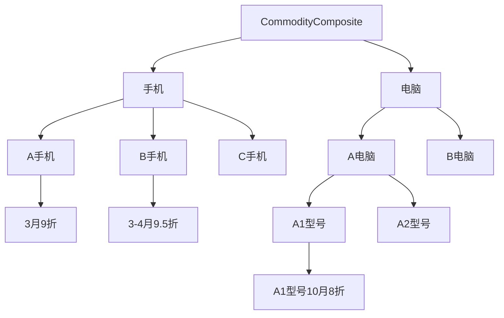

资料来源： https://www.jdon.com/designpatterns/


​	GOF设计模式分三种类型：结构型、创建型和行为型，这三者类型其实对应着一个系统的三个阶段：设计阶段、创建阶段和运行阶段。

​	结构型模式指出如何设计出系统的结构，也就是一个系统的孕育，如同人的十月怀胎过程。

​	创建型模式指出系统起初如何被创建，也就是宇宙大爆炸前一刻，是系统从纸上落地，如同人的出生和养育，是从无到有的创建过程。

​	行为型模式是针对系统创建后进入自我运行阶段，这时再也无需创建者和设计者干预，如同人的成年结婚生子。也就是宇宙形成后的运行状态。

---

## 一、创建模式

### 1. 工厂模式(Factory Method) 

```java
public class Factory{
　　public static Sample creator(int which){
　　//getClass 产生Sample 一般可使用动态类装载装入类。
　　if (which==1)
　　　　return new SampleA();
　　else if (which==2)
　　　　return new SampleB();
　　}
}
// 使用时如下
Sample sample = Factory.creator(1)
```

​	用于包装同一个类别Sample，Sample有对象SampleA和SampleB...。工厂模式的出现就是为了区别生成基类Sample的concrete对象。

​	在获取sample实例对象过程中，就不涉及到Sample的具体子类，从而达到封装效果，减少错误修改的机会。而类的生成，通过which来区分生成。通过类的种类区分，以前置条件隔离，达到更好的灵活性以及封装效果。

例如：用户等级划分时，用户不同的级别对应了不同的权限以及不同的业务流程。

S——普通客户、S1——初级客户、S2——中级客户、S3——高级客户...

以此类推，通过不同的前置条件*<用户等级>* 来达到不同的用户生成流程，以此来确定不同用户类型、用户权限、用户界面等等。

### 2. 抽象工厂(Abstract Factory)

​	与工厂方法比较，这两个模式区别在于需要创建对象的复杂程度上。如果我们创建对象的方法变得复杂了,如上面工厂方法中是创建一个对象Sample,如果我们还有新的产品接口Sample2。那么，我们就将上例中Factory变成抽象类,将共同部分封装在抽象类中,不同部分使用子类实现，下面就是将上例中的Factory拓展成抽象工厂。

```java
public abstract class Factory{
　　public abstract Sample creator();
　　public abstract Sample2 creator(String name);
}

public class SimpleFactory extends Factory{
　　public Sample creator(){
　　　　.........
　　　　return new SampleA
　　}
　　public Sample2 creator(String name){
　　　　.........
　　　　return new Sample2A
　　}
}

public class BombFactory extends Factory{
　　public Sample creator(){
　　　　......
　　　　return new SampleB 
　　}
　　public Sample2 creator(String name){
　　　　......
　　　　return new Sample2B
　　}
}
```

​	从上例中可见，一个抽象工厂统领了多个抽象工厂，意义何在？因为 SimpleFactory内，生产Sample和生产Sample2的方法之间有一定联系，所以才要将这两个方法捆绑在一个类中，这个工厂类有其本身特征，也许制造过程是统一的，比如：制造工艺比较简单，所以名称叫SimpleFactory。

高级语言中关于工厂模式最常用的一种前置条件配置为：*反射*

```java
className =  "com.jivesoftware.forum.database.DbForumFactory";
//动态转载类
Class c = Class.forName(className);
factory = (ForumFactory)c.newInstance();
```

### 3. 单态模式(Singleton)

​	*Singleton模式主要作用是保证在Java应用程序中，一个类Class只有一个实例存在。*

​	在很多操作中，比如建立目录 数据库连接都需要这样的单线程操作。

​	Singleton能够被状态化；这样，多个单态类可以组成一个状态仓库对外提供服务。比如，论坛中的帖子计数器，每次浏览需要一次计数，单态类能够保持住这个计数，且可异步操作。如果需要对这个单态下的数据做业务处理，则可以在不修改单态接口的情况下方便的做到。

​	Singleton也可以被无状态化，提供工具性质的功能。

​	Singleton的好处也在于可以节省内存，因为他实际限制了实例的个数，且重复的使用相同的实例提供不同的服务。同样，该类可以和工厂模式结合，达到资源的有效利用。

```java
// 饿汉模式——在类的装载过程中即静态创建实例
public class Singleton {
    private Singleton(){}
	//在自己内部定义自己一个实例。
	//注意这是private 只供内部调用
	private static Singleton instance = new Singleton();
	//这里提供了一个供外部访问本class的静态方法，可以直接访问　　
	public static Singleton getInstance() {
      return instance; 　　
  } 
}
// 懒汉模式——在需要使用的时候再行创建实例
public class Singleton {	//此例为线程安全模式
    private static Singleton instance = null;
    public static synchronized Singleton getInstance() {	// 应对多线程操作下的同步操作
        if (instance==null)
            instance＝new Singleton();
        return instance;
    }
}
// 双重检查 Double-Check locking(DCL)
public class Singleton {
    private static volatile Singleton singleton;
    private Singleton() {}
    public static Singleton getInstance() {
        if (singleton == null) {
            synchronized (Singleton.class) {
                if (singleton == null) {
                    singleton = new Singleton();
                }
            }
        }
        return singleton;
    }
}
// volatile 并发可见性关键字
```

需要注意的是单态模式依然存在局限性，例如分布式EJB下，单例模式几乎已经失去了作用。

### 4. 构建者模式(Builder)

*将一个复杂对象的构建与它的表示分离，使得同样的构建过程可以创建不同的表示。*

> Builder模式是一步一步创建一个复杂的对象,它允许用户可以只通过指定复杂对象的类型和内容就可以构建它们.用户不知道内部的具体构建细节.Builder模式是非常类似抽象工厂模式,细微的区别大概只有在反复使用中才能体会到.

​	Builder父类和子类主要提供用于对象的表示方法，用另一个类来完成对这些方法的有机组合，这个类的职责就是**‘监工’**。在监工类（Director）中，将父类组合进去，然后调用父类的操作来抽象的实现一件事情，这就是面向接口（抽象）变成的妙处了，当然这个Builder可以使接口也可以是抽象类，在这里我们使用抽象类。

```java
// Builder抽象类
public abstract class Builder {
    public abstract void makeString(String str);
    public abstract void makeTitle(String title);
    public abstract void makeItems(String[] items);
    public abstract void close();
}
// Builder子类1 完成对Html格式内容的表示
public class HtmlBuilder extends Builder {
    private String filename;
    public void makeTitle(String title) {}
    public void makeString(String str) {}
    public void makeItems(String[] items) {}
    public void close() {}
    public String getResult(){
        return filename;
    }
}
// Builder子类2 完成对text格式内容的表示
public class TextBuilder extends Builder {
    private  StringBuffer sb=new StringBuffer();
    public void makeTitle(String title) {}
    public void makeString(String str) {}
    public void makeItems(String[] items) {}
    public void close() {}
    public String getResult(){
        return filename;
    }
}
```

```java
// Director监工类——完成对内容的添加与构建。
public class Director {
    private Builder builder;
    public Director(Builder builder){
        this.builder=builder;
    }
    public void construct(){
        String [] items1=new String[]{"奏国歌","升国旗"};
        String [] items2=new String[]{"观众鼓掌","有序撤离"};
        builder.makeTitle("今日头条");
        builder.makeString("毕业典礼");
        builder.makeItems(items1);
        builder.makeString("典礼结束");
        builder.makeItems(items2);
        builder.close();
    }
}
```

```java
// 外部调用——依次生成Builder类以及Director监工类，以此完成对内容的创建和表示。
public class Main {
    public static void main(String[] args) {
        //String choice="plain";
        String choice="html";
        if(choice=="plain") {
            TextBuilder t=new TextBuilder();
            Director d=new Director(t); d.construct();
            System.out.println(t.getResult());
        }else if(choice=="html") {
            HtmlBuilder html=new HtmlBuilder();
            Director d=new Director(html); d.construct();
            System.out.println(html.getResult());
        }
    }
}
```

如上处理的目的是松耦合的隔离效果，表示层的生成，可以外内容与格式完全不变的情况下完成。例如软件界面风格的切换，即是表示层的切换。隔离的设计好处是复用。通过增加监工增加了对象的创建形式，通过增加Builder子类完成表示层的创建。

### 5. 原型模式(Prototype)

*用原型实例指定创建对象的种类,并且通过拷贝这些原型创建新的对象.*

Prototype模式允许一个对象再创建另外一个可定制的对象，根本无需知道任何如何创建的细节,工作原理是:通过将一个原型对象传给那个要发动创建的对象，这个要发动创建的对象通过请求原型对象拷贝它们自己来实施创建。

```java
public abstract class AbstractSpoon implements Cloneable{ 
　　String spoonName; 
　　public void setSpoonName(String spoonName) {this.spoonName = spoonName;}
　　public String getSpoonName() {return this.spoonName;}
　　public Object clone(){
　　　　Object object = null;
　　　　try {
　　　　　　object = super.clone();
　　　　} catch (CloneNotSupportedException exception) {
　　　　　　System.err.println("AbstractSpoon is not Cloneable");
　　　　}
　　　　return object;
　　}
}
```

java语言的特性让设计模式可以更好的实现，直接使用java中的clone()就可以实现该模式。

## 二、结构模式

### 1. 外观模式(Facade)

*为子系统中的一组接口提供一个一致的界面.*

外观模式的目的不是给予子系统添加新的功能接口，而是为了让外部减少与子系统内多个模块的交互，松散耦合，从而让外部能够更简单地使用子系统。

外观模式的本质是：封装交互，简化调用。

```java
// 外部调用一个复杂功能
public class FacadeTest {
    public static void main(String[] args) {
        System.out.println("开始办理行政手续...");
        ApproveFacade af = new ApproveFacade();
        af.wholeApprove();
        System.out.println("行政手续终于办完了");
    }
}
// 该复杂功能包括多个子功能，子功能的执行通过封装来实现，对外仅提供一个接口
class ApproveFacade {
    public ApproveFacade() { }
    public void wholeApprove() {
        new HealthOffice().approve();
        new RevenueOffice().approve();
        new SaicOffice().approve();
    }
}
```

### 2. 代理模式(Proxy)

*为其他对象提供一种代理以控制对这个对象的访问.*

**作用：**

1. 授权机制。
2. 某个客户端不能直接操作到某个对象，但又必须和其互动。

总之原则是,对于开销很大的对象,只有在使用它时才创建,这个原则可以为我们节省很多宝贵的Java内存. 所以,有些人认为Java耗费资源内存,我以为这和程序编制思路也有一定的关系.

```java
// 事件类
interface Things{
    public void th1();
    public void th2();
}
// 事件类执行
class Shopping implements Things{
    @Override
    public void th1(){
        //买毛巾
    }
    @Override
    public void th2(){
        //买衣服
    }
}
// 权限类
class ShopPermissions {
    /**
    * Permission to shop Th1.
    */
    public static final int ShopTh1 = 0;
    ...
}
// 代理类
class ShopProxy implements Things{
    private Shopping people;
    private ShopPermissions permissions;
    
    public Broker(Shopping people, ShopPermissions permissions) {
        this.people = people;
        this.permissions = permissions;
    }
    @Override
    public void Th1() {
        if(this.permissions.ShopTh1 == 1)	//只有当其权限时才可以执行购买
        	this.people.Th1();
    }
    // Th2也是类似情况。通过代理模式来执行实际的操作对象。
}
```

从代码的结构上来看，有点像一堵墙，其他程序只能通过Proxy来对实例对象做交互，即只能和Proxy来交互。

回到开头的作用。1.权限操作，如上示例即为权限部分。2. 不能直接操作，但需要互动。如对一个多线程操作，如果前一个行为未完成的情况下，需要执行该行为，通过代理模式就可以返回该行为的运行状态。例如返回提示，当前忙碌无法执行操作。

**延伸：copy-on-write操作，即使用Proxy代理完成**

​	在多线程操作中，需要对公共数据做读写操作，读操作不改变数据故无太大问题，但写操作时，如果需要做读操作，怎么办？加锁，如果碰到一个连续的读操作，期间需要做写操作时，对目标数据就需要做更新处理，但如果加了锁，则无法进行写操作。

​	此时为了解决锁的问题，提出一种方案，即读写分离操作。即在写入(增/删/改)操作时，拷贝一份数据进行写操作。而读操作继续对原始数据做处理。当写操作完成时更新原始数据。

### 3. 适配器模式(Adapter)

*将两个不兼容的类纠合在一起使用，属于结构型模式,需要有Adaptee(被适配者)和Adaptor(适配器)两个身份*

**在具体的实现过程中，又可以基于其实现层次是类层次还是对象层次，将其分为类适配器和对象适配器。**

```java
public class PegAdapter extends SquarePeg{
    private RoundPeg roundPeg;
    public PegAdapter(RoundPeg peg)(this.roundPeg=peg;)
        public void insert(String str){
        super.insert(str); 	//先继承父类方法，再执行适配接口操作。
        roundPeg.insertIntoHole(str);
    }
}
```

如上示例可见SquarePeg为适配者Adapter，.PegAdapter是Adapter,将Adaptee(被适配者RoundPeg)和Target(目标SquarePeg)进行适配.实际上这是将组合方法(composition)和继承(inheritance)方法综合运用.

使得行为或数据方向从SquarePeg--> roundPeg。完成不兼容接口的整理。

```java
// 下面是新的PegAdapter,叫做two-way adapter:
public class PegAdapter implements IRoundPeg,ISquarePeg{
    private RoundPeg roundPeg;
    private SquarePeg squarePeg;

    // 构造方法
    public PegAdapter(RoundPeg peg){this.roundPeg=peg;}
    // 构造方法
    public PegAdapter(SquarePeg peg)(this.squarePeg=peg;)
    	public void insert(String str){ 
    	roundPeg.insertIntoHole(str);
	}
}
```

**另解：适配器模式是指，定义一个类，将一个已经存在的类，转换成目标接口所期望的行为形式。**

```java
class UserAdapter extends UserInfo implements UserInterface {
    @Override
    public String getName() {
        return (String) super.getUserBaseInfo().get("name");
    }
    @Override
    public String getTelNumber() {
        return (String) super.getUserBaseInfo().get("telNumber");
    }
}
/*
UserInterface：目标角色——目标接口，系统所期待实现的目标；
UserInfo：源角色——当前已经存在的原有的实现类，即将被适配的类；
UserAdapter：适配器角色——将原有实现装换为目标接口的实现。
*/
```

**适配器模式是指定义一个适配器类，将一个已经存在的类，转换成目标接口所期望的行为形式。同时，一般来说，基于更多的推荐使用组合而不是继承，因此，对象适配器可能使用更多。**

### 4. 组合模式(Composite)

*将对象以树形结构组织起来,以达成 “部分－整体” 的层次结构，使得客户端对单个对象和组合对象的使用具有一致性.*

​	组合模式中当然在组合对象中含有被组合对象的引用，只是不同的是，组合模式在概念上更加严格，通常是指引用的被组合对象类型就是组合对象的类型。如此一来，使得组合对象和被组合对象处理起来具有一致性。当然，前提是组合被对象和被组合对象在本身的概念层次上具有此一致性。

```java
class TreeNode {
    private String name;
    private TreeNode parent;
    private Vector<TreeNode> children = new Vector<TreeNode>();
    
    public TreeNode() { }
    public TreeNode(String name) { this.name = name; }
    public String getName() { return name; }
    public void setName(String name) { this.name = name; }
    public TreeNode getParent() { return parent; }
    public void setParent(TreeNode parent) { this.parent = parent; }
    public Vector<TreeNode> getChildren() { return children; }
    public void setChildren(Vector<TreeNode> children) { this.children = children; }
    // 添加孩子结点
    public void addChild(TreeNode child) { children.add(child); }
    // 删除子结点
    public void removeChild(TreeNode child) { children.remove(child); }
    // 获取子结点
    public Enumeration<TreeNode> getChileren() { return children.elements(); }
}
```

如上结构，对应的业务处理为，节点的增删改业务。比如论坛中的回复就位树形结构，增删改操作即可在外部调用组合实现。

```java
//使用List存放，使用java内置的next函数来访问
abstract class CompositeEquipment extends Equipment
{
　　private int i=0; 
　　//定义一个Vector 用来存放'儿子'
　　private Lsit equipment=new ArrayList();
　　public CompositeEquipment(String name) { super(name); }
　　public boolean add(Equipment equipment) { this.equipment.add(equipment);return true; }

    public double netPrice() 
    {
        double netPrice=0.;
        Iterator iter=equipment.iterator();
        for(iter.hasNext())
        	netPrice += ((Equipment)iter.next()).netPrice();
        return netPrice;
    }
    public double discountPrice() 
    {
        double discountPrice=0.;
        Iterator iter=equipment.iterator();
        for(iter.hasNext())
        	discountPrice += ((Equipment)iter.next()).discountPrice();
        return discountPrice;
    }

	//注意这里，这里就提供用于访问自己组合体内的部件方法。
	//上面dIsk 之所以没有，是因为Disk是个单独(Primitive)的元素.
	public Iterator iter() { return equipment.iterator(); }
    //重载Iterator方法
    public boolean hasNext() { return i<equipment.size(); }
    //重载Iterator方法
    public Object next()
    {
        if(hasNext())
        	return equipment.elementAt(i++);
        else 
        	throw new NoSuchElementException();
    }
}
```



例如：如上树形结构，每一个节点均包含价格。此时如果外部程序调用3月份的手机价格如何。则会依次遍历手机分支下的价格，如果存在折扣，则计算折扣，否则不计算。

如此就能对一组存在树形结构的对象，做统一处理，而不用分别遍历。

**形式结构与逻辑结构相统一。便于业务实现。**

### 5. 装饰器模式(Decorator)

*动态给一个对象添加一些额外的职责,就象在墙上刷油漆.使用Decorator模式相比用生成子类方式达到功能的扩充显得更为灵活.*


